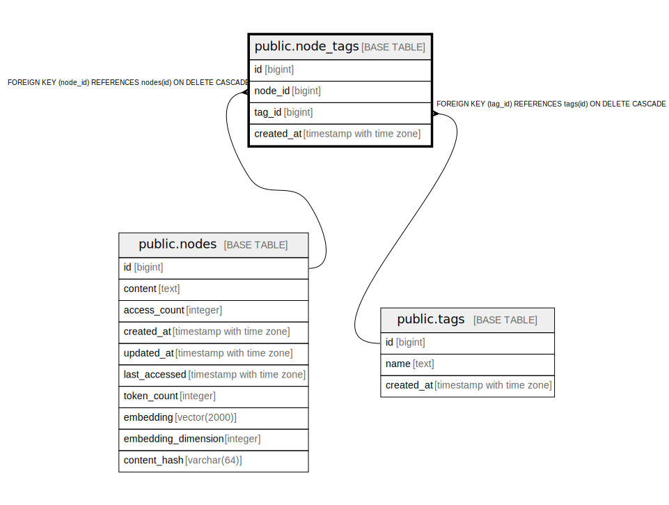

# public.node_tags

## Description

Join table connecting nodes to tags (many-to-many)

## Columns

| Name | Type | Default | Nullable | Children | Parents | Comment |
| ---- | ---- | ------- | -------- | -------- | ------- | ------- |
| id | bigint | nextval('node_tags_id_seq'::regclass) | false |  |  |  |
| node_id | bigint |  | false |  | [public.nodes](public.nodes.md) |  |
| tag_id | bigint |  | false |  | [public.tags](public.tags.md) |  |
| created_at | timestamp with time zone | CURRENT_TIMESTAMP | true |  |  |  |

## Constraints

| Name | Type | Definition |
| ---- | ---- | ---------- |
| node_tags_pkey | PRIMARY KEY | PRIMARY KEY (id) |
| idx_node_tags_unique | UNIQUE | UNIQUE (node_id, tag_id) |
| fk_rails_ebc9aafd9f | FOREIGN KEY | FOREIGN KEY (node_id) REFERENCES nodes(id) ON DELETE CASCADE |
| fk_rails_b51cdcc57f | FOREIGN KEY | FOREIGN KEY (tag_id) REFERENCES tags(id) ON DELETE CASCADE |

## Indexes

| Name | Definition |
| ---- | ---------- |
| node_tags_pkey | CREATE UNIQUE INDEX node_tags_pkey ON public.node_tags USING btree (id) |
| idx_node_tags_unique | CREATE UNIQUE INDEX idx_node_tags_unique ON public.node_tags USING btree (node_id, tag_id) |
| idx_node_tags_node_id | CREATE INDEX idx_node_tags_node_id ON public.node_tags USING btree (node_id) |
| idx_node_tags_tag_id | CREATE INDEX idx_node_tags_tag_id ON public.node_tags USING btree (tag_id) |

## Relations

---

> Generated by [tbls](https://github.com/k1LoW/tbls)
