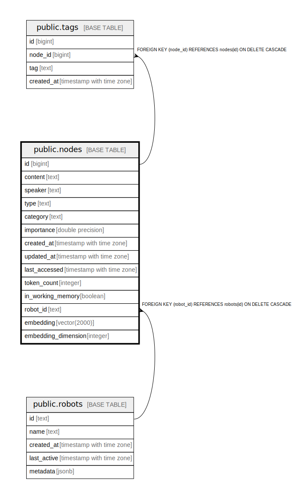

# public.nodes

## Description

Core memory storage for conversation messages and context

## Columns

| Name | Type | Default | Nullable | Children | Parents | Comment |
| ---- | ---- | ------- | -------- | -------- | ------- | ------- |
| id | bigint | nextval('nodes_id_seq'::regclass) | false | [public.node_tags](public.node_tags.md) |  |  |
| content | text |  | false |  |  | The conversation message/utterance content |
| source | text | ''::text | true |  |  | From where the content came (empty string if unknown) |
| access_count | integer | 0 | false |  |  | Number of times this node has been accessed/retrieved |
| created_at | timestamp with time zone | CURRENT_TIMESTAMP | true |  |  | When this memory was created |
| updated_at | timestamp with time zone | CURRENT_TIMESTAMP | true |  |  | When this memory was last modified |
| last_accessed | timestamp with time zone | CURRENT_TIMESTAMP | true |  |  | When this memory was last accessed |
| token_count | integer |  | true |  |  | Number of tokens in the content (for context budget management) |
| in_working_memory | boolean | false | true |  |  | Whether this memory is currently in working memory |
| robot_id | bigint |  | false |  | [public.robots](public.robots.md) | ID of the robot that owns this memory |
| embedding | vector(2000) |  | true |  |  | Vector embedding (max 2000 dimensions) for semantic search |
| embedding_dimension | integer |  | true |  |  | Actual number of dimensions used in the embedding vector (max 2000) |

## Constraints

| Name | Type | Definition |
| ---- | ---- | ---------- |
| check_embedding_dimension | CHECK | CHECK (((embedding_dimension IS NULL) OR ((embedding_dimension > 0) AND (embedding_dimension <= 2000)))) |
| fk_rails_60162e9d3a | FOREIGN KEY | FOREIGN KEY (robot_id) REFERENCES robots(id) ON DELETE CASCADE |
| nodes_pkey | PRIMARY KEY | PRIMARY KEY (id) |

## Indexes

| Name | Definition |
| ---- | ---------- |
| nodes_pkey | CREATE UNIQUE INDEX nodes_pkey ON public.nodes USING btree (id) |
| idx_nodes_created_at | CREATE INDEX idx_nodes_created_at ON public.nodes USING btree (created_at) |
| idx_nodes_updated_at | CREATE INDEX idx_nodes_updated_at ON public.nodes USING btree (updated_at) |
| idx_nodes_last_accessed | CREATE INDEX idx_nodes_last_accessed ON public.nodes USING btree (last_accessed) |
| idx_nodes_access_count | CREATE INDEX idx_nodes_access_count ON public.nodes USING btree (access_count) |
| idx_nodes_robot_id | CREATE INDEX idx_nodes_robot_id ON public.nodes USING btree (robot_id) |
| idx_nodes_source | CREATE INDEX idx_nodes_source ON public.nodes USING btree (source) |
| idx_nodes_in_working_memory | CREATE INDEX idx_nodes_in_working_memory ON public.nodes USING btree (in_working_memory) |
| idx_nodes_embedding | CREATE INDEX idx_nodes_embedding ON public.nodes USING hnsw (embedding vector_cosine_ops) WITH (m='16', ef_construction='64') |
| idx_nodes_content_gin | CREATE INDEX idx_nodes_content_gin ON public.nodes USING gin (to_tsvector('english'::regconfig, content)) |
| idx_nodes_content_trgm | CREATE INDEX idx_nodes_content_trgm ON public.nodes USING gin (content gin_trgm_ops) |

## Relations

---

> Generated by [tbls](https://github.com/k1LoW/tbls)
