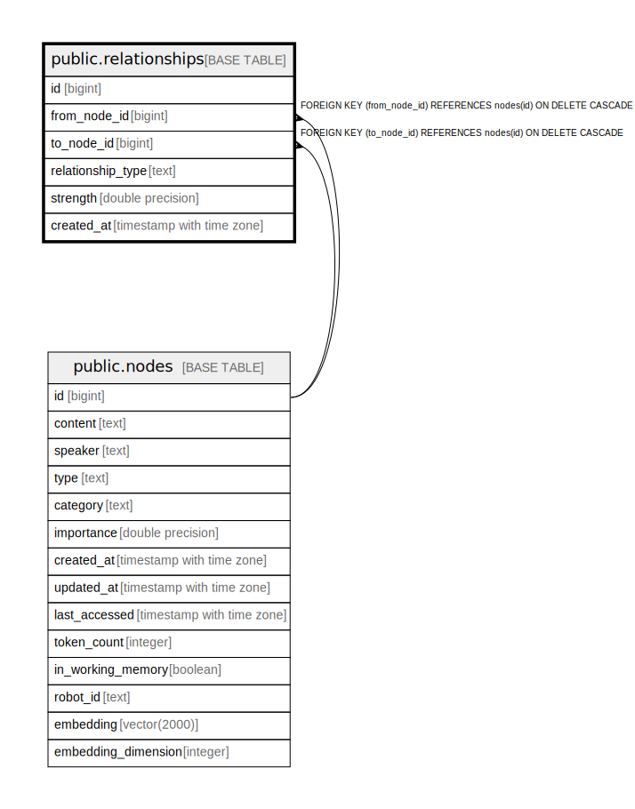

# public.relationships

## Description

Knowledge graph edges connecting related nodes

## Columns

| Name | Type | Default | Nullable | Children | Parents | Comment |
| ---- | ---- | ------- | -------- | -------- | ------- | ------- |
| id | bigint | nextval('relationships_id_seq'::regclass) | false |  |  |  |
| from_node_id | bigint |  | false |  | [public.nodes](public.nodes.md) | Source node ID |
| to_node_id | bigint |  | false |  | [public.nodes](public.nodes.md) | Target node ID |
| relationship_type | text |  | true |  |  | Type of relationship: relates_to, caused_by, follows, etc. |
| strength | double precision | 1.0 | true |  |  | Relationship strength/weight (0.0-1.0) |
| created_at | timestamp with time zone | CURRENT_TIMESTAMP | true |  |  | When this relationship was created |

## Constraints

| Name | Type | Definition |
| ---- | ---- | ---------- |
| relationships_pkey | PRIMARY KEY | PRIMARY KEY (id) |
| fk_rails_4c92229411 | FOREIGN KEY | FOREIGN KEY (from_node_id) REFERENCES nodes(id) ON DELETE CASCADE |
| fk_rails_b2829edeb4 | FOREIGN KEY | FOREIGN KEY (to_node_id) REFERENCES nodes(id) ON DELETE CASCADE |

## Indexes

| Name | Definition |
| ---- | ---------- |
| relationships_pkey | CREATE UNIQUE INDEX relationships_pkey ON public.relationships USING btree (id) |
| idx_relationships_unique | CREATE UNIQUE INDEX idx_relationships_unique ON public.relationships USING btree (from_node_id, to_node_id, relationship_type) |
| idx_relationships_from | CREATE INDEX idx_relationships_from ON public.relationships USING btree (from_node_id) |
| idx_relationships_to | CREATE INDEX idx_relationships_to ON public.relationships USING btree (to_node_id) |

## Relations

---

> Generated by [tbls](https://github.com/k1LoW/tbls)
