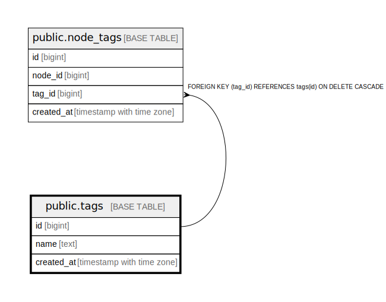

# public.tags

## Description

Hierarchical topic tags for flexible categorization using colon-delimited format

## Columns

| Name | Type | Default | Nullable | Children | Parents | Comment |
| ---- | ---- | ------- | -------- | -------- | ------- | ------- |
| id | bigint | nextval('tags_id_seq'::regclass) | false |  |  |  |
| node_id | bigint |  | false |  | [public.nodes](public.nodes.md) | ID of the node being tagged |
| tag | text |  | false |  |  | Hierarchical tag in format: root:level1:level2 (e.g., database:postgresql:timescaledb) |
| created_at | timestamp with time zone | CURRENT_TIMESTAMP | true |  |  | When this tag was created |

## Constraints

| Name | Type | Definition |
| ---- | ---- | ---------- |
| fk_rails_c2bba39827 | FOREIGN KEY | FOREIGN KEY (node_id) REFERENCES nodes(id) ON DELETE CASCADE |
| tags_pkey | PRIMARY KEY | PRIMARY KEY (id) |

## Indexes

| Name | Definition |
| ---- | ---------- |
| tags_pkey | CREATE UNIQUE INDEX tags_pkey ON public.tags USING btree (id) |
| idx_tags_unique | CREATE UNIQUE INDEX idx_tags_unique ON public.tags USING btree (node_id, tag) |
| idx_tags_node_id | CREATE INDEX idx_tags_node_id ON public.tags USING btree (node_id) |
| idx_tags_tag | CREATE INDEX idx_tags_tag ON public.tags USING btree (tag) |
| idx_tags_tag_pattern | CREATE INDEX idx_tags_tag_pattern ON public.tags USING btree (tag text_pattern_ops) |

## Relations

---

> Generated by [tbls](https://github.com/k1LoW/tbls)
