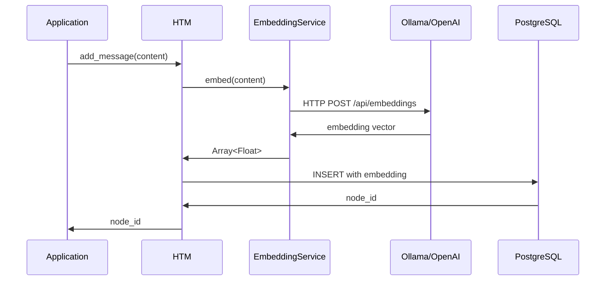

# EmbeddingService Class

Client-side embedding generation service for HTM.

## Overview

`HTM::EmbeddingService` generates vector embeddings for text content before database insertion. It supports multiple embedding providers:

- **Ollama** - Local embedding server (default, via `nomic-embed-text` model)
- **OpenAI** - OpenAI's `text-embedding-3-small` model

The service also provides token counting for working memory management.

**Architecture:**
- Ruby application generates embeddings via HTTP call to Ollama/OpenAI
- Embeddings are passed to PostgreSQL during INSERT
- Simple, reliable, cross-platform operation

## Class Definition

```ruby
class HTM::EmbeddingService
  attr_reader :provider, :model, :dimensions
end
```

## Initialization

### `new(provider, **options)` {: #new }

Create a new embedding service instance.

```ruby
HTM::EmbeddingService.new(
  provider = :ollama,
  model: 'nomic-embed-text',
  ollama_url: nil,
  dimensions: nil
)
```

#### Parameters

| Parameter | Type | Default | Description |
|-----------|------|---------|-------------|
| `provider` | Symbol | `:ollama` | Embedding provider (`:ollama`, `:openai`) |
| `model` | String | `'nomic-embed-text'` | Model name for the provider |
| `ollama_url` | String, nil | `ENV['OLLAMA_URL']` or `'http://localhost:11434'` | Ollama server URL |
| `dimensions` | Integer, nil | Auto-detected | Expected embedding dimensions |

#### Returns

`HTM::EmbeddingService` - Configured embedding service instance

#### Raises

- `HTM::EmbeddingError` - If provider is invalid or configuration fails

#### Examples

**Default Ollama configuration:**

```ruby
service = HTM::EmbeddingService.new
# Uses Ollama at http://localhost:11434 with nomic-embed-text (768 dimensions)
```

**Custom Ollama model:**

```ruby
service = HTM::EmbeddingService.new(
  :ollama,
  model: 'mxbai-embed-large',
  ollama_url: 'http://localhost:11434',
  dimensions: 1024
)
```

**OpenAI configuration:**

```ruby
# Requires OPENAI_API_KEY environment variable
service = HTM::EmbeddingService.new(
  :openai,
  model: 'text-embedding-3-small',
  dimensions: 1536
)
```

**HTM automatically initializes EmbeddingService:**

```ruby
htm = HTM.new(
  robot_name: "Assistant",
  embedding_provider: :ollama,
  embedding_model: 'nomic-embed-text'
)
# EmbeddingService configured automatically
```

---

## Instance Methods

### `embed(text)` {: #embed }

Generate embedding vector for text.

```ruby
embed(text) → Array<Float>
```

#### Parameters

| Parameter | Type | Description |
|-----------|------|-------------|
| `text` | String | Text to embed |

#### Returns

`Array<Float>` - Embedding vector (dimensions depend on model)

#### Raises

- `HTM::EmbeddingError` - If embedding generation fails
- `ArgumentError` - If text is nil or empty

#### Examples

```ruby
service = HTM::EmbeddingService.new(:ollama)

# Generate embedding
embedding = service.embed("PostgreSQL with TimescaleDB")
# => [0.023, -0.441, 0.182, ..., 0.091]  # 768 dimensions

puts embedding.length  # => 768 (for nomic-embed-text)
```

**Error handling:**

```ruby
begin
  embedding = service.embed("some text")
rescue HTM::EmbeddingError => e
  puts "Embedding failed: #{e.message}"
  # Check Ollama is running: curl http://localhost:11434/api/tags
end
```

#### Implementation Details

**Ollama provider:**
- Makes HTTP POST to `/api/embeddings`
- Returns dense vector representation
- Requires Ollama server running locally

**OpenAI provider:**
- Makes HTTP POST to OpenAI API
- Requires `OPENAI_API_KEY` environment variable
- API costs: $0.0001 per 1K tokens

---

### `count_tokens(text)` {: #count_tokens }

Count tokens in text for working memory management.

```ruby
count_tokens(text) → Integer
```

#### Parameters

| Parameter | Type | Description |
|-----------|------|-------------|
| `text` | String | Text to count tokens for |

#### Returns

`Integer` - Approximate token count

#### Examples

```ruby
service = HTM::EmbeddingService.new

tokens = service.count_tokens("Hello, world!")
# => 4

tokens = service.count_tokens("The quick brown fox jumps over the lazy dog")
# => 10
```

**Used internally by HTM:**

```ruby
htm.add_message(
  "This is a long conversation message...",
  speaker: "user"
)
# HTM calls embedding_service.count_tokens() internally
# to manage working memory token budget
```

---

## Embedding Providers

### Ollama (Default)

**Status**: ✅ Fully implemented

Local embedding server with various models, accessed via HTTP.

**Installation:**

```bash
# macOS/Linux
curl https://ollama.ai/install.sh | sh

# Pull embedding model
ollama pull nomic-embed-text
```

**Models:**

| Model | Dimensions | Speed | Use Case |
|-------|------------|-------|----------|
| `nomic-embed-text` | 768 | Fast | General-purpose (default) |
| `mxbai-embed-large` | 1024 | Medium | Higher quality embeddings |
| `all-minilm` | 384 | Very fast | Lower quality, fast search |

**Configuration:**

```ruby
service = HTM::EmbeddingService.new(
  :ollama,
  model: 'nomic-embed-text',
  ollama_url: 'http://localhost:11434'
)

embedding = service.embed("test text")
```

**Troubleshooting:**

If Ollama is unavailable, embedding generation will fail:

```ruby
# Check Ollama is running
system("curl http://localhost:11434/api/tags")

# Start Ollama if needed
system("ollama serve")
```

**Advantages:**
- ✅ Free (no API costs)
- ✅ Private (data never leaves your machine)
- ✅ Fast (local generation)
- ✅ Works offline

**Disadvantages:**
- ❌ Requires local installation
- ❌ Uses local compute resources
- ❌ Slightly lower quality than OpenAI

---

### OpenAI

**Status**: ✅ Fully implemented

Uses OpenAI's embedding API, accessed via HTTP.

**Configuration:**

```bash
export OPENAI_API_KEY="sk-..."
```

```ruby
service = HTM::EmbeddingService.new(
  :openai,
  model: 'text-embedding-3-small'
)

# Add message - embedding generated via OpenAI API
embedding = service.embed("test text")
```

**Models:**

| Model | Dimensions | Speed | Cost |
|-------|------------|-------|------|
| `text-embedding-3-small` | 1536 | Fast | $0.0001/1K tokens |
| `text-embedding-ada-002` | 1536 | Fast | $0.0001/1K tokens |

**Error Handling:**

```ruby
begin
  service = HTM::EmbeddingService.new(:openai)
  embedding = service.embed("test")
rescue HTM::EmbeddingError => e
  if e.message.include?("API key")
    puts "Set OPENAI_API_KEY environment variable"
  end
end
```

**Advantages:**
- ✅ High quality embeddings
- ✅ No local installation required
- ✅ Managed service

**Disadvantages:**
- ❌ API costs ($0.0001 per 1K tokens)
- ❌ Requires internet connection
- ❌ Data sent to OpenAI servers
- ❌ Requires API key management

---

## Error Handling

### Common Errors

**Ollama not running:**

```ruby
# Error: Failed to connect to Ollama
# Solution: Start Ollama
system("ollama serve")
```

**OpenAI API key missing:**

```ruby
# Error: OPENAI_API_KEY not set
# Solution: Set environment variable
ENV['OPENAI_API_KEY'] = 'sk-...'
```

**Invalid model:**

```ruby
# Error: Model not found
# Solution: Pull the model first
system("ollama pull nomic-embed-text")
```

### Exception Types

```ruby
HTM::EmbeddingError
  ├─ "Ollama connection failed"
  ├─ "OpenAI API error: ..."
  ├─ "Invalid model: ..."
  └─ "Empty text provided"
```

---

## Performance

### Latency Benchmarks

Based on typical production workloads:

| Provider | Model | Latency (P50) | Latency (P95) | Cost per 1K embeds |
|----------|-------|---------------|---------------|---------------------|
| Ollama | nomic-embed-text | 20ms | 40ms | Free |
| Ollama | mxbai-embed-large | 30ms | 60ms | Free |
| OpenAI | text-embedding-3-small | 40ms | 80ms | $0.10 |

**Factors affecting latency:**
- Network latency (Ollama local vs OpenAI remote)
- Text length (longer text = more tokens = slower)
- Model size (larger models = slower)
- System load (CPU/GPU utilization)

### Optimization Tips

**Use appropriate model size:**

```ruby
# Fast but lower quality
service = HTM::EmbeddingService.new(:ollama, model: 'all-minilm')

# Balanced (recommended)
service = HTM::EmbeddingService.new(:ollama, model: 'nomic-embed-text')

# Slower but higher quality
service = HTM::EmbeddingService.new(:ollama, model: 'mxbai-embed-large')
```

**Batch operations:**

```ruby
# HTM automatically generates embeddings for each message
# No special batching API needed
messages.each do |msg|
  htm.add_message(msg, speaker: "user")
  # Embedding generated for each message
end
```

---

## Integration with HTM

### Automatic Initialization

HTM initializes `EmbeddingService` automatically:

```ruby
htm = HTM.new(
  robot_name: "Assistant",
  embedding_provider: :ollama,        # Optional, default
  embedding_model: 'nomic-embed-text' # Optional, default
)

# EmbeddingService is ready to use internally
```

### Embedding Generation Flow



### Query Embedding

Search queries also generate embeddings:

```ruby
# User searches for "database performance"
results = htm.recall(
  timeframe: "last week",
  topic: "database performance",
  strategy: :vector
)

# Internally:
# 1. embedding_service.embed("database performance")
# 2. SQL vector search using embedding
# 3. Return similar nodes
```

---

## Examples

### Basic Usage

```ruby
require 'htm'

# Create service
service = HTM::EmbeddingService.new(:ollama)

# Generate embedding
text = "PostgreSQL with TimescaleDB handles time-series data efficiently"
embedding = service.embed(text)

puts "Embedding dimensions: #{embedding.length}"
puts "First 5 values: #{embedding[0..4]}"

# Count tokens
tokens = service.count_tokens(text)
puts "Token count: #{tokens}"
```

### Multiple Providers

```ruby
# Ollama for development
dev_service = HTM::EmbeddingService.new(
  :ollama,
  model: 'nomic-embed-text'
)

# OpenAI for production
prod_service = HTM::EmbeddingService.new(
  :openai,
  model: 'text-embedding-3-small'
)

# Same interface
dev_embedding = dev_service.embed("test")
prod_embedding = prod_service.embed("test")
```

### Custom Model Dimensions

```ruby
# Specify dimensions explicitly
service = HTM::EmbeddingService.new(
  :ollama,
  model: 'custom-model',
  dimensions: 512
)

embedding = service.embed("text")
# Embedding will be padded/truncated to 512 dimensions
```

---

## See Also

- [HTM API](htm.md) - Main HTM class
- [LongTermMemory API](long-term-memory.md) - Storage layer
- [ADR-003: Ollama Embeddings](../architecture/adrs/003-ollama-embeddings.md) - Architecture decision
- [Ollama Documentation](https://ollama.ai/docs) - Ollama setup guide
- [OpenAI Embeddings](https://platform.openai.com/docs/guides/embeddings) - OpenAI API docs
