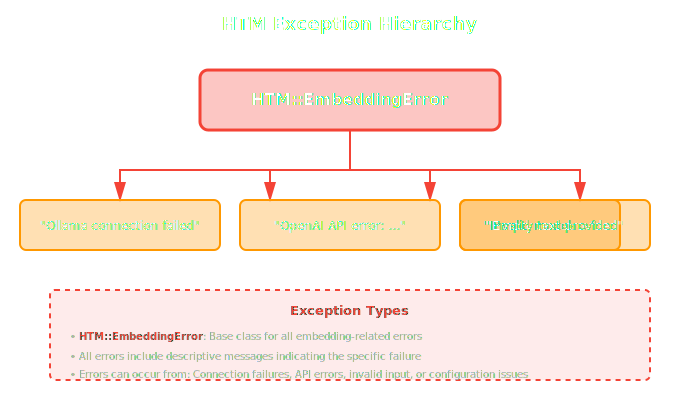
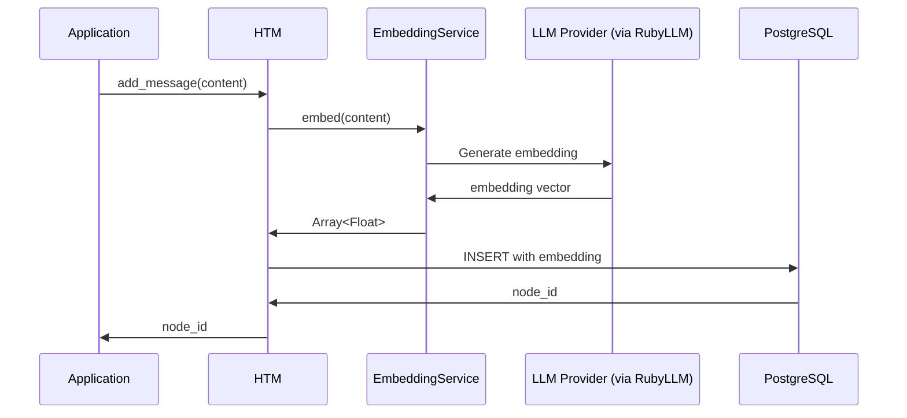

# EmbeddingService Class

Client-side embedding generation service for HTM.

## Overview

`HTM::EmbeddingService` generates vector embeddings for text content before database insertion. It uses RubyLLM to support multiple embedding providers:

- **Ollama** - Local embedding server (default for development)
- **OpenAI** - OpenAI's embedding models
- **Anthropic** - For tag extraction (via chat models)
- **Gemini** - Google's embedding models
- **Azure** - Azure OpenAI deployments
- **Bedrock** - AWS Bedrock models
- **DeepSeek** - DeepSeek embeddings

The service also provides token counting for working memory management.

**Architecture:**
- Ruby application generates embeddings via RubyLLM
- RubyLLM handles provider-specific API calls
- Embeddings are passed to PostgreSQL during INSERT
- Simple, reliable, cross-platform operation

## Class Definition

```ruby
class HTM::EmbeddingService
  attr_reader :provider, :model, :dimensions
end
```

## Initialization

### `new(provider, **options)` {: #new }

Create a new embedding service instance.

```ruby
HTM::EmbeddingService.new(
  provider = :ollama,
  model: 'nomic-embed-text',
  dimensions: nil
)
```

#### Parameters

| Parameter | Type | Default | Description |
|-----------|------|---------|-------------|
| `provider` | Symbol | `:ollama` | Embedding provider (`:ollama`, `:openai`, `:gemini`, `:azure`, `:bedrock`, `:deepseek`) |
| `model` | String | Provider-dependent | Model name for the provider |
| `dimensions` | Integer, nil | Auto-detected | Expected embedding dimensions |

**Provider-specific configuration** is handled via environment variables (see RubyLLM documentation).

#### Returns

`HTM::EmbeddingService` - Configured embedding service instance

#### Raises

- `HTM::EmbeddingError` - If provider is invalid or configuration fails

#### Examples

**Default configuration (uses Ollama):**

```ruby
service = HTM::EmbeddingService.new
# Uses Ollama with nomic-embed-text (768 dimensions)
```

**Ollama with custom model:**

```ruby
service = HTM::EmbeddingService.new(
  :ollama,
  model: 'mxbai-embed-large',
  dimensions: 1024
)
```

**OpenAI configuration:**

```ruby
# Requires OPENAI_API_KEY environment variable
service = HTM::EmbeddingService.new(
  :openai,
  model: 'text-embedding-3-small',
  dimensions: 1536
)
```

**Gemini configuration:**

```ruby
# Requires GEMINI_API_KEY environment variable
service = HTM::EmbeddingService.new(
  :gemini,
  model: 'text-embedding-004',
  dimensions: 768
)
```

**HTM global configuration (recommended):**

```ruby
HTM.configure do |config|
  config.embedding.provider = :openai  # or :ollama, :gemini, etc.
  config.embedding.model = 'text-embedding-3-small'
end

htm = HTM.new(robot_name: "Assistant")
# EmbeddingService configured automatically from global config
```

---

## Instance Methods

### `embed(text)` {: #embed }

Generate embedding vector for text.

```ruby
embed(text) → Array<Float>
```

#### Parameters

| Parameter | Type | Description |
|-----------|------|-------------|
| `text` | String | Text to embed |

#### Returns

`Array<Float>` - Embedding vector (dimensions depend on model)

#### Raises

- `HTM::EmbeddingError` - If embedding generation fails
- `ArgumentError` - If text is nil or empty

#### Examples

```ruby
service = HTM::EmbeddingService.new(:ollama)

# Generate embedding
embedding = service.embed("PostgreSQL with TimescaleDB")
# => [0.023, -0.441, 0.182, ..., 0.091]  # 768 dimensions

puts embedding.length  # => 768 (for nomic-embed-text)
```

**Error handling:**

```ruby
begin
  embedding = service.embed("some text")
rescue HTM::EmbeddingError => e
  puts "Embedding failed: #{e.message}"
  # For Ollama: Check if running with `curl http://localhost:11434/api/tags`
  # For cloud providers: Check API key is set correctly
end
```

#### Implementation Details

All providers are handled through RubyLLM, which provides a consistent interface across providers.

**Ollama:** Local HTTP calls, requires Ollama server running

**OpenAI:** Cloud API calls, requires `OPENAI_API_KEY`

**Gemini:** Cloud API calls, requires `GEMINI_API_KEY`

**Azure:** Cloud API calls, requires Azure credentials

**Bedrock:** AWS API calls, requires AWS credentials

---

### `count_tokens(text)` {: #count_tokens }

Count tokens in text for working memory management.

```ruby
count_tokens(text) → Integer
```

#### Parameters

| Parameter | Type | Description |
|-----------|------|-------------|
| `text` | String | Text to count tokens for |

#### Returns

`Integer` - Approximate token count

#### Examples

```ruby
service = HTM::EmbeddingService.new

tokens = service.count_tokens("Hello, world!")
# => 4

tokens = service.count_tokens("The quick brown fox jumps over the lazy dog")
# => 10
```

**Used internally by HTM:**

```ruby
htm.add_message(
  "This is a long conversation message...",
  speaker: "user"
)
# HTM calls embedding_service.count_tokens() internally
# to manage working memory token budget
```

---

## Embedding Providers

HTM uses RubyLLM which supports multiple providers. Choose based on your requirements for privacy, cost, and quality.

### Ollama (Default for Development)

**Status**: ✅ Fully implemented

Local embedding server with various models.

**Installation:**

```bash
# macOS/Linux
curl https://ollama.ai/install.sh | sh

# Pull embedding model
ollama pull nomic-embed-text
```

**Models:**

| Model | Dimensions | Speed | Use Case |
|-------|------------|-------|----------|
| `nomic-embed-text` | 768 | Fast | General-purpose (default) |
| `mxbai-embed-large` | 1024 | Medium | Higher quality embeddings |
| `all-minilm` | 384 | Very fast | Lower quality, fast search |

**Configuration:**

```ruby
HTM.configure do |config|
  config.embedding.provider = :ollama
  config.embedding.model = 'nomic-embed-text'
end
```

**Advantages:**
- ✅ Free (no API costs)
- ✅ Private (data never leaves your machine)
- ✅ Fast (local generation)
- ✅ Works offline

**Disadvantages:**
- ❌ Requires local installation
- ❌ Uses local compute resources

---

### OpenAI (Recommended for Production)

**Status**: ✅ Fully implemented

Uses OpenAI's embedding API.

**Configuration:**

```bash
export OPENAI_API_KEY="sk-..."
```

```ruby
HTM.configure do |config|
  config.embedding.provider = :openai
  config.embedding.model = 'text-embedding-3-small'
end
```

**Models:**

| Model | Dimensions | Speed | Cost |
|-------|------------|-------|------|
| `text-embedding-3-small` | 1536 | Fast | $0.0001/1K tokens |
| `text-embedding-3-large` | 3072 | Fast | $0.00013/1K tokens |

**Advantages:**
- ✅ High quality embeddings
- ✅ No local installation required
- ✅ Managed service

**Disadvantages:**
- ❌ API costs
- ❌ Requires internet connection
- ❌ Data sent to cloud

---

### Other Providers

**Gemini:**
```bash
export GEMINI_API_KEY="..."
```
```ruby
HTM.configure do |config|
  config.embedding.provider = :gemini
  config.embedding.model = 'text-embedding-004'
end
```

**Azure OpenAI:**
```bash
export AZURE_OPENAI_API_KEY="..."
export AZURE_OPENAI_ENDPOINT="https://your-resource.openai.azure.com"
```

**AWS Bedrock:**
```bash
export AWS_ACCESS_KEY_ID="..."
export AWS_SECRET_ACCESS_KEY="..."
export AWS_REGION="us-east-1"
```

**DeepSeek:**
```bash
export DEEPSEEK_API_KEY="..."
```

See the [RubyLLM documentation](https://rubyllm.com/) for complete provider configuration.

---

## Error Handling

### Common Errors

**Ollama not running:**

```ruby
# Error: Failed to connect to Ollama
# Solution: Start Ollama
system("ollama serve")
```

**API key missing (cloud providers):**

```ruby
# Error: API key not set
# Solution: Set environment variable
ENV['OPENAI_API_KEY'] = 'sk-...'     # For OpenAI
ENV['ANTHROPIC_API_KEY'] = 'sk-...'  # For Anthropic
ENV['GEMINI_API_KEY'] = '...'        # For Gemini
```

**Invalid model (Ollama):**

```ruby
# Error: Model not found
# Solution: Pull the model first
system("ollama pull nomic-embed-text")
```

### Exception Types



---

## Performance

### Latency Benchmarks

Based on typical production workloads:

| Provider | Model | Latency (P50) | Latency (P95) | Cost per 1K embeds |
|----------|-------|---------------|---------------|---------------------|
| Ollama | nomic-embed-text | 20ms | 40ms | Free |
| Ollama | mxbai-embed-large | 30ms | 60ms | Free |
| OpenAI | text-embedding-3-small | 40ms | 80ms | $0.10 |
| Gemini | text-embedding-004 | 50ms | 90ms | Varies |

**Factors affecting latency:**
- Network latency (local providers vs cloud)
- Text length (longer text = more tokens = slower)
- Model size (larger models = slower)
- System load (CPU/GPU utilization)

### Optimization Tips

**Use appropriate model size:**

```ruby
# Fast but lower quality (Ollama)
HTM.configure { |c| c.embedding.model = 'all-minilm' }

# Balanced - Ollama (recommended for development)
HTM.configure { |c| c.embedding.model = 'nomic-embed-text' }

# High quality - OpenAI (recommended for production)
HTM.configure do |c|
  c.embedding.provider = :openai
  c.embedding.model = 'text-embedding-3-small'
end
```

**Batch operations:**

```ruby
# HTM automatically generates embeddings for each message
# No special batching API needed
messages.each do |msg|
  htm.add_message(msg, speaker: "user")
  # Embedding generated for each message
end
```

---

## Integration with HTM

### Automatic Initialization

HTM initializes `EmbeddingService` automatically:

```ruby
HTM.configure do |config|
  config.embedding.provider = :ollama  # or :openai, :gemini, etc.
  config.embedding.model = 'nomic-embed-text'
end

htm = HTM.new(robot_name: "Assistant")
# EmbeddingService is ready to use internally
```

### Embedding Generation Flow



### Query Embedding

Search queries also generate embeddings:

```ruby
# User searches for "database performance"
results = htm.recall(
  timeframe: "last week",
  topic: "database performance",
  strategy: :vector
)

# Internally:
# 1. embedding_service.embed("database performance")
# 2. SQL vector search using embedding
# 3. Return similar nodes
```

---

## Examples

### Basic Usage

```ruby
require 'htm'

# Create service
service = HTM::EmbeddingService.new(:ollama)

# Generate embedding
text = "PostgreSQL with TimescaleDB handles time-series data efficiently"
embedding = service.embed(text)

puts "Embedding dimensions: #{embedding.length}"
puts "First 5 values: #{embedding[0..4]}"

# Count tokens
tokens = service.count_tokens(text)
puts "Token count: #{tokens}"
```

### Multiple Providers

```ruby
# Configure for development (Ollama)
HTM.configure do |config|
  config.embedding.provider = :ollama
  config.embedding.model = 'nomic-embed-text'
end

# Configure for production (OpenAI)
HTM.configure do |config|
  config.embedding.provider = :openai
  config.embedding.model = 'text-embedding-3-small'
end

# Same interface regardless of provider
embedding = HTM::EmbeddingService.new.embed("test")
```

### Custom Model Dimensions

```ruby
# Specify dimensions explicitly
service = HTM::EmbeddingService.new(
  :ollama,
  model: 'custom-model',
  dimensions: 512
)

embedding = service.embed("text")
# Embedding will be padded/truncated to 512 dimensions
```

---

## See Also

- [HTM API](htm.md) - Main HTM class
- [LongTermMemory API](long-term-memory.md) - Storage layer
- [ADR-003: Default Embedding Provider](../architecture/adrs/003-ollama-embeddings.md) - Architecture decision for defaults
- [RubyLLM Documentation](https://rubyllm.com/) - Multi-provider LLM interface
- [Ollama Documentation](https://ollama.ai/docs) - Local LLM provider
- [OpenAI Embeddings](https://platform.openai.com/docs/guides/embeddings) - Cloud embeddings
