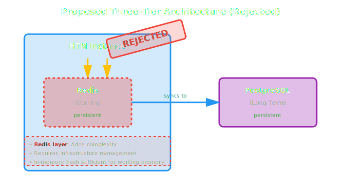

# ADR-010: Redis-Based Working Memory (Rejected)

**Status**: Rejected

**Date**: 2025-10-25

**Decision Makers**: Dewayne VanHoozer, Claude (Anthropic)

---

## Quick Summary

**Proposal**: Add Redis as a persistent storage layer for working memory, creating a three-tier architecture (Working Memory in Redis, Long-term Memory in PostgreSQL, with in-process caching).

**Decision**: **REJECTED** - Keep the current two-tier architecture with in-memory working memory.

**Why Rejected**: Redis adds complexity, cost, and failure modes without solving a proven problem. PostgreSQL already provides durability, and working memory's ephemeral nature is a feature, not a bug.

**Impact**: Avoiding unnecessary complexity while maintaining simplicity, performance, and reliability.

---

## Context

### Motivation for Consideration

During architectural review, we identified that working memory is currently volatile (in-process Ruby hash) and loses state on process restart. This raised the question:

> "Should working memory persist across restarts using Redis?"

### Current Architecture (Two-Tier)


**How it works**:
1. `add_node()` saves **immediately** to PostgreSQL
2. Node is **also** added to working memory (cache)
3. Working memory evicts old nodes when full
4. Eviction **only removes from cache** - data remains in PostgreSQL

**Key insight**: Working memory is a **write-through cache**, not the source of truth.

### Proposed Architecture (Three-Tier)



**Proposed changes**:
- Store working memory in Redis (shared across processes)
- Persist working memory state across restarts
- Allow multi-process working memory sharing
- Optional flush strategies (on-demand, auto-exit, periodic)

---

## Analysis

### Perceived Benefits (Why We Considered It)

1. **Persistence Across Restarts**
   - Working memory survives process crashes
   - Can resume conversations exactly where left off

2. **Multi-Process Sharing**
   - Multiple HTM instances can share hot context
   - "Hive mind" working memory across robots

3. **Larger Capacity**
   - Not limited by process memory (~2GB)
   - Could scale to 10s-100s of GB in Redis

4. **External Observability**
   - Inspect working memory via `redis-cli`
   - Monitor access patterns externally

### Actual Drawbacks (Why We Rejected It)

#### 1. **Adds Complexity Without Clear Benefit**

| Aspect | Current | With Redis |
|--------|---------|------------|
| Dependencies | PostgreSQL only | PostgreSQL + Redis |
| Failure Modes | 1 database | 2 databases |
| Deployment | Single service | Multiple services |
| Configuration | Simple | Complex (URLs, pools, namespaces) |
| Debugging | Straightforward | More moving parts |

#### 2. **PostgreSQL Already Solves the Problem**

**Restart recovery is trivial**:
```ruby
# On restart, rebuild working memory from PostgreSQL
htm = HTM.new(robot_name: "Assistant")

recent_memories = htm.recall(
  timeframe: "last 10 minutes",
  topic: "",
  limit: 50
)
# ↑ Automatically added to working memory
```

**Multi-process sharing already works**:
```ruby
# Process A
htm_a.add_node("decision", "Use PostgreSQL")
# → Saved to PostgreSQL

# Process B (different process)
memories = htm_b.recall(timeframe: "last minute", topic: "PostgreSQL")
# → Retrieved from PostgreSQL, added to Process B's working memory
```

The "hive mind" already exists via shared PostgreSQL!

#### 3. **Performance Penalty**

| Operation | In-Memory | Redis (Local) | Redis (Network) |
|-----------|-----------|---------------|-----------------|
| `add()` | ~0.001ms | ~0.5ms | ~5ms |
| `get()` | ~0.001ms | ~0.5ms | ~5ms |
| Network overhead | None | TCP localhost | TCP network |

**100-500x slower** for working memory operations, even locally.

#### 4. **Working Memory is *Supposed* to be Ephemeral**

The whole design philosophy:
- **Token-limited** (128k) for LLM context windows
- **Fast access** for immediate context
- **Disposable** - it's a performance optimization

Making it persistent contradicts its purpose!

#### 5. **Operational Burden**

**Additional costs**:
- Redis server hosting/management
- Memory allocation for Redis
- Monitoring Redis health
- Backup/recovery for Redis
- Network configuration
- Connection pool tuning

**Additional failure scenarios**:
- Redis connection failures
- Redis out of memory
- Redis network partitions
- Redis data corruption
- Synchronization issues between Redis and PostgreSQL

#### 6. **YAGNI (You Aren't Gonna Need It)**

No proven requirement for:
- Sub-millisecond working memory access across processes
- Exact working memory state preservation across crashes
- Real-time synchronization of working memory between instances

This is **premature optimization** solving a hypothetical problem.

---

## Decision

**We will NOT implement Redis-based working memory.**

We will **maintain the current two-tier architecture**:
- **Working Memory**: In-memory Ruby hash (volatile)
- **Long-term Memory**: PostgreSQL (durable)

---

## Rationale

### Why the Current Design is Sufficient

1. **Data is Already Safe**
   - All nodes are immediately persisted to PostgreSQL
   - Working memory is just a cache
   - Nothing is lost on restart except cache state

2. **Restart Recovery is Fast**
   - Rebuild working memory via `recall()`
   - Takes milliseconds to query recent context
   - No need for persistent cache state

3. **Multi-Process Works Today**
   - Processes share via PostgreSQL
   - No real-time synchronization needed
   - Each process maintains its own hot cache

4. **Simplicity Wins**
   - One database (PostgreSQL)
   - One failure mode
   - Easy to understand and debug
   - Lower operational cost

5. **Performance is Excellent**
   - In-memory hash: <1ms operations
   - PostgreSQL: 10-50ms queries (acceptable)
   - No need for Redis middle layer

### When Redis *Might* Make Sense (Future)

We'll reconsider if we encounter:
- **Proven requirement** for cross-process hot memory sharing
- **Measured performance problem** with PostgreSQL recall
- **Specific use case** needing persistent working memory state
- **User demand** for this feature

Until then: **YAGNI**.

---

## Consequences

### Positive

✅ **Simplicity maintained**
- Single database dependency
- Straightforward architecture
- Easy to understand and debug

✅ **Lower operational cost**
- No Redis hosting
- No Redis management
- Fewer failure modes

✅ **Better performance**
- In-memory working memory is fastest possible
- No network overhead

✅ **Sufficient for use cases**
- All data persisted in PostgreSQL
- Multi-process sharing via PostgreSQL
- Fast restart recovery

### Negative (Accepted Trade-offs)

❌ **Working memory lost on crash**
- **Mitigation**: Rebuild via `recall()` in <1 second
- **Impact**: Minimal - data is safe in PostgreSQL

❌ **No real-time cross-process working memory**
- **Mitigation**: Processes share via PostgreSQL
- **Impact**: Acceptable - no proven requirement

❌ **Limited by process memory**
- **Mitigation**: 128k token limit is sufficient for LLM context
- **Impact**: None - this is by design

---

## Alternatives Considered

### Alternative 1: Hybrid L1/L2 Caching
- L1: In-memory (hot data)
- L2: Redis (warm data)
- **Rejected**: Even more complexity for minimal gain

### Alternative 2: PostgreSQL UNLOGGED Tables
- Use unlogged PostgreSQL tables for working memory
- Faster writes, but not crash-safe
- **Rejected**: Still slower than in-memory, adds DB complexity

### Alternative 3: Shared Memory (IPC)
- Use OS shared memory for cross-process working memory
- **Rejected**: Platform-specific, complex, limited use case

---

## References

- **Discussion**: `/tmp/redis_working_memory_architecture.md`
- **Related ADR**: ADR-002 (Two-Tier Memory Architecture)
- **Architecture Review**: `ARCHITECTURE_REVIEW.md`
- **GitHub Issues**: #1-#10 (focus on proven improvements)

---

## Lessons Learned

1. **Question assumptions**: "Working memory is volatile" seemed like a problem, but it's actually by design
2. **PostgreSQL is powerful**: Already provides durability, querying, and sharing
3. **Simplicity has value**: Adding Redis would double complexity for minimal real benefit
4. **YAGNI applies**: Solve proven problems, not hypothetical ones
5. **Architecture reviews are valuable**: Thoroughly analyzing alternatives leads to better decisions (even when the decision is "no")

---

## Future Review

This decision should be revisited if:
- User requests for persistent working memory
- Measured performance problems with PostgreSQL recall
- Multi-process real-time sharing becomes a requirement
- Benchmarks show significant benefit to Redis caching

Until then, this decision stands: **Keep it simple. Trust PostgreSQL.**
