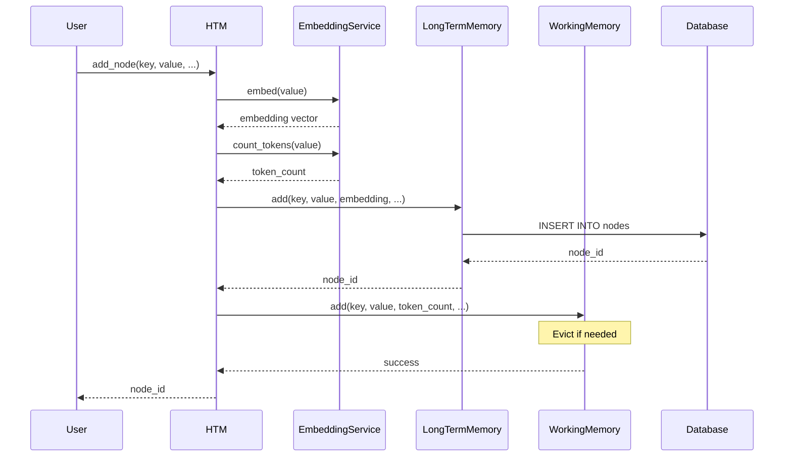
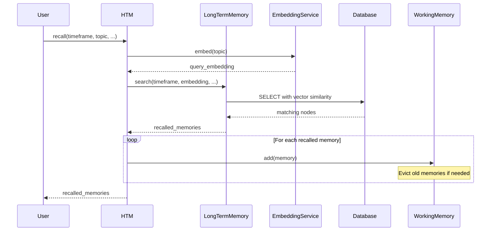
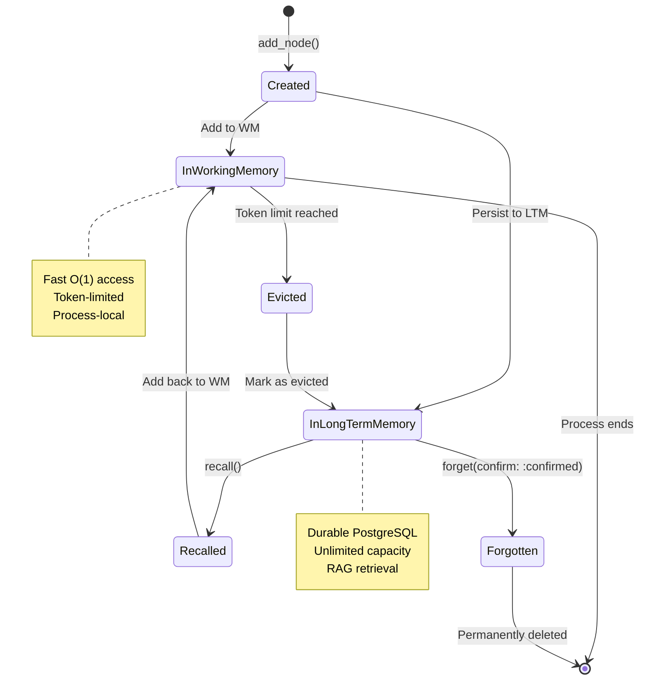

# Architecture Overview

HTM (Hierarchical Temporary Memory) implements a sophisticated two-tier memory system designed specifically for LLM-based applications ("robots"). This architecture enables robots to maintain long-term context across sessions while managing token budgets efficiently.

## System Overview

HTM provides intelligent memory management through five core components that work together to deliver persistent, searchable, and context-aware memory for AI agents.

<svg viewBox="0 0 800 600" xmlns="http://www.w3.org/2000/svg" style="background: transparent;">
  <!-- HTM Core -->
  <rect x="300" y="50" width="200" height="80" fill="rgba(76, 175, 80, 0.2)" stroke="#4CAF50" stroke-width="2" rx="5"/>
  <text x="400" y="85" text-anchor="middle" fill="#E0E0E0" font-size="16" font-weight="bold">HTM</text>
  <text x="400" y="105" text-anchor="middle" fill="#B0B0B0" font-size="12">Coordination Layer</text>

  <!-- Working Memory -->
  <rect x="50" y="200" width="200" height="120" fill="rgba(33, 150, 243, 0.2)" stroke="#2196F3" stroke-width="2" rx="5"/>
  <text x="150" y="235" text-anchor="middle" fill="#E0E0E0" font-size="14" font-weight="bold">Working Memory</text>
  <text x="150" y="255" text-anchor="middle" fill="#B0B0B0" font-size="11">Token-Limited</text>
  <text x="150" y="275" text-anchor="middle" fill="#B0B0B0" font-size="11">In-Memory</text>
  <text x="150" y="295" text-anchor="middle" fill="#B0B0B0" font-size="11">LRU Eviction</text>

  <!-- Long-Term Memory -->
  <rect x="300" y="200" width="200" height="120" fill="rgba(156, 39, 176, 0.2)" stroke="#9C27B0" stroke-width="2" rx="5"/>
  <text x="400" y="235" text-anchor="middle" fill="#E0E0E0" font-size="14" font-weight="bold">Long-Term Memory</text>
  <text x="400" y="255" text-anchor="middle" fill="#B0B0B0" font-size="11">PostgreSQL</text>
  <text x="400" y="275" text-anchor="middle" fill="#B0B0B0" font-size="11">Unlimited Capacity</text>
  <text x="400" y="295" text-anchor="middle" fill="#B0B0B0" font-size="11">Durable Storage</text>

  <!-- Embedding Service -->
  <rect x="550" y="200" width="200" height="120" fill="rgba(255, 152, 0, 0.2)" stroke="#FF9800" stroke-width="2" rx="5"/>
  <text x="650" y="235" text-anchor="middle" fill="#E0E0E0" font-size="14" font-weight="bold">Embedding Service</text>
  <text x="650" y="255" text-anchor="middle" fill="#B0B0B0" font-size="11">Ollama/OpenAI</text>
  <text x="650" y="275" text-anchor="middle" fill="#B0B0B0" font-size="11">Vector Embeddings</text>
  <text x="650" y="295" text-anchor="middle" fill="#B0B0B0" font-size="11">Semantic Search</text>

  <!-- Database -->
  <rect x="300" y="380" width="200" height="120" fill="rgba(244, 67, 54, 0.2)" stroke="#F44336" stroke-width="2" rx="5"/>
  <text x="400" y="415" text-anchor="middle" fill="#E0E0E0" font-size="14" font-weight="bold">Database</text>
  <text x="400" y="435" text-anchor="middle" fill="#B0B0B0" font-size="11">PostgreSQL 16+</text>
  <text x="400" y="455" text-anchor="middle" fill="#B0B0B0" font-size="11">TimescaleDB</text>
  <text x="400" y="475" text-anchor="middle" fill="#B0B0B0" font-size="11">pgvector + pg_trgm</text>

  <!-- Connections -->
  <line x1="400" y1="130" x2="150" y2="200" stroke="#2196F3" stroke-width="2"/>
  <line x1="400" y1="130" x2="400" y2="200" stroke="#9C27B0" stroke-width="2"/>
  <line x1="400" y1="130" x2="650" y2="200" stroke="#FF9800" stroke-width="2"/>
  <line x1="400" y1="320" x2="400" y2="380" stroke="#F44336" stroke-width="2"/>

  <!-- Labels -->
  <text x="275" y="170" fill="#B0B0B0" font-size="10">manages</text>
  <text x="410" y="170" fill="#B0B0B0" font-size="10">persists</text>
  <text x="520" y="170" fill="#B0B0B0" font-size="10">generates</text>
  <text x="420" y="360" fill="#B0B0B0" font-size="10">stores</text>

  <!-- Data Flow Arrows -->
  <defs>
    <marker id="arrowhead" markerWidth="10" markerHeight="10" refX="9" refY="3" orient="auto">
      <polygon points="0 0, 10 3, 0 6" fill="#4CAF50"/>
    </marker>
  </defs>

  <text x="20" y="540" fill="#4CAF50" font-size="12" font-weight="bold">Data Flow:</text>
  <text x="20" y="560" fill="#B0B0B0" font-size="11">Add Memory → Working Memory → Long-Term Memory (persistent)</text>
  <text x="20" y="580" fill="#B0B0B0" font-size="11">Recall → Long-Term (RAG search) → Working Memory (evict if needed)</text>
</svg>

## Core Components

### HTM (Main Interface)

The HTM class is the primary interface for memory operations. It coordinates between working memory, long-term memory, and embedding services to provide a unified API.

**Key Responsibilities:**

- Initialize and coordinate all memory subsystems
- Manage robot identification and registration
- Generate embeddings for new memories
- Orchestrate recall operations with RAG-based retrieval
- Assemble context for LLM consumption
- Track memory statistics and robot activity

**Related ADRs:** [ADR-002](adrs/002-two-tier-memory.md), [ADR-008](adrs/008-robot-identification.md)

### Working Memory

Token-limited, in-memory storage for active conversation context. Working memory acts as a fast cache for recently accessed or highly important memories that the LLM needs immediate access to.

**Characteristics:**

- **Capacity:** Token-limited (default: 128,000 tokens)
- **Storage:** Ruby Hash (in-memory)
- **Eviction:** Hybrid importance + recency (LRU-based)
- **Lifetime:** Process lifetime
- **Access Time:** O(1) hash lookups

**Related ADRs:** [ADR-002](adrs/002-two-tier-memory.md), [ADR-007](adrs/007-eviction-strategy.md)

### Long-Term Memory

Durable PostgreSQL storage for permanent knowledge retention. All memories are stored here permanently unless explicitly deleted.

**Characteristics:**

- **Capacity:** Effectively unlimited
- **Storage:** PostgreSQL with TimescaleDB extension
- **Retention:** Permanent (explicit deletion only)
- **Access Pattern:** RAG-based retrieval (semantic + temporal)
- **Lifetime:** Forever

**Related ADRs:** [ADR-001](adrs/001-postgresql-timescaledb.md), [ADR-005](adrs/005-rag-retrieval.md)

### Embedding Service

Generates vector embeddings for semantic search and manages token counting for memory management.

**Supported Providers:**

- **Ollama** (default): Local embedding models (gpt-oss, nomic-embed-text, mxbai-embed-large)
- **OpenAI**: text-embedding-3-small, text-embedding-3-large
- **Cohere**: embed-english-v3.0, embed-multilingual-v3.0
- **Local**: Transformers.js for browser/edge deployment

**Related ADRs:** [ADR-003](adrs/003-ollama-embeddings.md)

### Database

PostgreSQL 16+ with extensions for time-series optimization, vector similarity search, and full-text search.

**Key Extensions:**

- **TimescaleDB**: Hypertable partitioning, compression policies, time-range optimization
- **pgvector**: Vector similarity search with HNSW indexing
- **pg_trgm**: Trigram-based fuzzy text matching

**Related ADRs:** [ADR-001](adrs/001-postgresql-timescaledb.md)

## Component Interaction Flow

### Adding a Memory

### Recalling Memories

## Key Architectural Principles

### 1. Never Forget (Unless Told)

HTM implements a "never forget" philosophy. Eviction from working memory moves data to long-term storage, it doesn't delete it. Only explicit `forget(key, confirm: :confirmed)` operations delete data.

!!! info "Design Principle"
    Memory eviction is about managing working memory tokens, not data deletion. All evicted memories remain searchable and recallable from long-term storage.

**Related ADRs:** [ADR-009](adrs/009-never-forget.md)

### 2. Two-Tier Memory Hierarchy

Working memory provides fast O(1) access to recent/important context, while long-term memory provides unlimited durable storage with RAG-based retrieval.

!!! success "Performance Benefit"
    This architecture balances the competing needs of fast access (working memory) and unlimited retention (long-term memory).

**Related ADRs:** [ADR-002](adrs/002-two-tier-memory.md)

### 3. Hive Mind Architecture

All robots share a global long-term memory database, enabling cross-robot learning and context continuity. Each robot maintains its own working memory for process isolation.

!!! tip "Multi-Robot Collaboration"
    Knowledge gained by one robot benefits all robots. Users never need to repeat information across sessions or robots.

**Related ADRs:** [ADR-004](adrs/004-hive-mind.md)

### 4. RAG-Based Retrieval

HTM uses Retrieval-Augmented Generation patterns with hybrid search strategies combining semantic similarity (vector search) and temporal relevance (time-range filtering).

!!! note "Search Strategies"
    - **Vector**: Pure semantic similarity
    - **Full-text**: Keyword-based search
    - **Hybrid**: Combines both with RRF scoring

**Related ADRs:** [ADR-005](adrs/005-rag-retrieval.md)

### 5. Importance-Weighted Eviction

Working memory eviction prioritizes low-importance older memories first, preserving critical context even if it's old.

!!! warning "Token Budget Management"
    Eviction is inevitable with finite token limits. The hybrid importance + recency strategy ensures the most valuable memories stay in working memory.

**Related ADRs:** [ADR-007](adrs/007-eviction-strategy.md)

## Memory Lifecycle

## Architecture Documents

Explore detailed architecture documentation:

- **[Detailed Architecture](overview.md)** - Deep dive into system architecture, data flows, and performance characteristics
- **[Two-Tier Memory System](two-tier-memory.md)** - Working memory and long-term memory design, eviction strategies, and context assembly
- **[Hive Mind Architecture](hive-mind.md)** - Multi-robot shared memory, robot identification, and cross-robot knowledge sharing

## Technology Stack

| Layer | Technology | Purpose |
|-------|-----------|---------|
| **Language** | Ruby 3.2+ | Core implementation |
| **Database** | PostgreSQL 16+ | Relational storage |
| **Time-Series** | TimescaleDB | Hypertable partitioning, compression |
| **Vector Search** | pgvector | Semantic similarity (HNSW) |
| **Full-Text** | pg_trgm | Fuzzy text matching |
| **Embeddings** | Ollama/OpenAI | Vector generation |
| **Connection Pool** | connection_pool gem | Database connection management |
| **Testing** | Minitest | Test framework |

## Performance Characteristics

### Working Memory

- **Add**: O(1) amortized (eviction is O(n log n) when needed)
- **Retrieve**: O(1) hash lookup
- **Context Assembly**: O(n log n) for sorting, O(k) for selecting
- **Typical Size**: 50-200 nodes (~128K tokens)

### Long-Term Memory

- **Add**: O(log n) with PostgreSQL indexes
- **Vector Search**: O(log n) with HNSW (approximate)
- **Full-Text Search**: O(log n) with GIN indexes
- **Hybrid Search**: O(log n) + merge
- **Typical Size**: Thousands to millions of nodes

### Overall System

- **Memory Addition**: < 100ms (including embedding generation)
- **Recall Operation**: < 200ms (typical hybrid search)
- **Context Assembly**: < 10ms (working memory sort)
- **Eviction**: < 10ms (rare, only when working memory full)

## Scalability Considerations

### Vertical Scaling

- **Working Memory**: Limited by process RAM (~1-2GB for 128K tokens)
- **Database**: PostgreSQL scales to TBs with proper indexing
- **Embeddings**: Local models (Ollama) bounded by GPU/CPU

### Horizontal Scaling

- **Multiple Robots**: Each robot process has independent working memory
- **Database**: Single shared PostgreSQL instance (can add replicas)
- **Read Replicas**: For query scaling (future consideration)
- **Sharding**: By robot_id or timeframe (future consideration)

!!! tip "Scaling Strategy"
    Start with single PostgreSQL instance. Add read replicas when query load increases. Consider partitioning by robot_id for multi-tenant scenarios.

## Related Documentation

- [Installation Guide](../getting-started/installation.md) - Setup PostgreSQL, TimescaleDB, and dependencies
- [Quick Start](../getting-started/quick-start.md) - Get started with HTM in 5 minutes
- [API Reference](../api/htm.md) - Complete API documentation
- [Architecture Decision Records](adrs/index.md) - Detailed decision history

## Architecture Reviews

All architecture decisions are documented in ADRs and reviewed by domain experts:

- **Systems Architect**: Overall system design and scalability
- **Database Architect**: PostgreSQL schema and query optimization
- **AI Engineer**: Embedding strategies and RAG implementation
- **Performance Specialist**: Latency and throughput analysis
- **Ruby Expert**: Idiomatic Ruby patterns and best practices
- **Security Specialist**: Data privacy and access control

See [Architecture Decision Records](adrs/index.md) for complete review notes.
