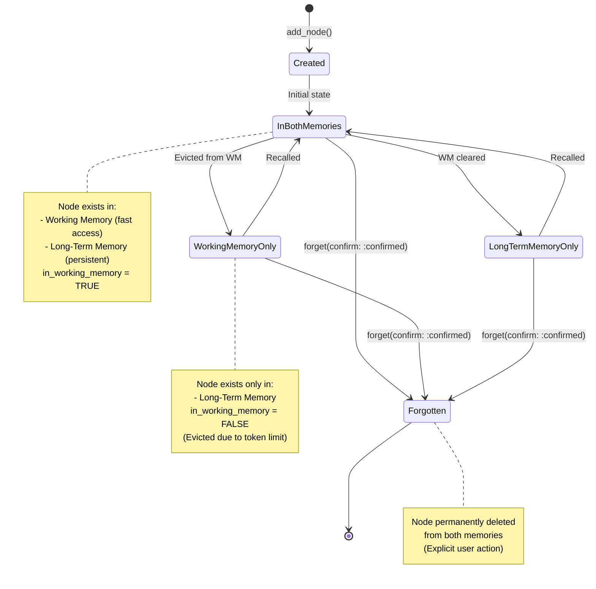
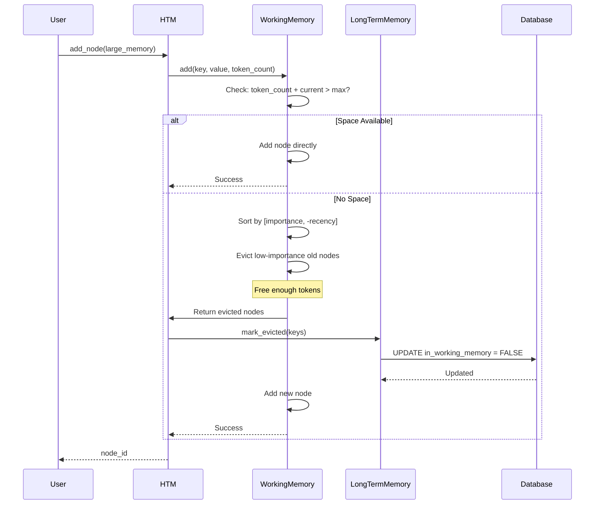

# Detailed Architecture

This document provides a comprehensive deep dive into HTM's system architecture, component interactions, data flows, database schema, and performance characteristics.

## Table of Contents

- [System Architecture](#system-architecture)
- [Component Diagrams](#component-diagrams)
- [Data Flow Diagrams](#data-flow-diagrams)
- [Memory Lifecycle](#memory-lifecycle)
- [Database Schema](#database-schema)
- [Technology Stack](#technology-stack)
- [Performance Characteristics](#performance-characteristics)
- [Scalability Considerations](#scalability-considerations)

## System Architecture

HTM implements a layered architecture with clear separation of concerns between presentation (API), business logic (memory management), and data access (database).

### Architecture Layers

<svg viewBox="0 0 800 700" xmlns="http://www.w3.org/2000/svg" style="background: transparent;">
  <!-- Title -->
  <text x="400" y="30" text-anchor="middle" fill="#E0E0E0" font-size="18" font-weight="bold">HTM Layered Architecture</text>

  <!-- Layer 1: API Layer -->
  <rect x="100" y="60" width="600" height="100" fill="rgba(76, 175, 80, 0.2)" stroke="#4CAF50" stroke-width="2" rx="5"/>
  <text x="400" y="85" text-anchor="middle" fill="#E0E0E0" font-size="16" font-weight="bold">API Layer</text>
  <text x="200" y="110" text-anchor="middle" fill="#B0B0B0" font-size="12">add_node()</text>
  <text x="320" y="110" text-anchor="middle" fill="#B0B0B0" font-size="12">recall()</text>
  <text x="440" y="110" text-anchor="middle" fill="#B0B0B0" font-size="12">retrieve()</text>
  <text x="560" y="110" text-anchor="middle" fill="#B0B0B0" font-size="12">forget()</text>
  <text x="400" y="135" text-anchor="middle" fill="#B0B0B0" font-size="12">create_context() • memory_stats() • which_robot_said()</text>

  <!-- Layer 2: Coordination Layer -->
  <rect x="100" y="180" width="600" height="100" fill="rgba(33, 150, 243, 0.2)" stroke="#2196F3" stroke-width="2" rx="5"/>
  <text x="400" y="205" text-anchor="middle" fill="#E0E0E0" font-size="16" font-weight="bold">Coordination Layer (HTM)</text>
  <text x="250" y="235" text-anchor="middle" fill="#B0B0B0" font-size="12">Robot Registration</text>
  <text x="400" y="235" text-anchor="middle" fill="#B0B0B0" font-size="12">Embedding Generation</text>
  <text x="550" y="235" text-anchor="middle" fill="#B0B0B0" font-size="12">Token Counting</text>
  <text x="400" y="260" text-anchor="middle" fill="#B0B0B0" font-size="12">Memory Orchestration • Context Assembly</text>

  <!-- Layer 3: Memory Management Layer -->
  <rect x="100" y="300" width="290" height="120" fill="rgba(156, 39, 176, 0.2)" stroke="#9C27B0" stroke-width="2" rx="5"/>
  <text x="245" y="325" text-anchor="middle" fill="#E0E0E0" font-size="14" font-weight="bold">Working Memory</text>
  <text x="245" y="350" text-anchor="middle" fill="#B0B0B0" font-size="11">Token Budget</text>
  <text x="245" y="370" text-anchor="middle" fill="#B0B0B0" font-size="11">Eviction Strategy</text>
  <text x="245" y="390" text-anchor="middle" fill="#B0B0B0" font-size="11">Context Assembly</text>
  <text x="245" y="410" text-anchor="middle" fill="#B0B0B0" font-size="11">In-Memory Storage</text>

  <rect x="410" y="300" width="290" height="120" fill="rgba(255, 152, 0, 0.2)" stroke="#FF9800" stroke-width="2" rx="5"/>
  <text x="555" y="325" text-anchor="middle" fill="#E0E0E0" font-size="14" font-weight="bold">Long-Term Memory</text>
  <text x="555" y="350" text-anchor="middle" fill="#B0B0B0" font-size="11">Persistence</text>
  <text x="555" y="370" text-anchor="middle" fill="#B0B0B0" font-size="11">RAG Search</text>
  <text x="555" y="390" text-anchor="middle" fill="#B0B0B0" font-size="11">Relationship Graphs</text>
  <text x="555" y="410" text-anchor="middle" fill="#B0B0B0" font-size="11">Robot Registry</text>

  <!-- Layer 4: Services Layer -->
  <rect x="100" y="440" width="290" height="100" fill="rgba(244, 67, 54, 0.2)" stroke="#F44336" stroke-width="2" rx="5"/>
  <text x="245" y="465" text-anchor="middle" fill="#E0E0E0" font-size="14" font-weight="bold">Embedding Service</text>
  <text x="245" y="490" text-anchor="middle" fill="#B0B0B0" font-size="11">Ollama • OpenAI • Cohere</text>
  <text x="245" y="510" text-anchor="middle" fill="#B0B0B0" font-size="11">Vector Generation</text>
  <text x="245" y="530" text-anchor="middle" fill="#B0B0B0" font-size="11">Token Counting</text>

  <rect x="410" y="440" width="290" height="100" fill="rgba(255, 193, 7, 0.2)" stroke="#FFC107" stroke-width="2" rx="5"/>
  <text x="555" y="465" text-anchor="middle" fill="#E0E0E0" font-size="14" font-weight="bold">Database Service</text>
  <text x="555" y="490" text-anchor="middle" fill="#B0B0B0" font-size="11">Connection Pool</text>
  <text x="555" y="510" text-anchor="middle" fill="#B0B0B0" font-size="11">Query Execution</text>
  <text x="555" y="530" text-anchor="middle" fill="#B0B0B0" font-size="11">Transaction Management</text>

  <!-- Layer 5: Data Layer -->
  <rect x="100" y="560" width="600" height="100" fill="rgba(121, 85, 72, 0.2)" stroke="#795548" stroke-width="2" rx="5"/>
  <text x="400" y="585" text-anchor="middle" fill="#E0E0E0" font-size="16" font-weight="bold">Data Layer</text>
  <text x="250" y="615" text-anchor="middle" fill="#B0B0B0" font-size="12">PostgreSQL 16+</text>
  <text x="400" y="615" text-anchor="middle" fill="#B0B0B0" font-size="12">TimescaleDB</text>
  <text x="550" y="615" text-anchor="middle" fill="#B0B0B0" font-size="12">pgvector</text>
  <text x="400" y="640" text-anchor="middle" fill="#B0B0B0" font-size="11">Hypertables • Vector Indexes • Full-Text Search</text>

  <!-- Connection arrows -->
  <line x1="400" y1="160" x2="400" y2="180" stroke="#808080" stroke-width="2" marker-end="url(#arrow)"/>
  <line x1="400" y1="280" x2="245" y2="300" stroke="#808080" stroke-width="2" marker-end="url(#arrow)"/>
  <line x1="400" y1="280" x2="555" y2="300" stroke="#808080" stroke-width="2" marker-end="url(#arrow)"/>
  <line x1="245" y1="420" x2="245" y2="440" stroke="#808080" stroke-width="2" marker-end="url(#arrow)"/>
  <line x1="555" y1="420" x2="555" y2="440" stroke="#808080" stroke-width="2" marker-end="url(#arrow)"/>
  <line x1="400" y1="540" x2="400" y2="560" stroke="#808080" stroke-width="2" marker-end="url(#arrow)"/>

  <defs>
    <marker id="arrow" markerWidth="10" markerHeight="10" refX="9" refY="3" orient="auto">
      <polygon points="0 0, 10 3, 0 6" fill="#808080"/>
    </marker>
  </defs>
</svg>

### Component Responsibilities

#### API Layer (HTM class)

- Public interface for all memory operations
- Robot identification and initialization
- Request routing to appropriate subsystems
- Response aggregation and formatting
- Activity logging and statistics

#### Coordination Layer

- **Robot Management**: Registration, activity tracking, metadata
- **Embedding Coordination**: Generate embeddings for new memories and search queries
- **Memory Orchestration**: Coordinate between working and long-term memory
- **Context Assembly**: Build LLM context strings from working memory
- **Token Management**: Count tokens and enforce limits

#### Memory Management Layer

##### Working Memory

- **In-Memory Store**: Fast Ruby Hash-based storage
- **Token Budget**: Enforce maximum token limit (default 128K)
- **Eviction Policy**: Hybrid importance + recency eviction
- **Access Tracking**: LRU-style access order for recency
- **Context Assembly**: Three strategies (recent, important, balanced)

##### Long-Term Memory

- **Persistence**: Write all memories to PostgreSQL
- **RAG Search**: Vector + temporal + full-text search
- **Relationship Management**: Store and query node relationships
- **Robot Registry**: Track all robots using the system
- **Eviction Marking**: Mark which nodes are in working memory

#### Services Layer

##### Embedding Service

- **Provider Abstraction**: Support multiple embedding providers
- **Vector Generation**: Generate embeddings for text
- **Token Counting**: Estimate token counts for strings
- **Model Management**: Handle different models per provider

##### Database Service

- **Connection Pooling**: Manage PostgreSQL connections
- **Query Execution**: Execute parameterized queries safely
- **Transaction Management**: ACID guarantees for operations
- **Error Handling**: Retry logic and failure recovery

#### Data Layer

- **PostgreSQL**: Relational storage with ACID guarantees
- **TimescaleDB**: Time-series optimization and compression
- **pgvector**: Vector similarity search with HNSW
- **pg_trgm**: Fuzzy text matching for search

## Component Diagrams

### HTM Core Components

<svg viewBox="0 0 900 600" xmlns="http://www.w3.org/2000/svg" style="background: transparent;">
  <!-- HTM Core -->
  <rect x="350" y="50" width="200" height="100" fill="rgba(76, 175, 80, 0.2)" stroke="#4CAF50" stroke-width="3" rx="5"/>
  <text x="450" y="85" text-anchor="middle" fill="#E0E0E0" font-size="16" font-weight="bold">HTM</text>
  <text x="450" y="110" text-anchor="middle" fill="#B0B0B0" font-size="11">@robot_id: UUID</text>
  <text x="450" y="130" text-anchor="middle" fill="#B0B0B0" font-size="11">@robot_name: String</text>

  <!-- Working Memory -->
  <rect x="50" y="250" width="240" height="280" fill="rgba(33, 150, 243, 0.2)" stroke="#2196F3" stroke-width="2" rx="5"/>
  <text x="170" y="280" text-anchor="middle" fill="#E0E0E0" font-size="14" font-weight="bold">WorkingMemory</text>
  <line x1="60" y1="290" x2="280" y2="290" stroke="#2196F3" stroke-width="1"/>
  <text x="70" y="310" fill="#B0B0B0" font-size="11">@max_tokens: Integer</text>
  <text x="70" y="330" fill="#B0B0B0" font-size="11">@nodes: Hash</text>
  <text x="70" y="350" fill="#B0B0B0" font-size="11">@access_order: Array</text>
  <line x1="60" y1="360" x2="280" y2="360" stroke="#2196F3" stroke-width="1"/>
  <text x="70" y="380" fill="#B0B0B0" font-size="11">+add(key, value, ...)</text>
  <text x="70" y="400" fill="#B0B0B0" font-size="11">+remove(key)</text>
  <text x="70" y="420" fill="#B0B0B0" font-size="11">+has_space?(tokens)</text>
  <text x="70" y="440" fill="#B0B0B0" font-size="11">+evict_to_make_space()</text>
  <text x="70" y="460" fill="#B0B0B0" font-size="11">+assemble_context()</text>
  <text x="70" y="480" fill="#B0B0B0" font-size="11">+token_count()</text>
  <text x="70" y="500" fill="#B0B0B0" font-size="11">+utilization_percentage()</text>

  <!-- Long-Term Memory -->
  <rect x="330" y="250" width="240" height="280" fill="rgba(156, 39, 176, 0.2)" stroke="#9C27B0" stroke-width="2" rx="5"/>
  <text x="450" y="280" text-anchor="middle" fill="#E0E0E0" font-size="14" font-weight="bold">LongTermMemory</text>
  <line x1="340" y1="290" x2="560" y2="290" stroke="#9C27B0" stroke-width="1"/>
  <text x="350" y="310" fill="#B0B0B0" font-size="11">@db: Database</text>
  <text x="350" y="330" fill="#B0B0B0" font-size="11">@connection_pool</text>
  <line x1="340" y1="340" x2="560" y2="340" stroke="#9C27B0" stroke-width="1"/>
  <text x="350" y="360" fill="#B0B0B0" font-size="11">+add(key, value, ...)</text>
  <text x="350" y="380" fill="#B0B0B0" font-size="11">+retrieve(key)</text>
  <text x="350" y="400" fill="#B0B0B0" font-size="11">+delete(key)</text>
  <text x="350" y="420" fill="#B0B0B0" font-size="11">+search(timeframe, ...)</text>
  <text x="350" y="440" fill="#B0B0B0" font-size="11">+search_fulltext(query)</text>
  <text x="350" y="460" fill="#B0B0B0" font-size="11">+search_hybrid()</text>
  <text x="350" y="480" fill="#B0B0B0" font-size="11">+register_robot()</text>
  <text x="350" y="500" fill="#B0B0B0" font-size="11">+add_relationship()</text>

  <!-- Embedding Service -->
  <rect x="610" y="250" width="240" height="280" fill="rgba(255, 152, 0, 0.2)" stroke="#FF9800" stroke-width="2" rx="5"/>
  <text x="730" y="280" text-anchor="middle" fill="#E0E0E0" font-size="14" font-weight="bold">EmbeddingService</text>
  <line x1="620" y1="290" x2="840" y2="290" stroke="#FF9800" stroke-width="1"/>
  <text x="630" y="310" fill="#B0B0B0" font-size="11">@provider: Symbol</text>
  <text x="630" y="330" fill="#B0B0B0" font-size="11">@model: String</text>
  <text x="630" y="350" fill="#B0B0B0" font-size="11">@dimensions: Integer</text>
  <line x1="620" y1="360" x2="840" y2="360" stroke="#FF9800" stroke-width="1"/>
  <text x="630" y="380" fill="#B0B0B0" font-size="11">+embed(text)</text>
  <text x="630" y="400" fill="#B0B0B0" font-size="11">+count_tokens(text)</text>
  <text x="630" y="420" fill="#B0B0B0" font-size="11">-ollama_embed()</text>
  <text x="630" y="440" fill="#B0B0B0" font-size="11">-openai_embed()</text>
  <text x="630" y="460" fill="#B0B0B0" font-size="11">-cohere_embed()</text>
  <text x="630" y="480" fill="#B0B0B0" font-size="11">-local_embed()</text>

  <!-- Relationships -->
  <line x1="450" y1="150" x2="170" y2="250" stroke="#2196F3" stroke-width="2"/>
  <line x1="450" y1="150" x2="450" y2="250" stroke="#9C27B0" stroke-width="2"/>
  <line x1="450" y1="150" x2="730" y2="250" stroke="#FF9800" stroke-width="2"/>

  <text x="310" y="200" fill="#B0B0B0" font-size="10">1 has 1</text>
  <text x="460" y="200" fill="#B0B0B0" font-size="10">1 has 1</text>
  <text x="590" y="200" fill="#B0B0B0" font-size="10">1 has 1</text>
</svg>

## Data Flow Diagrams

### Memory Addition Flow

This diagram shows the complete flow of adding a new memory node to HTM, including embedding generation, database persistence, and working memory management.

```mermaid
graph TD
    A[User: add_node] -->|1. Request| B[HTM]
    B -->|2. Generate embedding| C[EmbeddingService]
    C -->|3. Call provider API| D[Ollama/OpenAI]
    D -->|4. Return vector| C
    C -->|5. Return embedding| B

    B -->|6. Count tokens| C
    C -->|7. Return count| B

    B -->|8. Persist| E[LongTermMemory]
    E -->|9. INSERT nodes| F[PostgreSQL]
    F -->|10. Return node_id| E
    E -->|11. Return node_id| B

    B -->|12. Check space| G[WorkingMemory]
    G -->|13. Space available?| H{Has Space?}
    H -->|No| I[Evict nodes]
    I -->|14. Mark evicted| E
    H -->|Yes| J[Add to WM]
    I --> J

    J -->|15. Success| B
    B -->|16. Log operation| E
    B -->|17. Return node_id| A

    style A fill:rgba(76,175,80,0.3)
    style B fill:rgba(33,150,243,0.3)
    style C fill:rgba(255,152,0,0.3)
    style E fill:rgba(156,39,176,0.3)
    style G fill:rgba(33,150,243,0.3)
```

### Memory Recall Flow

This diagram illustrates the RAG-based retrieval process for recalling memories from a specific timeframe and topic.

```mermaid
graph TD
    A[User: recall] -->|1. Request| B[HTM]
    B -->|2. Parse timeframe| C[Parse Natural Language]
    C -->|3. Return range| B

    B -->|4. Generate query embedding| D[EmbeddingService]
    D -->|5. Return vector| B

    B -->|6. Search| E[LongTermMemory]
    E -->|7. Vector similarity| F{Search Strategy}
    F -->|:vector| G[Vector Search]
    F -->|:fulltext| H[Full-Text Search]
    F -->|:hybrid| I[Hybrid Search]

    G -->|8. Query PostgreSQL| J[pgvector HNSW]
    H -->|8. Query PostgreSQL| K[GIN Full-Text]
    I -->|8. Query PostgreSQL| L[Both + RRF]

    J --> M[Return results]
    K --> M
    L --> M

    M -->|9. Results| E
    E -->|10. Results| B

    B -->|11. For each result| N[WorkingMemory]
    N -->|12. Add to WM| O{Has Space?}
    O -->|No| P[Evict old nodes]
    O -->|Yes| Q[Add node]
    P --> Q

    Q -->|13. Log operation| E
    B -->|14. Return memories| A

    style A fill:rgba(76,175,80,0.3)
    style B fill:rgba(33,150,243,0.3)
    style E fill:rgba(156,39,176,0.3)
    style N fill:rgba(33,150,243,0.3)
```

### Context Assembly Flow

This diagram shows how working memory assembles context for LLM consumption using different strategies.

```mermaid
graph TD
    A[User: create_context] -->|1. Request with strategy| B[HTM]
    B -->|2. Assemble| C[WorkingMemory]

    C -->|3. Strategy?| D{Strategy Type}
    D -->|:recent| E[Sort by access order]
    D -->|:important| F[Sort by importance]
    D -->|:balanced| G[Hybrid score]

    E --> H[Sorted nodes]
    F --> H
    G --> H

    H -->|4. Build context| I[Token budget loop]
    I -->|5. Check tokens| J{Tokens < max?}
    J -->|Yes| K[Add node to context]
    J -->|No| L[Stop, return context]
    K --> I

    L -->|6. Join nodes| M[Assembled context string]
    M -->|7. Return| C
    C -->|8. Return| B
    B -->|9. Return| A

    style A fill:rgba(76,175,80,0.3)
    style C fill:rgba(33,150,243,0.3)
    style G fill:rgba(255,193,7,0.3)
```

## Memory Lifecycle

### Node States

A memory node transitions through several states during its lifetime in HTM:



### Eviction Process

When working memory reaches its token limit, the eviction process runs to free up space:



## Database Schema

### Entity-Relationship Diagram

<svg viewBox="0 0 900 700" xmlns="http://www.w3.org/2000/svg" style="background: transparent;">
  <!-- Title -->
  <text x="450" y="30" text-anchor="middle" fill="#E0E0E0" font-size="18" font-weight="bold">HTM Database Schema</text>

  <!-- Nodes Table -->
  <rect x="50" y="60" width="280" height="280" fill="rgba(33, 150, 243, 0.2)" stroke="#2196F3" stroke-width="2" rx="5"/>
  <text x="190" y="85" text-anchor="middle" fill="#E0E0E0" font-size="14" font-weight="bold">nodes</text>
  <line x1="60" y1="95" x2="320" y2="95" stroke="#2196F3" stroke-width="1"/>
  <text x="70" y="115" fill="#FFC107" font-size="11" font-weight="bold">id: BIGSERIAL PK</text>
  <text x="70" y="135" fill="#B0B0B0" font-size="11">key: TEXT UNIQUE</text>
  <text x="70" y="155" fill="#B0B0B0" font-size="11">value: TEXT</text>
  <text x="70" y="175" fill="#B0B0B0" font-size="11">type: TEXT</text>
  <text x="70" y="195" fill="#B0B0B0" font-size="11">category: TEXT</text>
  <text x="70" y="215" fill="#B0B0B0" font-size="11">importance: REAL</text>
  <text x="70" y="235" fill="#B0B0B0" font-size="11">token_count: INTEGER</text>
  <text x="70" y="255" fill="#B0B0B0" font-size="11">in_working_memory: BOOL</text>
  <text x="70" y="275" fill="#4CAF50" font-size="11">robot_id: TEXT FK</text>
  <text x="70" y="295" fill="#B0B0B0" font-size="11">embedding: vector(1536)</text>
  <text x="70" y="315" fill="#B0B0B0" font-size="11">created_at, updated_at, ...</text>

  <!-- Robots Table -->
  <rect x="570" y="60" width="280" height="160" fill="rgba(76, 175, 80, 0.2)" stroke="#4CAF50" stroke-width="2" rx="5"/>
  <text x="710" y="85" text-anchor="middle" fill="#E0E0E0" font-size="14" font-weight="bold">robots</text>
  <line x1="580" y1="95" x2="840" y2="95" stroke="#4CAF50" stroke-width="1"/>
  <text x="590" y="115" fill="#FFC107" font-size="11" font-weight="bold">id: TEXT PK (UUID)</text>
  <text x="590" y="135" fill="#B0B0B0" font-size="11">name: TEXT</text>
  <text x="590" y="155" fill="#B0B0B0" font-size="11">created_at: TIMESTAMP</text>
  <text x="590" y="175" fill="#B0B0B0" font-size="11">last_active: TIMESTAMP</text>
  <text x="590" y="195" fill="#B0B0B0" font-size="11">metadata: JSONB</text>

  <!-- Relationships Table -->
  <rect x="50" y="380" width="280" height="180" fill="rgba(156, 39, 176, 0.2)" stroke="#9C27B0" stroke-width="2" rx="5"/>
  <text x="190" y="405" text-anchor="middle" fill="#E0E0E0" font-size="14" font-weight="bold">relationships</text>
  <line x1="60" y1="415" x2="320" y2="415" stroke="#9C27B0" stroke-width="1"/>
  <text x="70" y="435" fill="#FFC107" font-size="11" font-weight="bold">id: BIGSERIAL PK</text>
  <text x="70" y="455" fill="#4CAF50" font-size="11">from_node_id: BIGINT FK</text>
  <text x="70" y="475" fill="#4CAF50" font-size="11">to_node_id: BIGINT FK</text>
  <text x="70" y="495" fill="#B0B0B0" font-size="11">relationship_type: TEXT</text>
  <text x="70" y="515" fill="#B0B0B0" font-size="11">strength: REAL</text>
  <text x="70" y="535" fill="#B0B0B0" font-size="11">created_at: TIMESTAMP</text>

  <!-- Tags Table -->
  <rect x="380" y="380" width="200" height="160" fill="rgba(255, 152, 0, 0.2)" stroke="#FF9800" stroke-width="2" rx="5"/>
  <text x="480" y="405" text-anchor="middle" fill="#E0E0E0" font-size="14" font-weight="bold">tags</text>
  <line x1="390" y1="415" x2="570" y2="415" stroke="#FF9800" stroke-width="1"/>
  <text x="400" y="435" fill="#FFC107" font-size="11" font-weight="bold">id: BIGSERIAL PK</text>
  <text x="400" y="455" fill="#4CAF50" font-size="11">node_id: BIGINT FK</text>
  <text x="400" y="475" fill="#B0B0B0" font-size="11">tag: TEXT</text>
  <text x="400" y="495" fill="#B0B0B0" font-size="11">created_at: TIMESTAMP</text>

  <!-- Operations Log Table -->
  <rect x="630" y="380" width="220" height="180" fill="rgba(244, 67, 54, 0.2)" stroke="#F44336" stroke-width="2" rx="5"/>
  <text x="740" y="405" text-anchor="middle" fill="#E0E0E0" font-size="14" font-weight="bold">operations_log</text>
  <line x1="640" y1="415" x2="840" y2="415" stroke="#F44336" stroke-width="1"/>
  <text x="650" y="435" fill="#FFC107" font-size="11" font-weight="bold">id: BIGSERIAL PK</text>
  <text x="650" y="455" fill="#B0B0B0" font-size="11">timestamp: TIMESTAMP</text>
  <text x="650" y="475" fill="#B0B0B0" font-size="11">operation: TEXT</text>
  <text x="650" y="495" fill="#4CAF50" font-size="11">node_id: BIGINT FK</text>
  <text x="650" y="515" fill="#4CAF50" font-size="11">robot_id: TEXT FK</text>
  <text x="650" y="535" fill="#B0B0B0" font-size="11">details: JSONB</text>

  <!-- Foreign Key Relationships -->
  <line x1="330" y1="200" x2="570" y2="140" stroke="#4CAF50" stroke-width="2" marker-end="url(#fk-arrow)"/>
  <text x="420" y="160" fill="#4CAF50" font-size="10">robot_id FK</text>

  <line x1="190" y1="340" x2="190" y2="380" stroke="#9C27B0" stroke-width="2" marker-end="url(#fk-arrow)"/>
  <text x="200" y="360" fill="#9C27B0" font-size="10">from/to FK</text>

  <line x1="280" y1="340" x2="420" y2="380" stroke="#FF9800" stroke-width="2" marker-end="url(#fk-arrow)"/>
  <text x="330" y="360" fill="#FF9800" font-size="10">node_id FK</text>

  <line x1="330" y1="280" x2="630" y2="470" stroke="#F44336" stroke-width="2" marker-end="url(#fk-arrow)"/>
  <text x="450" y="380" fill="#F44336" font-size="10">node_id FK</text>

  <line x1="710" y1="220" x2="710" y2="380" stroke="#4CAF50" stroke-width="2" marker-end="url(#fk-arrow)"/>
  <text x="720" y="300" fill="#4CAF50" font-size="10">robot_id FK</text>

  <defs>
    <marker id="fk-arrow" markerWidth="10" markerHeight="10" refX="9" refY="3" orient="auto">
      <polygon points="0 0, 10 3, 0 6" fill="#4CAF50"/>
    </marker>
  </defs>

  <!-- Legend -->
  <text x="50" y="630" fill="#E0E0E0" font-size="12" font-weight="bold">Legend:</text>
  <text x="50" y="650" fill="#FFC107" font-size="10">PK = Primary Key</text>
  <text x="200" y="650" fill="#4CAF50" font-size="10">FK = Foreign Key</text>
</svg>

### Table Details

#### nodes

The main table storing all memory nodes with vector embeddings, metadata, and timestamps.

| Column | Type | Description |
|--------|------|-------------|
| `id` | BIGSERIAL | Primary key, auto-incrementing |
| `key` | TEXT | Unique identifier for node (user-defined) |
| `value` | TEXT | Content of the memory |
| `type` | TEXT | Memory type (fact, context, code, preference, decision, question) |
| `category` | TEXT | Optional category for organization |
| `importance` | REAL | Importance score (0.0-10.0, default 1.0) |
| `created_at` | TIMESTAMP | Creation timestamp |
| `updated_at` | TIMESTAMP | Last update timestamp |
| `last_accessed` | TIMESTAMP | Last access timestamp |
| `token_count` | INTEGER | Number of tokens in value |
| `in_working_memory` | BOOLEAN | Whether currently in working memory |
| `robot_id` | TEXT | Foreign key to robots table |
| `embedding` | vector(1536) | Vector embedding for semantic search |

**Indexes:**

- Primary key on `id`
- Unique index on `key`
- B-tree indexes on `created_at`, `updated_at`, `last_accessed`, `type`, `category`, `robot_id`
- HNSW index on `embedding` for vector similarity
- GIN indexes on `to_tsvector('english', value)` for full-text search
- GIN trigram index on `value` for fuzzy matching

#### robots

Registry of all robots using the HTM system.

| Column | Type | Description |
|--------|------|-------------|
| `id` | TEXT | Primary key, UUID v4 |
| `name` | TEXT | Human-readable robot name |
| `created_at` | TIMESTAMP | Registration timestamp |
| `last_active` | TIMESTAMP | Last activity timestamp |
| `metadata` | JSONB | Flexible robot configuration |

#### relationships

Graph edges connecting related nodes.

| Column | Type | Description |
|--------|------|-------------|
| `id` | BIGSERIAL | Primary key |
| `from_node_id` | BIGINT | Source node foreign key |
| `to_node_id` | BIGINT | Target node foreign key |
| `relationship_type` | TEXT | Type of relationship (e.g., "related_to", "follows") |
| `strength` | REAL | Relationship strength (0.0-1.0) |
| `created_at` | TIMESTAMP | Creation timestamp |

**Indexes:**

- B-tree indexes on `from_node_id` and `to_node_id`
- Unique constraint on `(from_node_id, to_node_id, relationship_type)`

#### tags

Flexible categorization system for nodes.

| Column | Type | Description |
|--------|------|-------------|
| `id` | BIGSERIAL | Primary key |
| `node_id` | BIGINT | Foreign key to nodes |
| `tag` | TEXT | Tag name |
| `created_at` | TIMESTAMP | Creation timestamp |

**Indexes:**

- B-tree index on `node_id`
- B-tree index on `tag`
- Unique constraint on `(node_id, tag)`

#### operations_log

Audit trail of all memory operations for debugging and replay.

| Column | Type | Description |
|--------|------|-------------|
| `id` | BIGSERIAL | Primary key |
| `timestamp` | TIMESTAMP | Operation timestamp |
| `operation` | TEXT | Operation type (add, retrieve, recall, forget, evict) |
| `node_id` | BIGINT | Foreign key to nodes (nullable) |
| `robot_id` | TEXT | Foreign key to robots |
| `details` | JSONB | Flexible operation metadata |

**Indexes:**

- B-tree indexes on `timestamp`, `robot_id`, `operation`

## Technology Stack

### Core Technologies

| Technology | Version | Purpose | Why Chosen |
|-----------|---------|---------|------------|
| **Ruby** | 3.2+ | Implementation language | Readable, expressive, mature ecosystem |
| **PostgreSQL** | 16+ | Relational database | ACID guarantees, rich extensions, production-proven |
| **TimescaleDB** | 2.13+ | Time-series extension | Hypertable partitioning, automatic compression |
| **pgvector** | 0.5+ | Vector similarity | HNSW indexing, PostgreSQL-native, fast approximate search |
| **pg_trgm** | - | Fuzzy text search | Built-in PostgreSQL extension for trigram matching |

### Ruby Dependencies

```ruby
# Core dependencies
gem 'pg', '~> 1.5'                    # PostgreSQL client
gem 'pgvector', '~> 0.2'              # Vector operations
gem 'connection_pool', '~> 2.4'      # Connection pooling
gem 'faraday', '~> 2.7'              # HTTP client (for embedding APIs)

# Optional dependencies
gem 'tiktoken_ruby', '~> 0.0.6'      # Token counting (OpenAI-compatible)
```

### Embedding Providers

| Provider | Models | Dimensions | Speed | Cost |
|----------|--------|------------|-------|------|
| **Ollama** (default) | gpt-oss, nomic-embed-text, mxbai-embed-large | 768-1024 | Fast (local) | Free |
| **OpenAI** | text-embedding-3-small, text-embedding-3-large | 1536, 3072 | Fast (API) | $0.0001/1K tokens |
| **Cohere** | embed-english-v3.0, embed-multilingual-v3.0 | 1024 | Fast (API) | $0.0001/1K tokens |
| **Local** | Transformers.js models | Varies | Medium (CPU) | Free |

## Performance Characteristics

### Latency Benchmarks

Based on typical production workloads with 10,000 nodes in long-term memory:

| Operation | Median | P95 | P99 | Notes |
|-----------|--------|-----|-----|-------|
| `add_node()` | 50ms | 120ms | 200ms | Includes embedding generation |
| `recall()` (vector) | 80ms | 150ms | 250ms | HNSW approximate search |
| `recall()` (fulltext) | 30ms | 60ms | 100ms | GIN index search |
| `recall()` (hybrid) | 120ms | 200ms | 350ms | Combines both + RRF |
| `retrieve()` | 5ms | 10ms | 20ms | Simple primary key lookup |
| `create_context()` | 8ms | 15ms | 25ms | In-memory sort + join |
| `forget()` | 10ms | 20ms | 40ms | DELETE with cascades |

!!! tip "Performance Optimization"
    - Use connection pooling (included by default)
    - Add database indexes for common query patterns
    - Consider read replicas for query-heavy workloads
    - Monitor HNSW build time for large embedding tables

### Throughput

| Workload | Throughput | Resource Usage |
|----------|-----------|----------------|
| Add nodes | 500-1000/sec | CPU-bound (embeddings) |
| Vector search | 2000-5000/sec | I/O-bound (database) |
| Full-text search | 5000-10000/sec | I/O-bound (database) |
| Context assembly | 10000+/sec | Memory-bound (working memory) |

### Storage

| Component | Size Estimate | Compression |
|-----------|--------------|-------------|
| Node (text only) | ~1KB average | None |
| Node (with embedding) | ~7KB (1536 dims × 4 bytes) | TimescaleDB compression (70-90%) |
| Indexes | ~2x data size | Minimal |
| Operations log | ~200 bytes/op | TimescaleDB compression |

**Example:** 100,000 nodes with embeddings:

- Raw data: ~700 MB
- With indexes: ~2.1 GB
- With compression (after 30 days): ~300 MB

## Scalability Considerations

### Vertical Scaling Limits

| Resource | Limit | Mitigation |
|----------|-------|------------|
| **Working Memory (RAM)** | ~2GB per robot process | Use smaller `working_memory_size`, evict more aggressively |
| **PostgreSQL Connections** | ~100-200 (default) | Connection pooling, adjust `max_connections` |
| **Embedding API Rate Limits** | Provider-dependent | Implement rate limiting, use local models |
| **HNSW Build Time** | O(n log n) on large tables | Partition tables by timeframe |

### Horizontal Scaling Strategies

#### Multi-Process (Single Host)

- Each robot process has independent working memory
- All processes share single PostgreSQL instance
- Connection pooling prevents connection exhaustion

#### Multi-Host (Distributed)

- **Option 1: Shared Database**
  - All hosts connect to central PostgreSQL
  - Read replicas for query scaling
  - Write operations to primary only

- **Option 2: Sharded Database**
  - Partition by `robot_id` or timeframe
  - Requires coordination for cross-shard queries
  - More complex but scales writes

#### Read Scaling

- Add PostgreSQL read replicas
- Route `recall()` and `retrieve()` to replicas
- Primary handles writes only
- TimescaleDB native replication support

!!! warning "Consistency Considerations"
    Read replicas may lag primary by seconds. For strong consistency requirements, query primary database.

### Future Scaling Enhancements

1. **Redis-backed Working Memory**: Share working memory across processes
2. **Horizontal Partitioning**: Shard `nodes` table by `robot_id` or time ranges
3. **Caching Layer**: Add Redis cache for hot nodes
4. **Async Embedding Generation**: Queue embedding jobs for batch processing
5. **Vector Database Migration**: Consider specialized vector DB (Pinecone, Weaviate) at massive scale

## Related Documentation

- [Architecture Index](index.md) - Architecture overview and component summary
- [Two-Tier Memory System](two-tier-memory.md) - Working memory and long-term memory deep dive
- [Hive Mind Architecture](hive-mind.md) - Multi-robot shared memory design
- [API Reference](../api/htm.md) - Complete API documentation
- [Architecture Decision Records](adrs/index.md) - Decision history
