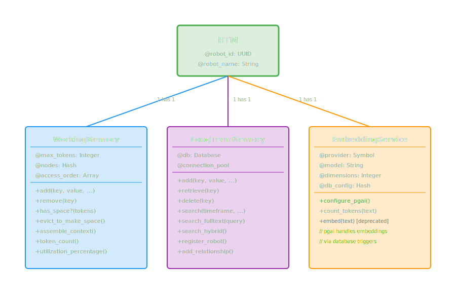
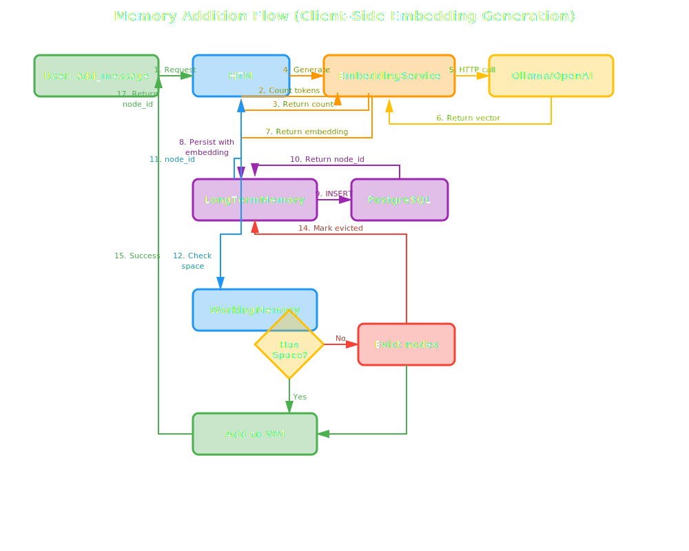

# Detailed Architecture

This document provides a comprehensive deep dive into HTM's system architecture, component interactions, data flows, database schema, and performance characteristics.

## Table of Contents

- [System Architecture](#system-architecture)
- [Component Diagrams](#component-diagrams)
- [Data Flow Diagrams](#data-flow-diagrams)
- [Memory Lifecycle](#memory-lifecycle)
- [Database Schema](#database-schema)
- [Technology Stack](#technology-stack)
- [Performance Characteristics](#performance-characteristics)
- [Scalability Considerations](#scalability-considerations)

## System Architecture

HTM implements a layered architecture with clear separation of concerns between presentation (API), business logic (memory management), and data access (database).

### Architecture Layers


### Component Responsibilities

#### API Layer (HTM class)

- Public interface for all memory operations
- Robot identification and initialization
- Request routing to appropriate subsystems
- Response aggregation and formatting
- Activity logging and statistics

#### Coordination Layer

- **Robot Management**: Registration, activity tracking, metadata
- **Embedding Coordination**: Generate embeddings for new memories and search queries
- **Memory Orchestration**: Coordinate between working and long-term memory
- **Context Assembly**: Build LLM context strings from working memory
- **Token Management**: Count tokens and enforce limits

#### Memory Management Layer

##### Working Memory

- **In-Memory Store**: Fast Ruby Hash-based storage
- **Token Budget**: Enforce maximum token limit (default 128K)
- **Eviction Policy**: Hybrid importance + recency eviction
- **Access Tracking**: LRU-style access order for recency
- **Context Assembly**: Three strategies (recent, important, balanced)

##### Long-Term Memory

- **Persistence**: Write all memories to PostgreSQL
- **RAG Search**: Vector + temporal + full-text search
- **Relationship Management**: Store and query node relationships
- **Robot Registry**: Track all robots using the system
- **Eviction Marking**: Mark which nodes are in working memory

#### Services Layer

##### Embedding Service

- **Client-Side Generation**: Generate embeddings before database insertion
- **Token Counting**: Estimate token counts for strings
- **Model Management**: Handle different models per provider
- **Multi-Provider Support**: Ollama (default), OpenAI, Anthropic, Gemini, Azure, Bedrock, DeepSeek via RubyLLM

!!! info "Architecture Change (October 2025)"
    Embeddings are generated client-side in Ruby before database insertion. This provides reliable, cross-platform operation without complex database extension dependencies.

##### Database Service

- **Connection Pooling**: Manage PostgreSQL connections
- **Query Execution**: Execute parameterized queries safely
- **Transaction Management**: ACID guarantees for operations
- **Error Handling**: Retry logic and failure recovery

#### Data Layer

- **PostgreSQL**: Relational storage with ACID guarantees
- **TimescaleDB**: Time-series optimization and compression
- **pgvector**: Vector similarity search with HNSW
- **pg_trgm**: Fuzzy text matching for search

## Component Diagrams

### HTM Core Components



## Data Flow Diagrams

### Memory Addition Flow

This diagram shows the complete flow of adding a new memory node to HTM with **client-side embedding generation**.

!!! info "Architecture Note"
    With client-side generation (October 2025), embeddings are generated in Ruby before database insertion. This provides reliable, cross-platform operation.



### Memory Recall Flow

This diagram illustrates the RAG-based retrieval process with **client-side query embeddings**.

!!! info "Architecture Note"
    With client-side generation, query embeddings are generated in Ruby before being passed to SQL for vector similarity search.


### Context Assembly Flow

This diagram shows how working memory assembles context for LLM consumption using different strategies.


## Memory Lifecycle

### Node States

A memory node transitions through several states during its lifetime in HTM:


### Eviction Process

When working memory reaches its token limit, the eviction process runs to free up space:


## Database Schema

### Entity-Relationship Diagram


### Table Details

#### nodes

The main table storing all memory nodes with vector embeddings, metadata, and timestamps.

| Column | Type | Description |
|--------|------|-------------|
| `id` | BIGSERIAL | Primary key, auto-incrementing |
| `key` | TEXT | Unique identifier for node (user-defined) |
| `value` | TEXT | Content of the memory |
| `type` | TEXT | Memory type (fact, context, code, preference, decision, question) |
| `category` | TEXT | Optional category for organization |
| `importance` | REAL | Importance score (0.0-10.0, default 1.0) |
| `created_at` | TIMESTAMP | Creation timestamp |
| `updated_at` | TIMESTAMP | Last update timestamp |
| `last_accessed` | TIMESTAMP | Last access timestamp |
| `token_count` | INTEGER | Number of tokens in value |
| `in_working_memory` | BOOLEAN | Whether currently in working memory |
| `robot_id` | TEXT | Foreign key to robots table |
| `embedding` | vector(1536) | Vector embedding for semantic search |

**Indexes:**

- Primary key on `id`
- Unique index on `key`
- B-tree indexes on `created_at`, `updated_at`, `last_accessed`, `type`, `category`, `robot_id`
- HNSW index on `embedding` for vector similarity
- GIN indexes on `to_tsvector('english', value)` for full-text search
- GIN trigram index on `value` for fuzzy matching

#### robots

Registry of all robots using the HTM system.

| Column | Type | Description |
|--------|------|-------------|
| `id` | TEXT | Primary key, UUID v4 |
| `name` | TEXT | Human-readable robot name |
| `created_at` | TIMESTAMP | Registration timestamp |
| `last_active` | TIMESTAMP | Last activity timestamp |
| `metadata` | JSONB | Flexible robot configuration |

#### relationships

Graph edges connecting related nodes.

| Column | Type | Description |
|--------|------|-------------|
| `id` | BIGSERIAL | Primary key |
| `from_node_id` | BIGINT | Source node foreign key |
| `to_node_id` | BIGINT | Target node foreign key |
| `relationship_type` | TEXT | Type of relationship (e.g., "related_to", "follows") |
| `strength` | REAL | Relationship strength (0.0-1.0) |
| `created_at` | TIMESTAMP | Creation timestamp |

**Indexes:**

- B-tree indexes on `from_node_id` and `to_node_id`
- Unique constraint on `(from_node_id, to_node_id, relationship_type)`

#### tags

Flexible categorization system for nodes.

| Column | Type | Description |
|--------|------|-------------|
| `id` | BIGSERIAL | Primary key |
| `node_id` | BIGINT | Foreign key to nodes |
| `tag` | TEXT | Tag name |
| `created_at` | TIMESTAMP | Creation timestamp |

**Indexes:**

- B-tree index on `node_id`
- B-tree index on `tag`
- Unique constraint on `(node_id, tag)`

#### operations_log

Audit trail of all memory operations for debugging and replay.

| Column | Type | Description |
|--------|------|-------------|
| `id` | BIGSERIAL | Primary key |
| `timestamp` | TIMESTAMP | Operation timestamp |
| `operation` | TEXT | Operation type (add, retrieve, recall, forget, evict) |
| `node_id` | BIGINT | Foreign key to nodes (nullable) |
| `robot_id` | TEXT | Foreign key to robots |
| `details` | JSONB | Flexible operation metadata |

**Indexes:**

- B-tree indexes on `timestamp`, `robot_id`, `operation`

## Technology Stack

### Core Technologies

| Technology | Version | Purpose | Why Chosen |
|-----------|---------|---------|------------|
| **Ruby** | 3.2+ | Implementation language | Readable, expressive, mature ecosystem |
| **PostgreSQL** | 16+ | Relational database | ACID guarantees, rich extensions, production-proven |
| **TimescaleDB** | 2.13+ | Time-series extension | Hypertable partitioning, automatic compression |
| **pgvector** | 0.5+ | Vector similarity | HNSW indexing, PostgreSQL-native, fast approximate search |
| **pg_trgm** | - | Fuzzy text search | Built-in PostgreSQL extension for trigram matching |

### Ruby Dependencies

```ruby
# Core dependencies
gem 'pg', '~> 1.5'                    # PostgreSQL client
gem 'pgvector', '~> 0.2'              # Vector operations
gem 'connection_pool', '~> 2.4'      # Connection pooling
gem 'faraday', '~> 2.7'              # HTTP client (for embedding APIs)

# Optional dependencies
gem 'tiktoken_ruby', '~> 0.0.6'      # Token counting (OpenAI-compatible)
```

### Embedding Providers

!!! info "Multi-Provider Support via RubyLLM"
    HTM uses RubyLLM for embedding generation, supporting multiple providers. Choose based on your requirements for privacy, cost, and quality.

| Provider | Models | Dimensions | Speed | Cost |
|----------|--------|------------|-------|------|
| **Ollama** (default) | nomic-embed-text, mxbai-embed-large | 384-1024 | Fast (local) | Free |
| **OpenAI** | text-embedding-3-small, text-embedding-3-large | 1536-3072 | Fast (API) | $0.0001/1K tokens |
| **Gemini** | text-embedding-004 | 768 | Fast (API) | Varies |
| **Azure** | OpenAI models via Azure | 1536 | Fast (API) | Enterprise pricing |
| **Bedrock** | Amazon Titan, Cohere | Varies | Fast (API) | AWS pricing |
| **DeepSeek** | DeepSeek embeddings | Varies | Fast (API) | Competitive |

## Performance Characteristics

### Latency Benchmarks

Based on typical production workloads with 10,000 nodes in long-term memory (client-side embeddings):

!!! info "Performance Characteristics"
    Client-side embedding generation provides reliable, debuggable operation. Latency includes HTTP call to Ollama/OpenAI for embedding generation.

| Operation | Median | P95 | P99 | Notes |
|-----------|--------|-----|-----|-------|
| `add_message()` | 50ms | 110ms | 190ms | Client-side embedding generation + insert |
| `recall()` (vector) | 80ms | 140ms | 230ms | Client-side query embedding + vector search |
| `recall()` (fulltext) | 30ms | 60ms | 100ms | GIN index search (no embedding needed) |
| `recall()` (hybrid) | 110ms | 190ms | 330ms | Client-side embedding + hybrid search |
| `retrieve()` | 5ms | 10ms | 20ms | Simple primary key lookup |
| `create_context()` | 8ms | 15ms | 25ms | In-memory sort + join |
| `forget()` | 10ms | 20ms | 40ms | DELETE with cascades |

!!! tip "Performance Optimization"
    - Use connection pooling (included by default)
    - Add database indexes for common query patterns
    - Consider read replicas for query-heavy workloads
    - Monitor HNSW build time for large embedding tables

### Throughput

| Workload | Throughput | Resource Usage |
|----------|-----------|----------------|
| Add nodes | 500-1000/sec | CPU-bound (embeddings) |
| Vector search | 2000-5000/sec | I/O-bound (database) |
| Full-text search | 5000-10000/sec | I/O-bound (database) |
| Context assembly | 10000+/sec | Memory-bound (working memory) |

### Storage

| Component | Size Estimate | Compression |
|-----------|--------------|-------------|
| Node (text only) | ~1KB average | None |
| Node (with embedding) | ~7KB (1536 dims × 4 bytes) | TimescaleDB compression (70-90%) |
| Indexes | ~2x data size | Minimal |
| Operations log | ~200 bytes/op | TimescaleDB compression |

**Example:** 100,000 nodes with embeddings:

- Raw data: ~700 MB
- With indexes: ~2.1 GB
- With compression (after 30 days): ~300 MB

## Scalability Considerations

### Vertical Scaling Limits

| Resource | Limit | Mitigation |
|----------|-------|------------|
| **Working Memory (RAM)** | ~2GB per robot process | Use smaller `working_memory_size`, evict more aggressively |
| **PostgreSQL Connections** | ~100-200 (default) | Connection pooling, adjust `max_connections` |
| **Embedding API Rate Limits** | Provider-dependent | Implement rate limiting, use local models |
| **HNSW Build Time** | O(n log n) on large tables | Partition tables by timeframe |

### Horizontal Scaling Strategies

#### Multi-Process (Single Host)

- Each robot process has independent working memory
- All processes share single PostgreSQL instance
- Connection pooling prevents connection exhaustion

#### Multi-Host (Distributed)

- **Option 1: Shared Database**
  - All hosts connect to central PostgreSQL
  - Read replicas for query scaling
  - Write operations to primary only

- **Option 2: Sharded Database**
  - Partition by `robot_id` or timeframe
  - Requires coordination for cross-shard queries
  - More complex but scales writes

#### Read Scaling

- Add PostgreSQL read replicas
- Route `recall()` and `retrieve()` to replicas
- Primary handles writes only
- TimescaleDB native replication support

!!! warning "Consistency Considerations"
    Read replicas may lag primary by seconds. For strong consistency requirements, query primary database.

### Future Scaling Enhancements

1. **Redis-backed Working Memory**: Share working memory across processes
2. **Horizontal Partitioning**: Shard `nodes` table by `robot_id` or time ranges
3. **Caching Layer**: Add Redis cache for hot nodes
4. **Async Embedding Generation**: Queue embedding jobs for batch processing
5. **Vector Database Migration**: Consider specialized vector DB (Pinecone, Weaviate) at massive scale

## Related Documentation

- [Architecture Index](index.md) - Architecture overview and component summary
- [Two-Tier Memory System](two-tier-memory.md) - Working memory and long-term memory deep dive
- [Hive Mind Architecture](hive-mind.md) - Multi-robot shared memory design
- [API Reference](../api/htm.md) - Complete API documentation
- [Architecture Decision Records](adrs/index.md) - Decision history
