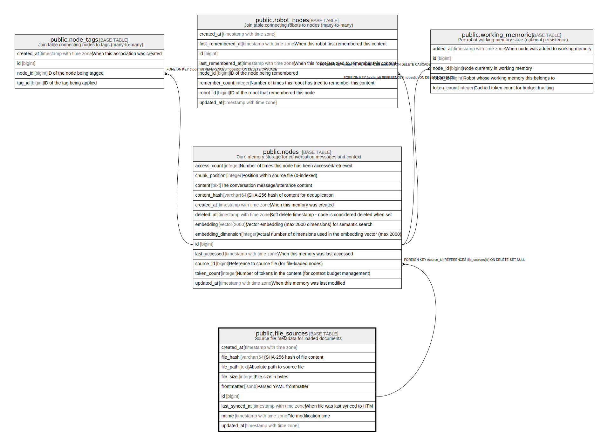

# public.file_sources

## Description

Source file metadata for loaded documents

## Columns

| Name | Type | Default | Nullable | Children | Parents | Comment |
| ---- | ---- | ------- | -------- | -------- | ------- | ------- |
| created_at | timestamp with time zone | CURRENT_TIMESTAMP | true |  |  |  |
| file_hash | varchar(64) |  | true |  |  | SHA-256 hash of file content |
| file_path | text |  | false |  |  | Absolute path to source file |
| file_size | integer |  | true |  |  | File size in bytes |
| frontmatter | jsonb | '{}'::jsonb | true |  |  | Parsed YAML frontmatter |
| id | bigint | nextval('file_sources_id_seq'::regclass) | false | [public.nodes](public.nodes.md) |  |  |
| last_synced_at | timestamp with time zone |  | true |  |  | When file was last synced to HTM |
| mtime | timestamp with time zone |  | true |  |  | File modification time |
| updated_at | timestamp with time zone | CURRENT_TIMESTAMP | true |  |  |  |

## Constraints

| Name | Type | Definition |
| ---- | ---- | ---------- |
| file_sources_pkey | PRIMARY KEY | PRIMARY KEY (id) |

## Indexes

| Name | Definition |
| ---- | ---------- |
| file_sources_pkey | CREATE UNIQUE INDEX file_sources_pkey ON public.file_sources USING btree (id) |
| idx_file_sources_hash | CREATE INDEX idx_file_sources_hash ON public.file_sources USING btree (file_hash) |
| idx_file_sources_last_synced | CREATE INDEX idx_file_sources_last_synced ON public.file_sources USING btree (last_synced_at) |
| idx_file_sources_path_unique | CREATE UNIQUE INDEX idx_file_sources_path_unique ON public.file_sources USING btree (file_path) |

## Relations

---

> Generated by [tbls](https://github.com/k1LoW/tbls)
