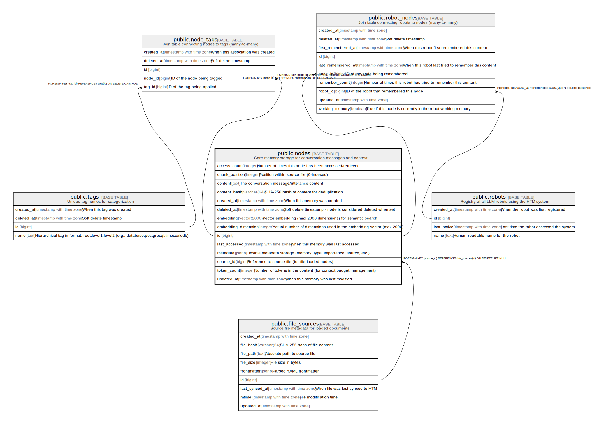

# public.nodes

## Description

Core memory storage for conversation messages and context

## Columns

| Name | Type | Default | Nullable | Children | Parents | Comment |
| ---- | ---- | ------- | -------- | -------- | ------- | ------- |
| access_count | integer | 0 | false |  |  | Number of times this node has been accessed/retrieved |
| chunk_position | integer |  | true |  |  | Position within source file (0-indexed) |
| content | text |  | false |  |  | The conversation message/utterance content |
| content_hash | varchar(64) |  | true |  |  | SHA-256 hash of content for deduplication |
| created_at | timestamp with time zone | CURRENT_TIMESTAMP | true |  |  | When this memory was created |
| deleted_at | timestamp with time zone |  | true |  |  | Soft delete timestamp - node is considered deleted when set |
| embedding | vector(2000) |  | true |  |  | Vector embedding (max 2000 dimensions) for semantic search |
| embedding_dimension | integer |  | true |  |  | Actual number of dimensions used in the embedding vector (max 2000) |
| id | bigint | nextval('nodes_id_seq'::regclass) | false | [public.node_tags](public.node_tags.md) [public.robot_nodes](public.robot_nodes.md) [public.working_memories](public.working_memories.md) |  |  |
| last_accessed | timestamp with time zone | CURRENT_TIMESTAMP | true |  |  | When this memory was last accessed |
| metadata | jsonb | '{}'::jsonb | false |  |  | Flexible metadata storage (memory_type, importance, source, etc.) |
| source_id | bigint |  | true |  | [public.file_sources](public.file_sources.md) | Reference to source file (for file-loaded nodes) |
| token_count | integer |  | true |  |  | Number of tokens in the content (for context budget management) |
| updated_at | timestamp with time zone | CURRENT_TIMESTAMP | true |  |  | When this memory was last modified |

## Constraints

| Name | Type | Definition |
| ---- | ---- | ---------- |
| check_embedding_dimension | CHECK | CHECK (((embedding_dimension IS NULL) OR ((embedding_dimension > 0) AND (embedding_dimension <= 2000)))) |
| fk_rails_920ad16d08 | FOREIGN KEY | FOREIGN KEY (source_id) REFERENCES file_sources(id) ON DELETE SET NULL |
| nodes_pkey | PRIMARY KEY | PRIMARY KEY (id) |

## Indexes

| Name | Definition |
| ---- | ---------- |
| idx_nodes_access_count | CREATE INDEX idx_nodes_access_count ON public.nodes USING btree (access_count) |
| idx_nodes_content_gin | CREATE INDEX idx_nodes_content_gin ON public.nodes USING gin (to_tsvector('english'::regconfig, content)) |
| idx_nodes_content_hash_unique | CREATE UNIQUE INDEX idx_nodes_content_hash_unique ON public.nodes USING btree (content_hash) |
| idx_nodes_content_trgm | CREATE INDEX idx_nodes_content_trgm ON public.nodes USING gin (content gin_trgm_ops) |
| idx_nodes_created_at | CREATE INDEX idx_nodes_created_at ON public.nodes USING btree (created_at) |
| idx_nodes_deleted_at | CREATE INDEX idx_nodes_deleted_at ON public.nodes USING btree (deleted_at) |
| idx_nodes_embedding | CREATE INDEX idx_nodes_embedding ON public.nodes USING hnsw (embedding vector_cosine_ops) WITH (m='16', ef_construction='64') |
| idx_nodes_last_accessed | CREATE INDEX idx_nodes_last_accessed ON public.nodes USING btree (last_accessed) |
| idx_nodes_metadata | CREATE INDEX idx_nodes_metadata ON public.nodes USING gin (metadata) |
| idx_nodes_not_deleted_created_at | CREATE INDEX idx_nodes_not_deleted_created_at ON public.nodes USING btree (created_at) WHERE (deleted_at IS NULL) |
| idx_nodes_source_chunk_position | CREATE INDEX idx_nodes_source_chunk_position ON public.nodes USING btree (source_id, chunk_position) |
| idx_nodes_source_id | CREATE INDEX idx_nodes_source_id ON public.nodes USING btree (source_id) |
| idx_nodes_updated_at | CREATE INDEX idx_nodes_updated_at ON public.nodes USING btree (updated_at) |
| nodes_pkey | CREATE UNIQUE INDEX nodes_pkey ON public.nodes USING btree (id) |

## Relations

---

> Generated by [tbls](https://github.com/k1LoW/tbls)
