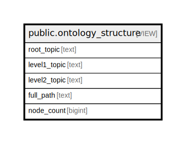

# public.ontology_structure

## Description

Provides a hierarchical view of all topics in the knowledge base. Topics use colon-delimited format (e.g., database:postgresql:timescaledb) and are assigned manually via tags.

<details>
<summary><strong>Table Definition</strong></summary>

```sql
CREATE VIEW ontology_structure AS (
 SELECT split_part(tag, ':'::text, 1) AS root_topic,
    split_part(tag, ':'::text, 2) AS level1_topic,
    split_part(tag, ':'::text, 3) AS level2_topic,
    tag AS full_path,
    count(DISTINCT node_id) AS node_count
   FROM tags
  WHERE (tag ~ '^[a-z0-9\-]+(:[a-z0-9\-]+)*$'::text)
  GROUP BY tag
  ORDER BY (split_part(tag, ':'::text, 1)), (split_part(tag, ':'::text, 2)), (split_part(tag, ':'::text, 3))
)
```

</details>

## Columns

| Name | Type | Default | Nullable | Children | Parents | Comment |
| ---- | ---- | ------- | -------- | -------- | ------- | ------- |
| root_topic | text |  | true |  |  |  |
| level1_topic | text |  | true |  |  |  |
| level2_topic | text |  | true |  |  |  |
| full_path | text |  | true |  |  |  |
| node_count | bigint |  | true |  |  |  |

## Referenced Tables

| Name | Columns | Comment | Type |
| ---- | ------- | ------- | ---- |
| [public.tags](public.tags.md) | 4 | Hierarchical topic tags for flexible categorization using colon-delimited format | BASE TABLE |

## Relations



---

> Generated by [tbls](https://github.com/k1LoW/tbls)
