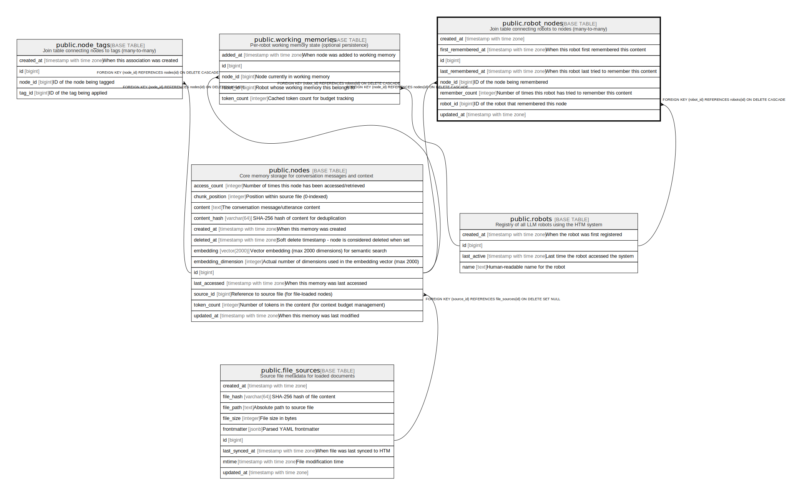

# public.robot_nodes

## Description

Join table connecting robots to nodes (many-to-many)

## Columns

| Name | Type | Default | Nullable | Children | Parents | Comment |
| ---- | ---- | ------- | -------- | -------- | ------- | ------- |
| created_at | timestamp with time zone | CURRENT_TIMESTAMP | true |  |  |  |
| deleted_at | timestamp with time zone |  | true |  |  | Soft delete timestamp |
| first_remembered_at | timestamp with time zone | CURRENT_TIMESTAMP | true |  |  | When this robot first remembered this content |
| id | bigint | nextval('robot_nodes_id_seq'::regclass) | false |  |  |  |
| last_remembered_at | timestamp with time zone | CURRENT_TIMESTAMP | true |  |  | When this robot last tried to remember this content |
| node_id | bigint |  | false |  | [public.nodes](public.nodes.md) | ID of the node being remembered |
| remember_count | integer | 1 | false |  |  | Number of times this robot has tried to remember this content |
| robot_id | bigint |  | false |  | [public.robots](public.robots.md) | ID of the robot that remembered this node |
| updated_at | timestamp with time zone | CURRENT_TIMESTAMP | true |  |  |  |
| working_memory | boolean | false | false |  |  | True if this node is currently in the robot working memory |

## Constraints

| Name | Type | Definition |
| ---- | ---- | ---------- |
| fk_rails_9b003078a8 | FOREIGN KEY | FOREIGN KEY (robot_id) REFERENCES robots(id) ON DELETE CASCADE |
| fk_rails_f2fc98d49e | FOREIGN KEY | FOREIGN KEY (node_id) REFERENCES nodes(id) ON DELETE CASCADE |
| robot_nodes_pkey | PRIMARY KEY | PRIMARY KEY (id) |

## Indexes

| Name | Definition |
| ---- | ---------- |
| idx_robot_nodes_deleted_at | CREATE INDEX idx_robot_nodes_deleted_at ON public.robot_nodes USING btree (deleted_at) |
| idx_robot_nodes_last_remembered_at | CREATE INDEX idx_robot_nodes_last_remembered_at ON public.robot_nodes USING btree (last_remembered_at) |
| idx_robot_nodes_node_id | CREATE INDEX idx_robot_nodes_node_id ON public.robot_nodes USING btree (node_id) |
| idx_robot_nodes_robot_id | CREATE INDEX idx_robot_nodes_robot_id ON public.robot_nodes USING btree (robot_id) |
| idx_robot_nodes_unique | CREATE UNIQUE INDEX idx_robot_nodes_unique ON public.robot_nodes USING btree (robot_id, node_id) |
| idx_robot_nodes_working_memory | CREATE INDEX idx_robot_nodes_working_memory ON public.robot_nodes USING btree (robot_id, working_memory) WHERE (working_memory = true) |
| robot_nodes_pkey | CREATE UNIQUE INDEX robot_nodes_pkey ON public.robot_nodes USING btree (id) |

## Relations

---

> Generated by [tbls](https://github.com/k1LoW/tbls)
