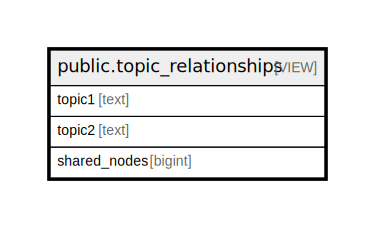

# public.topic_relationships

## Description

Shows which topics co-occur on the same nodes, revealing cross-topic relationships in the knowledge base.

<details>
<summary><strong>Table Definition</strong></summary>

```sql
CREATE VIEW topic_relationships AS (
 SELECT t1.tag AS topic1,
    t2.tag AS topic2,
    count(DISTINCT t1.node_id) AS shared_nodes
   FROM (tags t1
     JOIN tags t2 ON (((t1.node_id = t2.node_id) AND (t1.tag < t2.tag))))
  GROUP BY t1.tag, t2.tag
 HAVING (count(DISTINCT t1.node_id) >= 2)
  ORDER BY (count(DISTINCT t1.node_id)) DESC
)
```

</details>

## Columns

| Name | Type | Default | Nullable | Children | Parents | Comment |
| ---- | ---- | ------- | -------- | -------- | ------- | ------- |
| topic1 | text |  | true |  |  |  |
| topic2 | text |  | true |  |  |  |
| shared_nodes | bigint |  | true |  |  |  |

## Referenced Tables

| Name | Columns | Comment | Type |
| ---- | ------- | ------- | ---- |
| [public.tags](public.tags.md) | 4 | Hierarchical topic tags for flexible categorization using colon-delimited format | BASE TABLE |

## Relations



---

> Generated by [tbls](https://github.com/k1LoW/tbls)
