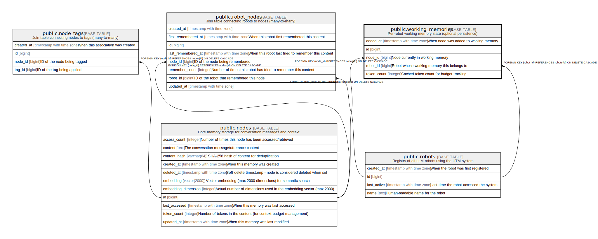

# public.working_memories

## Description

Per-robot working memory state (optional persistence)

## Columns

| Name | Type | Default | Nullable | Children | Parents | Comment |
| ---- | ---- | ------- | -------- | -------- | ------- | ------- |
| id | bigint | nextval('working_memories_id_seq'::regclass) | false |  |  |  |
| robot_id | bigint |  | false |  | [public.robots](public.robots.md) | Robot whose working memory this belongs to |
| node_id | bigint |  | false |  | [public.nodes](public.nodes.md) | Node currently in working memory |
| added_at | timestamp with time zone | CURRENT_TIMESTAMP | true |  |  | When node was added to working memory |
| token_count | integer |  | true |  |  | Cached token count for budget tracking |

## Constraints

| Name | Type | Definition |
| ---- | ---- | ---------- |
| fk_rails_4b7c3eb07b | FOREIGN KEY | FOREIGN KEY (robot_id) REFERENCES robots(id) ON DELETE CASCADE |
| fk_rails_2c1d8b383c | FOREIGN KEY | FOREIGN KEY (node_id) REFERENCES nodes(id) ON DELETE CASCADE |
| working_memories_pkey | PRIMARY KEY | PRIMARY KEY (id) |

## Indexes

| Name | Definition |
| ---- | ---------- |
| working_memories_pkey | CREATE UNIQUE INDEX working_memories_pkey ON public.working_memories USING btree (id) |
| idx_working_memories_robot_id | CREATE INDEX idx_working_memories_robot_id ON public.working_memories USING btree (robot_id) |
| idx_working_memories_node_id | CREATE INDEX idx_working_memories_node_id ON public.working_memories USING btree (node_id) |
| idx_working_memories_unique | CREATE UNIQUE INDEX idx_working_memories_unique ON public.working_memories USING btree (robot_id, node_id) |

## Relations

---

> Generated by [tbls](https://github.com/k1LoW/tbls)
