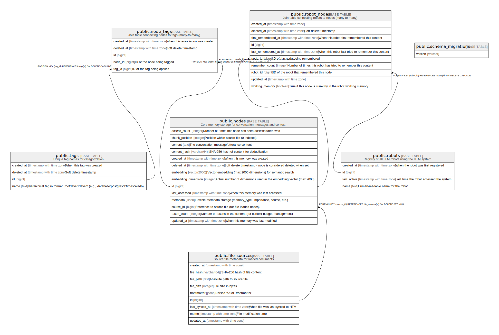

# Database Schema Documentation

This document provides a comprehensive reference for HTM's PostgreSQL database schema, including query patterns, optimization strategies, and best practices.

## Schema Overview

HTM uses PostgreSQL 17 with pgvector and pg_trgm extensions to provide:

- **Vector similarity search** via pgvector for semantic memory retrieval
- **Full-text search** with PostgreSQL's built-in tsvector capabilities
- **Fuzzy matching** using pg_trgm for flexible text search
- **Many-to-many relationships** for flexible tagging and categorization

### Required Extensions

HTM requires these PostgreSQL extensions:

```sql
CREATE EXTENSION IF NOT EXISTS pg_trgm WITH SCHEMA public;
CREATE EXTENSION IF NOT EXISTS vector WITH SCHEMA public;
```

## Entity-Relationship Diagram

Here's the complete database structure (auto-generated by tbls):



## Table Reference

For detailed table definitions, columns, indexes, and constraints, see the auto-generated documentation:

### Core Tables

| Table | Description | Details |
|-------|-------------|---------|
| [robots](../database/public.robots.md) | Registry of all LLM robots using the HTM system | Stores robot metadata and activity tracking |
| [nodes](../database/public.nodes.md) | Core memory storage for conversation messages and context | Vector embeddings, full-text search, deduplication |
| [tags](../database/public.tags.md) | Unique hierarchical tag names for categorization | Colon-separated namespaces (e.g., `ai:llm:embeddings`) |
| [working_memories](../database/public.working_memories.md) | Per-robot working memory state | Optional persistence for token-limited context |
| file_sources | Source file metadata for loaded documents | Path, mtime, frontmatter, sync tracking |

### Join Tables

| Table | Description | Details |
|-------|-------------|---------|
| [robot_nodes](../database/public.robot_nodes.md) | Links robots to nodes (many-to-many) | Enables "hive mind" shared memory architecture |
| [node_tags](../database/public.node_tags.md) | Links nodes to tags (many-to-many) | Flexible multi-tag categorization |

### System Tables

| Table | Description | Details |
|-------|-------------|---------|
| [schema_migrations](../database/public.schema_migrations.md) | ActiveRecord migration tracking | Tracks applied migrations |

For the complete schema overview including all stored procedures and functions, see the [Database Tables Overview](../database/README.md).

## Key Concepts

### Content Deduplication

Content deduplication is enforced via SHA-256 hashing in the `nodes` table:

1. When `remember()` is called, a SHA-256 hash of the content is computed
2. If a node with the same `content_hash` exists, the existing node is reused
3. A new `robot_nodes` association is created (or updated if it already exists)
4. This ensures identical memories are stored once but can be "remembered" by multiple robots

### JSONB Metadata

The `nodes` table includes a `metadata` JSONB column for flexible key-value storage:

| Column | Type | Default | Description |
|--------|------|---------|-------------|
| `metadata` | jsonb | `{}` | Arbitrary key-value data |

**Features:**
- Stores any valid JSON data (strings, numbers, booleans, arrays, objects)
- GIN index (`idx_nodes_metadata`) for efficient containment queries
- Queried using PostgreSQL's `@>` containment operator

**Query examples:**
```sql
-- Find nodes with specific metadata
SELECT * FROM nodes WHERE metadata @> '{"priority": "high"}'::jsonb;

-- Find nodes with nested metadata
SELECT * FROM nodes WHERE metadata @> '{"user": {"role": "admin"}}'::jsonb;

-- Find nodes with multiple conditions
SELECT * FROM nodes WHERE metadata @> '{"environment": "production", "version": 2}'::jsonb;
```

**Ruby usage:**
```ruby
# Store with metadata
htm.remember("API config", metadata: { environment: "production", version: 2 })

# Recall filtering by metadata
htm.recall("config", metadata: { environment: "production" })
```

### Hierarchical Tags

Tags use colon-separated hierarchies for organization:
- `programming:ruby:gems` - Programming > Ruby > Gems
- `database:postgresql:extensions` - Database > PostgreSQL > Extensions
- `ai:llm:embeddings` - AI > LLM > Embeddings

Query by prefix to find all related tags:
```sql
SELECT * FROM tags WHERE name LIKE 'database:%';  -- All database-related tags
SELECT * FROM tags WHERE name LIKE 'ai:llm:%';    -- All LLM-related tags
```

### File Source Tracking

The `file_sources` table tracks loaded documents for re-sync support:

| Column | Type | Description |
|--------|------|-------------|
| `id` | bigint | Primary key |
| `file_path` | text | Absolute path to the source file |
| `file_hash` | varchar(64) | SHA-256 hash of file contents |
| `mtime` | timestamptz | File modification time for change detection |
| `file_size` | integer | File size in bytes |
| `frontmatter` | jsonb | Parsed YAML frontmatter metadata |
| `last_synced_at` | timestamptz | When file was last synced |
| `created_at` | timestamptz | When source was first loaded |
| `updated_at` | timestamptz | When source was last updated |

Nodes loaded from files have:
- `source_id` - Foreign key to file_sources (nullable, ON DELETE SET NULL)
- `chunk_position` - Integer position within the file (0-indexed)

Query nodes from a file:
```sql
SELECT n.*
FROM nodes n
JOIN file_sources fs ON n.source_id = fs.id
WHERE fs.file_path = '/path/to/file.md'
ORDER BY n.chunk_position;
```

### Remember Tracking

The `robot_nodes` table tracks per-robot remember metadata:

1. `first_remembered_at` - When this robot first encountered this content
2. `last_remembered_at` - Updated each time the robot tries to remember the same content
3. `remember_count` - Incremented each time (useful for identifying frequently reinforced memories)

This allows querying for:
- Recently reinforced memories: `ORDER BY last_remembered_at DESC`
- Frequently remembered content: `ORDER BY remember_count DESC`
- New vs old memories: Compare `first_remembered_at` across robots

---

## Common Query Patterns

### Finding Nodes for a Robot

```sql
SELECT n.*
FROM nodes n
JOIN robot_nodes rn ON n.id = rn.node_id
WHERE rn.robot_id = $1
ORDER BY rn.last_remembered_at DESC;
```

### Finding Robots that Share a Node

```sql
SELECT r.*
FROM robots r
JOIN robot_nodes rn ON r.id = rn.robot_id
WHERE rn.node_id = $1
ORDER BY rn.first_remembered_at;
```

### Finding Frequently Remembered Content

```sql
SELECT n.*, rn.remember_count, rn.first_remembered_at, rn.last_remembered_at
FROM nodes n
JOIN robot_nodes rn ON n.id = rn.node_id
WHERE rn.robot_id = $1
ORDER BY rn.remember_count DESC
LIMIT 10;
```

### Finding Tags for a Node

```sql
SELECT t.name
FROM tags t
JOIN node_tags nt ON t.id = nt.tag_id
WHERE nt.node_id = $1
ORDER BY t.name;
```

### Finding Nodes with a Specific Tag

```sql
SELECT n.*
FROM nodes n
JOIN node_tags nt ON n.id = nt.node_id
JOIN tags t ON nt.tag_id = t.id
WHERE t.name = 'database:postgresql'
ORDER BY n.created_at DESC;
```

### Finding Nodes with Hierarchical Tag Prefix

```sql
SELECT n.*
FROM nodes n
JOIN node_tags nt ON n.id = nt.node_id
JOIN tags t ON nt.tag_id = t.id
WHERE t.name LIKE 'ai:llm:%'
ORDER BY n.created_at DESC;
```

### Finding Related Topics by Shared Nodes

```sql
SELECT
    t1.name AS topic1,
    t2.name AS topic2,
    COUNT(DISTINCT nt1.node_id) AS shared_nodes
FROM tags t1
JOIN node_tags nt1 ON t1.id = nt1.tag_id
JOIN node_tags nt2 ON nt1.node_id = nt2.node_id
JOIN tags t2 ON nt2.tag_id = t2.id
WHERE t1.name < t2.name
GROUP BY t1.name, t2.name
HAVING COUNT(DISTINCT nt1.node_id) >= 2
ORDER BY shared_nodes DESC;
```

### Vector Similarity Search with Tag Filter

```sql
SELECT n.*, n.embedding <=> $1::vector AS distance
FROM nodes n
JOIN node_tags nt ON n.id = nt.node_id
JOIN tags t ON nt.tag_id = t.id
WHERE t.name = 'programming:ruby'
  AND n.embedding IS NOT NULL
ORDER BY distance
LIMIT 10;
```

### Full-Text Search with Tag Filter

```sql
SELECT n.*, ts_rank(to_tsvector('english', n.content), query) AS rank
FROM nodes n
JOIN node_tags nt ON n.id = nt.node_id
JOIN tags t ON nt.tag_id = t.id,
     to_tsquery('english', 'database & optimization') query
WHERE to_tsvector('english', n.content) @@ query
  AND t.name LIKE 'database:%'
ORDER BY rank DESC
LIMIT 20;
```

### Finding Content Shared by Multiple Robots

```sql
SELECT n.*, COUNT(DISTINCT rn.robot_id) AS robot_count
FROM nodes n
JOIN robot_nodes rn ON n.id = rn.node_id
GROUP BY n.id
HAVING COUNT(DISTINCT rn.robot_id) > 1
ORDER BY robot_count DESC;
```

---

## Database Optimization

### Vector Search Performance

The `idx_nodes_embedding` index uses HNSW (Hierarchical Navigable Small World) algorithm for fast approximate nearest neighbor search:

- **m=16**: Number of bi-directional links per node (higher = better recall, more memory)
- **ef_construction=64**: Size of dynamic candidate list during index construction (higher = better quality, slower build)

For queries, you can adjust `ef_search` (defaults to 40):
```sql
SET hnsw.ef_search = 100;  -- Better recall, slower queries
```

### Full-Text Search Performance

The `idx_nodes_content_gin` index enables fast full-text search using PostgreSQL's tsvector:

```sql
-- Query optimization with explicit tsvector
SELECT * FROM nodes
WHERE to_tsvector('english', content) @@ to_tsquery('english', 'memory & retrieval');
```

### Fuzzy Matching Performance

The `idx_nodes_content_trgm` index enables similarity search and pattern matching:

```sql
-- Similarity search
SELECT * FROM nodes
WHERE content % 'semantic retreval';  -- Handles typos

-- Pattern matching
SELECT * FROM nodes
WHERE content ILIKE '%memry%';  -- Uses trigram index
```

### Index Maintenance

Monitor and maintain indexes for optimal performance:

```sql
-- Check index usage
SELECT schemaname, tablename, indexname, idx_scan, idx_tup_read, idx_tup_fetch
FROM pg_stat_user_indexes
WHERE schemaname = 'public'
ORDER BY idx_scan DESC;

-- Reindex if needed
REINDEX INDEX CONCURRENTLY idx_nodes_embedding;
REINDEX INDEX CONCURRENTLY idx_nodes_content_gin;
```

---

## Schema Migration

The schema is managed through ActiveRecord migrations located in `db/migrate/`:

1. `20250101000001_create_robots.rb` - Creates robots table
2. `20250101000002_create_nodes.rb` - Creates nodes table with all indexes
3. `20250101000005_create_tags.rb` - Creates tags and nodes_tags tables
4. `20251128000002_create_file_sources.rb` - Creates file_sources table for document tracking
5. `20251128000003_add_source_to_nodes.rb` - Adds source_id and chunk_position to nodes

To apply migrations:
```bash
bundle exec rake htm:db:migrate
```

To generate the current schema dump:
```bash
bundle exec rake htm:db:schema:dump
```

The canonical schema is maintained in `db/schema.sql`.

---

## Database Extensions

### pgvector

Provides vector similarity search capabilities:

```sql
-- Install extension
CREATE EXTENSION IF NOT EXISTS vector WITH SCHEMA public;

-- Vector operations
SELECT embedding <=> $1::vector AS cosine_distance FROM nodes;  -- Cosine distance
SELECT embedding <-> $1::vector AS l2_distance FROM nodes;      -- L2 distance
SELECT embedding <#> $1::vector AS inner_product FROM nodes;    -- Inner product
```

### pg_trgm

Provides trigram-based fuzzy text matching:

```sql
-- Install extension
CREATE EXTENSION IF NOT EXISTS pg_trgm WITH SCHEMA public;

-- Trigram operations
SELECT content % 'search term' FROM nodes;           -- Similarity operator
SELECT similarity(content, 'search term') FROM nodes; -- Similarity score
SELECT content ILIKE '%pattern%' FROM nodes;          -- Pattern matching (uses trigram index)
```

---

## Best Practices

### Tagging Strategy

1. **Use hierarchical namespaces**: `category:subcategory:detail`
2. **Be consistent with naming**: Use lowercase, singular nouns
3. **Limit depth**: 2-3 levels is optimal (e.g., `ai:llm:embeddings`)
4. **Avoid redundancy**: Don't duplicate information already in node fields

### Node Management

1. **Set appropriate importance**: Use 0.0-1.0 scale for priority-based retrieval
2. **Update last_accessed**: Touch timestamp when retrieving for LRU eviction
3. **Manage token_count**: Update when content changes for working memory budget
4. **Use appropriate types**: fact, context, code, preference, decision, question

### Search Strategy

1. **Vector search**: Best for semantic similarity ("concepts like X")
2. **Full-text search**: Best for keyword matching ("documents containing Y")
3. **Fuzzy search**: Best for typo tolerance and pattern matching
4. **Hybrid search**: Combine vector + full-text with weighted scores

### Performance Tuning

1. **Monitor index usage**: Use pg_stat_user_indexes
2. **Vacuum regularly**: Especially after bulk deletes
3. **Adjust HNSW parameters**: Balance recall vs speed based on dataset size
4. **Use connection pooling**: Managed by HTM::LongTermMemory
