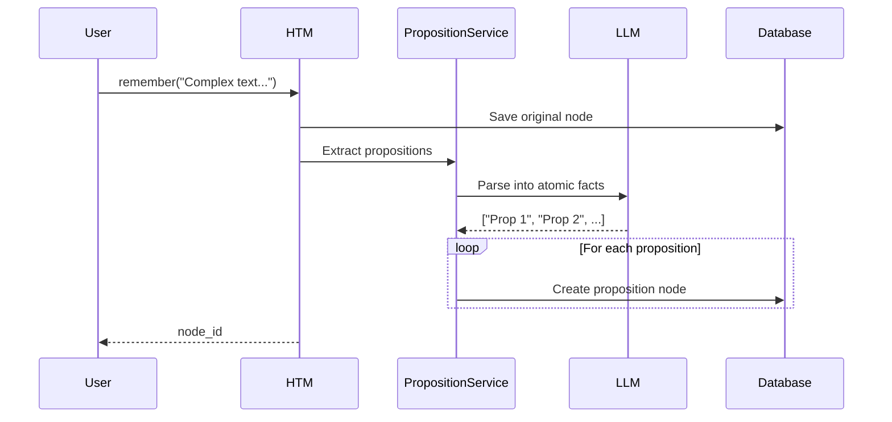

# Propositions: Atomic Fact Extraction

Proposition extraction breaks complex text into atomic, self-contained factual statements. This improves RAG retrieval accuracy by storing granular facts that can be matched more precisely.

## Overview

When proposition extraction is enabled, HTM:

1. Stores the original content as a node
2. Extracts atomic propositions from the content
3. Creates independent nodes for each proposition
4. Each proposition gets its own embedding and tags

## What is a Proposition?

A proposition is an atomic factual statement that:

- Expresses a **single fact** or claim
- Is **understandable without context**
- Uses **full names**, not pronouns
- Includes relevant **dates, times, and qualifiers**
- Contains **one subject-predicate relationship**

### Example

**Original text:**
> "In 1969, Neil Armstrong became the first person to walk on the Moon during Apollo 11."

**Extracted propositions:**
- "Neil Armstrong was an astronaut."
- "Neil Armstrong walked on the Moon in 1969."
- "Neil Armstrong was the first person to walk on the Moon."
- "Neil Armstrong walked on the Moon during the Apollo 11 mission."
- "The Apollo 11 mission occurred in 1969."

## Configuration

### Enable Proposition Extraction

```ruby
# Via configuration block
HTM.configure do |config|
  config.extract_propositions = true
  config.proposition_provider = :ollama  # or :openai, :anthropic, etc.
  config.proposition_model = 'gemma3:latest'
end

# Or via environment variable
# HTM_EXTRACT_PROPOSITIONS=true
```

### Provider Options

Proposition extraction uses LLM chat completion. Configure your preferred provider:

| Provider | Model Examples |
|----------|----------------|
| `:ollama` (default) | `gemma3:latest`, `llama3`, `mistral` |
| `:openai` | `gpt-4o-mini`, `gpt-4o` |
| `:anthropic` | `claude-3-haiku-20240307` |
| `:gemini` | `gemini-1.5-flash` |

```ruby
HTM.configure do |config|
  config.extract_propositions = true

  # Use OpenAI for higher quality extraction
  config.proposition_provider = :openai
  config.proposition_model = 'gpt-4o-mini'
end
```

## How It Works

### Workflow



### Proposition Nodes

Proposition nodes are stored with special metadata:

```ruby
{
  "is_proposition" => true,
  "source_node_id" => 123  # ID of the original node
}
```

This metadata allows you to:
- Identify proposition nodes
- Trace propositions back to source
- Filter propositions in queries

## Usage

### Basic Usage

```ruby
htm = HTM.new(robot_name: "Proposition Demo")

# With extraction enabled, this creates multiple nodes
node_id = htm.remember(
  "PostgreSQL 16 was released in September 2023 with improved query performance and new JSON features."
)

# The original node plus propositions are created:
# - "PostgreSQL 16 was released in September 2023."
# - "PostgreSQL 16 includes improved query performance."
# - "PostgreSQL 16 includes new JSON features."
```

### Direct Extraction

You can extract propositions without storing them:

```ruby
propositions = HTM.extract_propositions(
  "Ruby 3.3 introduced YJIT improvements and the Prism parser."
)
# => [
#   "Ruby 3.3 introduced YJIT improvements.",
#   "Ruby 3.3 introduced the Prism parser.",
#   "YJIT is a just-in-time compiler for Ruby.",
#   "Prism is a parser for Ruby."
# ]

# Manually store if needed
propositions.each { |p| htm.remember(p) }
```

### Querying Propositions

```ruby
# Find all proposition nodes
propositions = HTM::Models::Node.where("metadata->>'is_proposition' = ?", 'true')

# Find propositions from a specific source
source_node_id = 123
related = HTM::Models::Node.where(
  "metadata->>'source_node_id' = ?",
  source_node_id.to_s
)

# Include propositions in recall (default behavior)
results = htm.recall("PostgreSQL features", strategy: :hybrid)
```

## Recursion Prevention

Proposition nodes do **not** trigger further proposition extraction. This prevents infinite recursion:

```ruby
# Original node → triggers proposition extraction
htm.remember("Complex statement about many things.")

# Proposition nodes → do NOT trigger extraction
# (metadata.is_proposition = true prevents this)
```

## Performance Considerations

### Processing Time

Proposition extraction adds latency:

| Provider | Typical Latency |
|----------|-----------------|
| Ollama (local) | 1-3 seconds |
| OpenAI | 0.5-1 second |
| Anthropic | 0.5-1 second |

### Async Processing

With async job backend, extraction happens in background:

```ruby
HTM.configure do |config|
  config.extract_propositions = true
  config.job.backend = :thread  # or :sidekiq
end

# Returns immediately, propositions created async
node_id = htm.remember("Complex content...")
```

### Storage Impact

Proposition extraction increases storage:

- Original node: 1 record
- Propositions: 3-10 additional records (typical)
- Each proposition gets its own embedding

## Best Practices

### When to Use Propositions

**Good use cases:**
- Dense factual content (Wikipedia, documentation)
- Complex statements with multiple facts
- Content that will be queried for specific facts

**Less suitable:**
- Simple, atomic statements
- Conversational content
- Content where context is critical

### Quality Tuning

Use a capable model for better extraction:

```ruby
# Higher quality (slower, costs more)
config.proposition_provider = :openai
config.proposition_model = 'gpt-4o'

# Balanced (faster, local)
config.proposition_provider = :ollama
config.proposition_model = 'gemma3:latest'
```

### Selective Extraction

Enable/disable per operation if needed:

```ruby
# Temporarily disable for specific content
original_setting = HTM.configuration.extract_propositions
HTM.configuration.extract_propositions = false
htm.remember("Simple fact that doesn't need decomposition.")
HTM.configuration.extract_propositions = original_setting
```

## Rake Tasks

```bash
# Rebuild all propositions (clears and regenerates)
rake htm:db:rebuild:propositions
```

## Related Documentation

- [Adding Memories](adding-memories.md) - Core memory operations
- [Search Strategies](search-strategies.md) - Querying memories
- [Tags](tags.md) - Hierarchical tagging (propositions get tags too)
- [API Reference: PropositionService](../api/yard/HTM/PropositionService.md)
