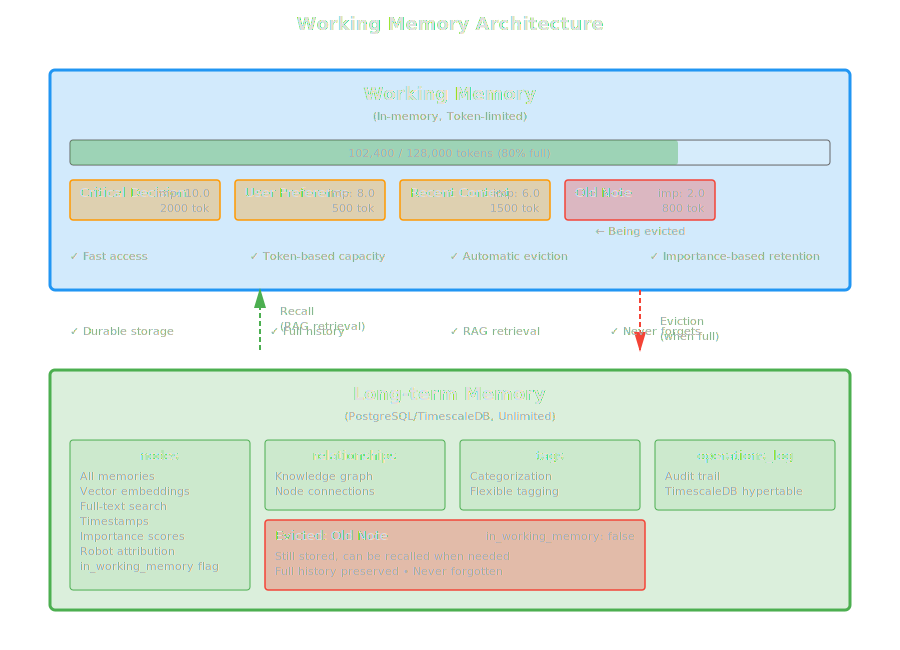

# Working Memory Management

Working memory is HTM's token-limited active context system designed for immediate LLM use. This guide explains how it works, how to manage it effectively, and best practices for optimal performance.

## What is Working Memory?

Working memory is an in-memory cache that:

- **Stores active memories** for fast access
- **Respects token limits** (default: 128,000 tokens)
- **Evicts old/unimportant memories** when full
- **Syncs with long-term memory** for durability

Think of it as RAM for your robot's consciousness - fast, limited, and volatile.

## Architecture



## Initialization

Configure working memory size when creating HTM:

```ruby
# Default: 128K tokens (roughly 512KB of text)
htm = HTM.new(
  robot_name: "Assistant",
  working_memory_size: 128_000
)

# Large working memory for extensive context
htm = HTM.new(
  robot_name: "Long Context Bot",
  working_memory_size: 1_000_000  # 1M tokens
)

# Small working memory for focused tasks
htm = HTM.new(
  robot_name: "Focused Bot",
  working_memory_size: 32_000  # 32K tokens
)
```

!!! tip "Choosing Memory Size"
    - **32K-64K**: Focused tasks, single conversations
    - **128K-256K**: General purpose, multiple topics (recommended)
    - **512K-1M**: Extensive context, long sessions
    - **>1M**: Specialized use cases only (memory overhead)

## How Working Memory Works

### Adding Memories

When you add a node, it goes to both working and long-term memory:

```ruby
htm.add_node(
  "fact_001",
  "User prefers Ruby for scripting",
  type: :fact,
  importance: 7.0
)

# Internally:
# 1. Calculate token count
# 2. Store in long-term memory (PostgreSQL)
# 3. Add to working memory (in-memory)
# 4. Check capacity, evict if needed
```

### Recalling Memories

When you recall, memories are added to working memory:

```ruby
memories = htm.recall(
  timeframe: "last week",
  topic: "database design"
)

# Internally:
# 1. Search long-term memory (RAG)
# 2. For each result:
#    a. Check if space available
#    b. Evict if needed
#    c. Add to working memory
```

### Automatic Eviction

When working memory is full, HTM evicts memories using a smart algorithm:

```ruby
# Algorithm:
# 1. Calculate eviction score = importance × recency
# 2. Sort by score (lowest first)
# 3. Evict until enough space
# 4. Mark as evicted in long-term memory
```

!!! note
    Evicted memories are **not deleted** - they remain in long-term memory and can be recalled later.

## Monitoring Utilization

### Basic Stats

```ruby
wm = htm.working_memory

puts "Nodes: #{wm.node_count}"
puts "Tokens: #{wm.token_count} / #{wm.max_tokens}"
puts "Utilization: #{wm.utilization_percentage}%"
```

### Detailed Monitoring

```ruby
class MemoryMonitor
  def initialize(htm)
    @htm = htm
  end

  def report
    wm = @htm.working_memory
    stats = @htm.memory_stats

    puts "=== Working Memory Report ==="
    puts "Capacity: #{wm.max_tokens} tokens"
    puts "Used: #{wm.token_count} tokens (#{wm.utilization_percentage}%)"
    puts "Free: #{wm.max_tokens - wm.token_count} tokens"
    puts "Nodes: #{wm.node_count}"
    puts
    puts "Average tokens per node: #{wm.token_count / wm.node_count}" if wm.node_count > 0
    puts
    puts "=== Long-term Memory ==="
    puts "Total nodes: #{stats[:total_nodes]}"
    puts "Database size: #{(stats[:database_size] / 1024.0 / 1024.0).round(2)} MB"
  end

  def health_check
    util = @htm.working_memory.utilization_percentage

    case util
    when 0..50
      { status: :healthy, message: "Plenty of space" }
    when 51..80
      { status: :warning, message: "Approaching capacity" }
    when 81..95
      { status: :critical, message: "Nearly full, evictions likely" }
    else
      { status: :full, message: "At capacity, frequent evictions" }
    end
  end
end

monitor = MemoryMonitor.new(htm)
monitor.report
health = monitor.health_check
puts "Health: #{health[:status]} - #{health[:message]}"
```

## Eviction Behavior

### Understanding Eviction

HTM evicts memories based on two factors:

1. **Importance**: Higher importance = less likely to evict
2. **Recency**: Newer memories = less likely to evict

```ruby
# Eviction score calculation
score = importance × (1 / age_in_hours)

# Example scores:
# High importance (9.0), recent (1 hour): 9.0 × 1.0 = 9.0 (keep)
# High importance (9.0), old (24 hours): 9.0 × 0.042 = 0.38 (maybe evict)
# Low importance (2.0), recent (1 hour): 2.0 × 1.0 = 2.0 (evict soon)
# Low importance (2.0), old (24 hours): 2.0 × 0.042 = 0.08 (evict first)
```

### Eviction Example

```ruby
# Fill working memory
htm = HTM.new(
  robot_name: "Test",
  working_memory_size: 10_000  # Small for demo
)

# Add important fact (will stay)
htm.add_node(
  "critical",
  "Critical system password",
  importance: 10.0
)

# Add many low-importance items
100.times do |i|
  htm.add_node(
    "temp_#{i}",
    "Temporary note #{i}",
    importance: 1.0
  )
end

# Check what survived
wm = htm.working_memory
puts "Surviving nodes: #{wm.node_count}"

# Critical fact should still be there
critical = htm.retrieve("critical")
puts "Critical fact present: #{!critical.nil?}"
```

### Manual Eviction

You can trigger eviction manually:

```ruby
# Access the eviction mechanism (internal API)
needed_tokens = 50_000

evicted = htm.working_memory.evict_to_make_space(needed_tokens)

puts "Evicted #{evicted.length} memories:"
evicted.each do |mem|
  puts "- #{mem[:key]}: #{mem[:value][0..50]}..."
end
```

!!! warning
    Manual eviction is rarely needed. HTM handles this automatically during normal operations.

## Best Practices

### 1. Set Appropriate Importance

```ruby
# Critical data: Never evict
htm.add_node(
  "api_key",
  "Production API key",
  importance: 10.0
)

# Important context: Retain longer
htm.add_node(
  "user_goal",
  "User wants to optimize database",
  importance: 8.0
)

# Temporary context: Evict when needed
htm.add_node(
  "current_topic",
  "Discussing query optimization",
  importance: 5.0
)

# Disposable notes: Evict first
htm.add_node(
  "scratch",
  "Temporary calculation result",
  importance: 1.0
)
```

### 2. Monitor Utilization Regularly

```ruby
class WorkingMemoryManager
  def initialize(htm, threshold: 80.0)
    @htm = htm
    @threshold = threshold
  end

  def check_and_warn
    util = @htm.working_memory.utilization_percentage

    if util > @threshold
      warn "Working memory at #{util}%!"
      warn "Consider increasing working_memory_size or reducing context"
    end
  end

  def auto_adjust_importance
    util = @htm.working_memory.utilization_percentage

    # If critically full, boost importance of current context
    if util > 90
      # Implementation would require tracking current context keys
      # and updating their importance in the database
      warn "Critical capacity reached"
    end
  end
end
```

### 3. Use Context Strategically

Don't load unnecessary data into working memory:

```ruby
# Bad: Load everything
all_memories = htm.recall(
  timeframe: "all time",
  topic: "anything",
  limit: 1000
)
# This fills working memory with potentially irrelevant data

# Good: Load what you need
relevant = htm.recall(
  timeframe: "last week",
  topic: "current project",
  limit: 20
)
# This keeps working memory focused
```

### 4. Clean Up When Done

Remove temporary memories:

```ruby
def with_temporary_context(htm, key, value)
  # Add temporary context
  htm.add_node(key, value, type: :context, importance: 2.0)

  yield

  # Clean up
  htm.forget(key, confirm: :confirmed)
end

with_temporary_context(htm, "scratch_001", "Temp data") do
  # Use the temporary context
  context = htm.create_context(strategy: :recent)
  # ... do work
end
# Temp data is now removed
```

### 5. Batch Operations Carefully

Be mindful when adding many memories at once:

```ruby
# Risky: Might fill working memory quickly
1000.times do |i|
  htm.add_node("item_#{i}", "Data #{i}", importance: 5.0)
end

# Better: Add with appropriate importance
1000.times do |i|
  htm.add_node(
    "item_#{i}",
    "Data #{i}",
    importance: 3.0  # Lower importance for bulk data
  )
end

# Or: Monitor during batch operations
batch_data.each_with_index do |data, i|
  htm.add_node("item_#{i}", data, importance: 5.0)

  # Check capacity every 100 items
  if i % 100 == 0
    util = htm.working_memory.utilization_percentage
    puts "Utilization: #{util}%"
  end
end
```

## Working Memory Strategies

### Strategy 1: Sliding Window

Keep only recent memories:

```ruby
class SlidingWindow
  def initialize(htm, window_size: 50)
    @htm = htm
    @window_size = window_size
    @keys = []
  end

  def add(key, value, **opts)
    @htm.add_node(key, value, **opts)
    @keys << key

    # Evict oldest if window exceeded
    if @keys.length > @window_size
      oldest = @keys.shift
      @htm.forget(oldest, confirm: :confirmed) rescue nil
    end
  end
end
```

### Strategy 2: Importance Thresholding

Only keep high-importance memories:

```ruby
class ImportanceFilter
  def initialize(htm, min_importance: 7.0)
    @htm = htm
    @min_importance = min_importance
  end

  def add(key, value, importance:, **opts)
    @htm.add_node(key, value, importance: importance, **opts)

    # If low importance and memory is tight, evict immediately
    if importance < @min_importance &&
       @htm.working_memory.utilization_percentage > 80

      # Let it evict naturally or remove from working memory
      # (Note: HTM doesn't expose direct working memory removal,
      #  so we rely on natural eviction)
    end
  end
end
```

### Strategy 3: Topic-Based Management

Group memories by topic and manage separately:

```ruby
class TopicManager
  def initialize(htm)
    @htm = htm
    @topics = Hash.new { |h, k| h[k] = [] }
  end

  def add(key, value, topic:, **opts)
    @htm.add_node(key, value, **opts)
    @topics[topic] << key
  end

  def clear_topic(topic)
    keys = @topics[topic] || []
    keys.each do |key|
      @htm.forget(key, confirm: :confirmed) rescue nil
    end
    @topics.delete(topic)
  end

  def focus_on_topic(topic)
    # Clear all other topics to make space
    @topics.keys.each do |t|
      clear_topic(t) unless t == topic
    end
  end
end
```

## Token Counting

HTM uses Tiktoken to count tokens:

```ruby
# Token counts vary by content
short = "Hello world"  # ~2 tokens
medium = "A" * 100     # ~25 tokens
long = "word " * 1000  # ~1000 tokens

# Check token count of a string
embedding_service = HTM::EmbeddingService.new
tokens = embedding_service.count_tokens(long)
puts "Token count: #{tokens}"
```

!!! note "Token vs Characters"
    - 1 token ≈ 4 characters (English)
    - 128K tokens ≈ 512KB text
    - Code uses fewer tokens per character
    - Special characters use more tokens

## Performance Considerations

### Memory Overhead

Working memory has minimal overhead:

```ruby
# Memory usage per node (approximate):
# - Key: ~50 bytes
# - Value: N bytes (your content)
# - Metadata: ~100 bytes
# - Total: ~150 bytes + content

# For 1000 nodes with 500-char content:
# 1000 × (150 + 500) = ~650KB

# Token count is stored but content dominates
```

### Access Speed

Working memory is very fast:

```ruby
require 'benchmark'

htm = HTM.new(robot_name: "Perf Test")

# Add 1000 memories
1000.times do |i|
  htm.add_node("key_#{i}", "Value #{i}", importance: 5.0)
end

# Benchmark working memory access
Benchmark.bm do |x|
  x.report("create_context:") do
    1000.times { htm.create_context(strategy: :balanced) }
  end
end

# Typical results:
# create_context: ~1ms per call
```

### Optimization Tips

```ruby
# 1. Avoid frequent context assembly
# Bad: Assemble context every message
def process_message(message)
  context = htm.create_context  # Slow if called frequently
  llm.chat(context + message)
end

# Good: Cache context, update periodically
@context_cache = nil
@context_age = 0

def process_message(message)
  if @context_cache.nil? || @context_age > 10
    @context_cache = htm.create_context
    @context_age = 0
  end
  @context_age += 1

  llm.chat(@context_cache + message)
end

# 2. Use appropriate token limits
# Don't request more than your LLM can handle
context = htm.create_context(
  strategy: :balanced,
  max_tokens: 100_000  # Match LLM's context window
)

# 3. Monitor and adjust
util = htm.working_memory.utilization_percentage
if util > 90
  # Reduce working memory size or increase eviction
end
```

## Debugging Working Memory

### Inspecting Contents

```ruby
class WorkingMemoryInspector
  def initialize(htm)
    @htm = htm
  end

  def show_contents
    wm = @htm.working_memory

    puts "=== Working Memory Contents ==="
    puts "Total nodes: #{wm.node_count}"
    puts "Total tokens: #{wm.token_count}"
    puts

    # Access internal structure (advanced)
    # Note: This requires access to WorkingMemory internals
    # For production, use public APIs only
  end

  def find_large_nodes(threshold: 1000)
    # Find nodes using many tokens
    # This would require iterating working memory
    # (not directly exposed in current API)
  end

  def show_eviction_candidates
    # Show which nodes would be evicted next
    # Based on importance and recency
  end
end
```

### Common Issues

**Issue: Working memory always full**

```ruby
# Check if you're adding too much
stats = htm.memory_stats
wm_util = stats[:working_memory][:utilization]

if wm_util > 95
  puts "Working memory consistently full"
  puts "Solutions:"
  puts "1. Increase working_memory_size"
  puts "2. Lower importance of bulk data"
  puts "3. Reduce recall limit"
  puts "4. Clean up temporary data more frequently"
end
```

**Issue: Important data getting evicted**

```ruby
# Increase importance of critical data
htm.add_node(
  "critical_data",
  "Important information",
  importance: 9.5  # High enough to avoid eviction
)
```

**Issue: Memory utilization too low**

```ruby
# Working memory underutilized
wm_util = htm.working_memory.utilization_percentage

if wm_util < 20
  puts "Working memory underutilized"
  puts "Consider:"
  puts "1. Reducing working_memory_size to save RAM"
  puts "2. Recalling more context"
  puts "3. Using larger token limits in create_context"
end
```

## Next Steps

- [**Context Assembly**](context-assembly.md) - Use working memory effectively with LLMs
- [**Long-term Memory**](long-term-memory.md) - Understand persistent storage
- [**Adding Memories**](adding-memories.md) - Learn about importance scoring

## Complete Example

```ruby
require 'htm'

# Initialize with moderate working memory
htm = HTM.new(
  robot_name: "Memory Manager",
  working_memory_size: 128_000
)

# Monitor class
class Monitor
  def initialize(htm)
    @htm = htm
  end

  def report
    wm = @htm.working_memory
    puts "Utilization: #{wm.utilization_percentage}%"
    puts "Nodes: #{wm.node_count}"
    puts "Tokens: #{wm.token_count} / #{wm.max_tokens}"
  end
end

monitor = Monitor.new(htm)

# Add memories with different importance
puts "Adding critical data..."
htm.add_node("critical", "Critical system data", importance: 10.0)
monitor.report

puts "\nAdding important data..."
10.times do |i|
  htm.add_node("important_#{i}", "Important item #{i}", importance: 8.0)
end
monitor.report

puts "\nAdding regular data..."
50.times do |i|
  htm.add_node("regular_#{i}", "Regular item #{i}", importance: 5.0)
end
monitor.report

puts "\nAdding temporary data..."
100.times do |i|
  htm.add_node("temp_#{i}", "Temporary item #{i}", importance: 2.0)
end
monitor.report

# Check what survived
puts "\n=== Survival Check ==="
critical = htm.retrieve("critical")
puts "Critical survived: #{!critical.nil?}"

# Create context
puts "\nCreating context..."
context = htm.create_context(strategy: :important, max_tokens: 50_000)
puts "Context length: #{context.length} characters"

# Final stats
puts "\n=== Final Stats ==="
monitor.report
```
