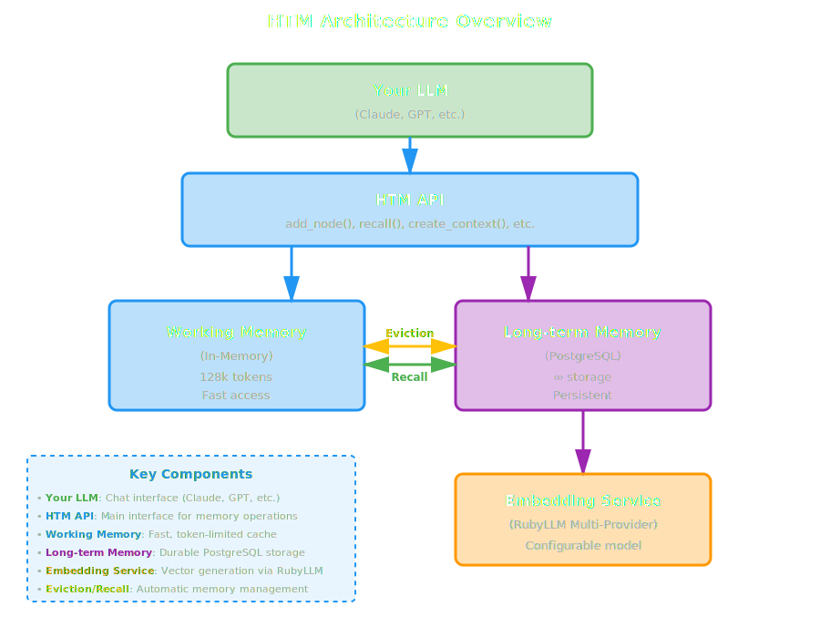

<div align="center">
  <div style="background: linear-gradient(135deg, #ffd93d 0%, #f5c800 100%); border: 4px solid #e6b800; border-radius: 12px; padding: 20px; margin: 20px auto; max-width: 800px; box-shadow: 0 8px 16px rgba(230, 184, 0, 0.3);">
    <p style="color: #000000; font-size: 42px; font-weight: bold; margin: 0;">
      💣 CAUTION 💣
    </p>
    <p style="color: #000; font-size: 27px; font-weight: bold; margin: 10px 0 0 0; line-height: 1.6;">
      This documentation may contain <strong>inaccuracies</strong>.<br/>
      Verify critical details in the source code and example demos.
    </p>
  </div>

  
</div>

<p>A hierarchical and temporal system for encoding, storing, and retrieving information—operating across varying levels of abstraction (from simple to detailed concepts and their relationships) and across time (from the present to the past).<br/>
</p>

## What does it mean?

- **Hierarchical**: operates across multiple levels of abstraction, from simple concepts to detailed relationships
- **Temporal**: functions across time, from the present moment to historical data
- **Memory function**: encodes, stores, and retrieves information

**HTM**: a hierarchical and temporal memory system that organizes and recalls information at multiple levels of detail over extended timeframes.

## Key Features

### Two-Tier Memory Architecture

HTM implements a realistic memory model inspired by human cognition:

- **Working Memory**: Token-limited active context optimized for immediate LLM consumption
- **Long-term Memory**: Durable PostgreSQL storage that persists forever

The two tiers work seamlessly together - working memory pulls from long-term storage as needed, and automatically evicts less important memories back to long-term storage when space is limited.

### Never-Forget Philosophy

HTM follows a "never forget unless explicitly told" principle:

- All memories persist in long-term storage indefinitely
- Working memory evictions move data to long-term storage, never delete it
- Only explicit `forget()` commands with confirmation actually delete data
- Complete audit trail of all memory operations

### RAG-Based Retrieval

HTM uses advanced Retrieval-Augmented Generation techniques:

- **Vector Similarity Search**: Semantic search using pgvector with embeddings from Ollama
- **Full-Text Search**: PostgreSQL full-text search for keyword matching
- **Hybrid Search**: Combines both vector and full-text for best results
- **Temporal Filtering**: Natural language time queries like "last week" or "yesterday"
- **Importance Scoring**: Prioritize critical memories over trivial ones

### Multi-Robot Hive Mind

HTM enables multiple AI robots to share a collective memory:

- All robots share access to global long-term memory
- Track which robot said what and when
- Cross-robot context awareness and conversation continuity
- Query conversation timelines across multiple robots

### Pseudo Knowledge Graph

Build rich relationship networks between memories using a hierarchical taxonomy:

- Link related memories together
- Tag-based categorization with up to four levels of abstraction
- Importance scoring for prioritization
- Navigate memory relationship abstractions

## Quick Example

Here's how simple it is to get started with HTM:

```ruby
require 'htm'

# Configure HTM globally (optional - uses Ollama by default)
HTM.configure do |config|
  config.embedding.provider = :ollama
  config.embedding.model = 'nomic-embed-text:latest'
  config.tag.provider = :ollama
  config.tag.model = 'gemma3:latest'
end

# Initialize HTM for your robot
htm = HTM.new(
  robot_name: "Chat Assistant",
  working_memory_size: 128_000     # 128k tokens
)

# Remember information (embeddings generated automatically in background)
node_id = htm.remember(
  "We decided to use PostgreSQL for HTM storage",
  tags: ["database:postgresql", "architecture"],
  metadata: { category: "architecture", priority: "high" }
)

# Recall memories from the past
memories = htm.recall(
  "database decisions",            # Topic (first positional argument)
  timeframe: "last week",
  strategy: :hybrid
)

# Create context for your LLM from working memory
context = htm.working_memory.assemble_context(
  strategy: :balanced,
  max_tokens: 50_000
)

# Use context in your LLM prompt
response = llm.chat(
  system: "You are a helpful assistant. " \
          "Here's your memory context:\n#{context}",
  user: "What database did we decide to use?"
)

# Explicit deletion only when needed (soft delete by default)
htm.forget(node_id)                              # Soft delete (recoverable)
htm.forget(node_id, soft: false, confirm: :confirmed)  # Permanent delete
```

## Use Cases

HTM is perfect for:

- **AI Coding Assistants**: Remember project decisions, code patterns, and user preferences
- **Customer Service Bots**: Maintain conversation history and customer context
- **Personal AI Assistants**: Remember user preferences, habits, and important information
- **Research Assistants**: Build knowledge graphs from documents and conversations
- **Multi-Agent Systems**: Enable collaborative memory across multiple AI agents

## Architecture Overview

HTM consists of several key components working together:



### Component Breakdown

- **HTM API**: Main interface for all memory operations
- **WorkingMemory**: Token-limited in-memory cache for immediate LLM use
- **LongTermMemory**: PostgreSQL-backed durable storage
- **EmbeddingService**: Generates vector embeddings via RubyLLM and Ollama
- **Database**: Schema management and connection pooling

## Memory Types

HTM supports different categories of memories:

- **`:fact`**: Immutable facts ("User's name is Dewayne")
- **`:context`**: Conversation state and context
- **`:code`**: Code snippets and programming patterns
- **`:preference`**: User preferences and settings
- **`:decision`**: Architectural and design decisions
- **`:question`**: Unresolved questions needing answers

Each type can have custom importance scores, tags, and relationships.

## Getting Started

Ready to add intelligent memory to your LLM application? Follow these steps:

1. **[Installation](getting-started/installation.md)**: Set up HTM, PostgreSQL, TimescaleDB, and Ollama
2. **[Quick Start](getting-started/quick-start.md)**: Build your first HTM-powered application in 5 minutes
3. **[User Guide](guides/getting-started.md)**: Deep dive into all HTM features
4. **[API Reference](api/htm.md)**: Complete API documentation

## Community and Support

- **GitHub**: [https://github.com/madbomber/htm](https://github.com/madbomber/htm)
- **Issues**: Report bugs and request features
- **Discussions**: Ask questions and share your projects

## Philosophy

HTM is built on several core principles:

1. **Never Forget**: Data should persist unless explicitly deleted
2. **Context is King**: LLMs need rich, relevant context to perform well
3. **Time Matters**: Recent and temporal context is crucial for AI cognition
4. **Relationships Count**: Memories are interconnected, not isolated
5. **Hive Mind**: Multiple agents should share collective intelligence

## Credits

HTM is developed by [Dewayne VanHoozer](https://github.com/madbomber) with design assistance from Claude (Anthropic).

Licensed under the MIT License.

---

**Next Steps:**

- [Install HTM](getting-started/installation.md) and set up your environment
- Follow the [Quick Start Guide](getting-started/quick-start.md) to build your first application
- Explore the [User Guide](guides/getting-started.md) for advanced features
- Check out the [API Reference](api/htm.md) for detailed documentation
