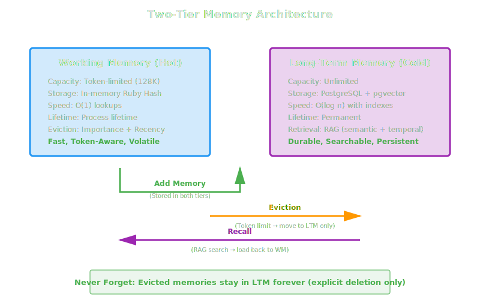
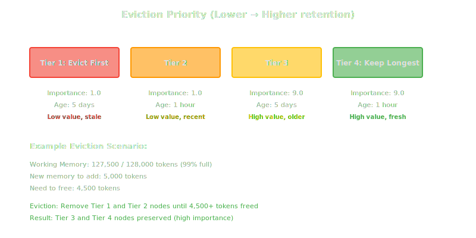
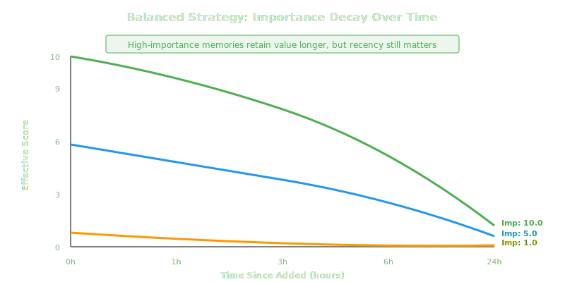
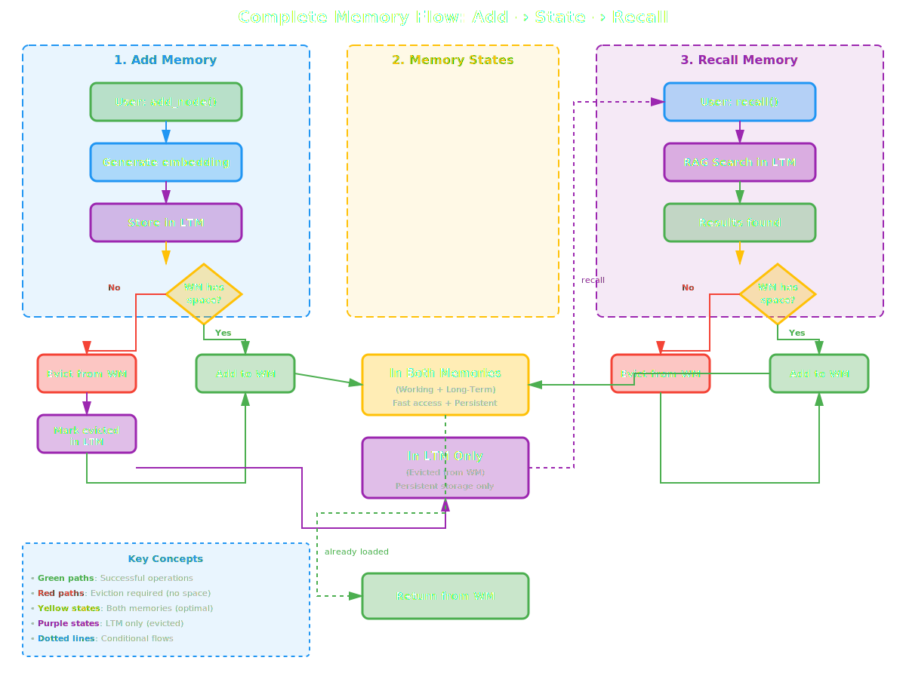

# Two-Tier Memory System

HTM implements a sophisticated two-tier memory architecture that balances the competing needs of fast access (working memory) and unlimited retention (long-term memory). This document provides a comprehensive deep dive into both tiers, their interactions, and optimization strategies.

## Overview

The two-tier architecture addresses a fundamental challenge in LLM-based applications: LLMs have limited context windows but need to maintain awareness across long conversations spanning days, weeks, or months.



!!! info "Related ADR"
    See [ADR-002: Two-Tier Memory Architecture](../architecture/adrs/002-two-tier-memory.md) for the complete architectural decision record.

## Working Memory (Hot Tier)

Working memory is a token-limited, in-memory cache for recently accessed or highly important memories. It provides O(1) access times for the LLM's immediate context needs.

### Design Characteristics

| Aspect | Details |
|--------|---------|
| **Purpose** | Immediate context for LLM consumption |
| **Capacity** | Token-limited (default: 128,000 tokens) |
| **Storage** | Ruby Hash: `{ key => node }` |
| **Access Pattern** | Frequent reads, moderate writes |
| **Eviction Policy** | Hybrid importance + recency (LRU-based) |
| **Lifetime** | Process lifetime (cleared on restart) |
| **Performance** | O(1) hash lookups, O(n log n) eviction |

### Data Structure

```ruby
class WorkingMemory
  def initialize(max_tokens:)
    @max_tokens = max_tokens
    @nodes = {}           # key => node_data
    @access_order = []    # LRU tracking
  end

  # Node structure
  # {
  #   value: "Memory content",
  #   token_count: 150,
  #   importance: 5.0,
  #   added_at: Time.now,
  #   from_recall: false
  # }
end
```

### Why Token-Limited?

LLMs have finite context windows. Even with 200K token models, managing token budgets is critical:

- **Prevent context overflow**: Ensure working memory fits in LLM context
- **Cost control**: API-based LLMs charge per token
- **Focus attention**: Too much context dilutes LLM focus
- **Performance**: Smaller context = faster LLM inference

!!! tip "Token Budget Strategy"
    Working memory token limit should be **60-70% of LLM context window** to leave room for system prompts, user queries, and LLM responses.

### Working Memory Operations

#### Add Node

```ruby
def add(key, value, token_count:, importance: 1.0, from_recall: false)
  # Check if eviction needed
  if token_count + current_tokens > @max_tokens
    evict_to_make_space(token_count)
  end

  # Add to working memory
  @nodes[key] = {
    value: value,
    token_count: token_count,
    importance: importance,
    added_at: Time.now,
    from_recall: from_recall
  }

  # Track access order (LRU)
  update_access(key)
end
```

**Time Complexity:** O(1) amortized (eviction is O(n log n) when triggered)

#### Retrieve Node

```ruby
def retrieve(key)
  return nil unless @nodes.key?(key)

  # Update access order
  update_access(key)

  @nodes[key]
end
```

**Time Complexity:** O(1)

#### Remove Node

```ruby
def remove(key)
  @nodes.delete(key)
  @access_order.delete(key)
end
```

**Time Complexity:** O(1) for hash, O(n) for access_order

### Eviction Strategy

When working memory exceeds its token limit, HTM evicts nodes based on a hybrid importance + recency score.

#### Eviction Algorithm

```ruby
def evict_to_make_space(needed_tokens)
  evicted = []
  tokens_freed = 0

  # Sort by [importance ASC, age DESC]
  # Lower importance evicted first
  # Within same importance, older evicted first
  candidates = @nodes.sort_by do |key, node|
    recency = Time.now - node[:added_at]
    [node[:importance], -recency]
  end

  # Greedy eviction: stop when enough space
  candidates.each do |key, node|
    break if tokens_freed >= needed_tokens

    evicted << { key: key, value: node[:value] }
    tokens_freed += node[:token_count]
    @nodes.delete(key)
    @access_order.delete(key)
  end

  evicted
end
```

#### Eviction Priority

Nodes are evicted in this order:

1. **Low importance, old** (e.g., importance: 1.0, age: 5 days)
2. **Low importance, recent** (e.g., importance: 1.0, age: 1 hour)
3. **High importance, old** (e.g., importance: 9.0, age: 5 days)
4. **High importance, recent** (e.g., importance: 9.0, age: 1 hour) ← **Kept longest**



!!! warning "Importance Matters"
    **Assign meaningful importance scores!** Low-importance memories (1.0-3.0) will be evicted first. Use higher scores (7.0-10.0) for critical information like architectural decisions, user preferences, and long-term facts.

!!! info "Related ADR"
    See [ADR-007: Working Memory Eviction Strategy](../architecture/adrs/007-eviction-strategy.md) for detailed rationale and alternatives considered.

### Context Assembly Strategies

Working memory provides three strategies for assembling context strings for LLM consumption:

#### 1. Recent (`:recent`)

Sort by access order, most recently accessed first.

```ruby
def assemble_context(strategy: :recent, max_tokens: nil)
  nodes = @access_order.reverse.map { |key| @nodes[key] }
  build_context(nodes, max_tokens || @max_tokens)
end
```

**Best For:**

- Conversational continuity
- Chat interfaces
- Following current discussion thread
- Debugging sessions

**Example Use Case:**

```ruby
# User having back-and-forth coding conversation
context = htm.working_memory.assemble_context(strategy: :recent, max_tokens: 8000)
# Recent messages prioritized for coherent conversation flow
```

#### 2. Frequent (`:frequent`)

Sort by access count, most accessed first.

**Best For:**

- Strategic planning
- Architectural decisions
- Summarization tasks
- Key facts retrieval

**Example Use Case:**

```ruby
# LLM helping with architectural review
context = htm.working_memory.assemble_context(strategy: :frequent)
# Most frequently accessed decisions and facts prioritized
```

#### 3. Balanced (`:balanced`) - **Recommended Default**

Hybrid scoring with time decay: `importance * (1.0 / (1 + recency_hours))`

```ruby
def assemble_context(strategy: :balanced, max_tokens: nil)
  nodes = @nodes.sort_by { |k, v|
    recency_hours = (Time.now - v[:added_at]) / 3600.0
    score = v[:importance] * (1.0 / (1 + recency_hours))
    -score  # Descending
  }.map(&:last)

  build_context(nodes, max_tokens || @max_tokens)
end
```

**Decay Function:**

- **Just added (0 hours):** `importance * 1.0` (full weight)
- **1 hour old:** `importance * 0.5` (half weight)
- **3 hours old:** `importance * 0.25` (quarter weight)
- **24 hours old:** `importance * 0.04` (4% weight)

**Best For:**

- General-purpose LLM interactions
- Mixed conversational + strategic tasks
- Default strategy when unsure

**Example Use Case:**

```ruby
# Code helper assisting with debugging and design
context = htm.working_memory.assemble_context(strategy: :balanced)
# Recent debugging context + important architectural decisions
```



!!! info "Related ADR"
    See [ADR-006: Context Assembly Strategies](../architecture/adrs/006-context-assembly.md) for detailed strategy analysis.

### Performance Characteristics

| Operation | Time Complexity | Typical Latency |
|-----------|----------------|-----------------|
| Add node | O(1) amortized | < 1ms |
| Retrieve node | O(1) | < 1ms |
| Eviction (when needed) | O(n log n) | < 10ms (for 200 nodes) |
| Context assembly | O(n log n) | < 10ms (for 200 nodes) |
| Check space | O(n) | < 1ms |

**Memory Usage:**

- Empty working memory: ~1KB
- 100 nodes (avg 500 tokens each): ~50KB metadata + node content
- 200 nodes (128K tokens): ~2-5MB total (including Ruby overhead)

## Long-Term Memory (Cold Tier)

Long-term memory provides unlimited, durable storage for all memories with advanced retrieval capabilities using RAG (Retrieval-Augmented Generation) patterns.

### Design Characteristics

| Aspect | Details |
|--------|---------|
| **Purpose** | Permanent knowledge base |
| **Capacity** | Effectively unlimited |
| **Storage** | PostgreSQL 16+ with pgvector and pg_trgm |
| **Access Pattern** | RAG-based retrieval (semantic + temporal) |
| **Retention** | Permanent (explicit deletion only) |
| **Lifetime** | Forever (survives process restarts) |
| **Performance** | O(log n) with indexes and HNSW |

### Database Schema (Simplified)

```sql
CREATE TABLE nodes (
  id BIGSERIAL PRIMARY KEY,
  content TEXT NOT NULL,
  content_hash TEXT UNIQUE,
  type TEXT,
  token_count INTEGER,
  metadata JSONB DEFAULT '{}',
  source_id BIGINT REFERENCES file_sources(id),
  embedding vector(3072),
  deleted_at TIMESTAMP,
  created_at TIMESTAMP DEFAULT CURRENT_TIMESTAMP,
  updated_at TIMESTAMP DEFAULT CURRENT_TIMESTAMP
);

-- HNSW index for vector similarity
CREATE INDEX idx_nodes_embedding ON nodes
  USING hnsw (embedding vector_cosine_ops)
  WITH (m = 16, ef_construction = 64);

-- Full-text search
CREATE INDEX idx_nodes_content_gin ON nodes
  USING gin(to_tsvector('english', content));
```

### Why PostgreSQL?

**PostgreSQL provides:**

- ACID guarantees for data integrity
- Rich ecosystem and tooling
- pgvector for vector similarity search
- Full-text search with GIN indexes and pg_trgm for fuzzy matching
- Soft delete support via `deleted_at` column
- JSONB metadata with GIN index for flexible filtering
- Mature, production-proven

!!! info "Related ADR"
    See [ADR-001: Use PostgreSQL for Storage](../architecture/adrs/001-postgresql-timescaledb.md) for complete rationale.

### Long-Term Memory Operations

#### Add Node

```ruby
# High-level API (recommended)
node_id = htm.remember("PostgreSQL is great for vector search",
                       type: :fact,
                       tags: ["database:postgresql"],
                       metadata: { source: "docs" })
```

**Time Complexity:** O(log n) with B-tree and HNSW indexes

#### Retrieve by ID

```ruby
# Direct model lookup
node = HTM::Models::Node.first(id: node_id)
```

**Time Complexity:** O(1) with unique index on key

#### Vector Search

```ruby
def search(timeframe:, query:, limit:, embedding_service:)
  query_embedding = embedding_service.embed(query)

  result = @db.exec_params(<<~SQL, [timeframe.begin, timeframe.end, query_embedding, limit])
    SELECT *, embedding <=> $3 AS distance
    FROM nodes
    WHERE created_at BETWEEN $1 AND $2
    ORDER BY distance ASC
    LIMIT $4
  SQL

  result.to_a
end
```

**Time Complexity:** O(log n) with HNSW approximate nearest neighbor

#### Hybrid Search (Vector + Full-Text)

Combines vector similarity and full-text search using Reciprocal Rank Fusion (RRF):

```ruby
def search_hybrid(timeframe:, query:, limit:, embedding_service:)
  query_embedding = embedding_service.embed(query)

  # Get both vector and full-text results
  vector_results = search(timeframe, query, limit * 2, embedding_service)
  fulltext_results = search_fulltext(timeframe, query, limit * 2)

  # RRF scoring
  scores = {}

  vector_results.each_with_index do |node, rank|
    scores[node['id']] ||= 0
    scores[node['id']] += 1.0 / (rank + 60)  # RRF constant: 60
  end

  fulltext_results.each_with_index do |node, rank|
    scores[node['id']] ||= 0
    scores[node['id']] += 1.0 / (rank + 60)
  end

  # Sort by combined score
  all_nodes = (vector_results + fulltext_results).uniq { |n| n['id'] }
  all_nodes.sort_by { |n| -scores[n['id']] }.take(limit)
end
```

!!! info "Related ADR"
    See [ADR-005: RAG-Based Retrieval with Hybrid Search](../architecture/adrs/005-rag-retrieval.md) for search strategy details.

### RAG-Based Retrieval

HTM uses Retrieval-Augmented Generation patterns to find relevant memories:

#### Search Strategies

##### 1. Vector Search (`:vector`)

Pure semantic similarity using cosine distance between embeddings.

**Best For:**

- Conceptual similarity
- Finding related ideas
- Semantic matching across paraphrases

**Example:**

```ruby
# Query: "database optimization"
# Finds: "PostgreSQL index tuning", "query performance", "EXPLAIN ANALYZE"
memories = htm.recall("database optimization", timeframe: "last month", strategy: :vector)
```

##### 2. Full-Text Search (`:fulltext`)

Keyword-based matching using PostgreSQL GIN indexes.

**Best For:**

- Exact phrase matching
- Keyword search
- Code snippets
- Proper nouns

**Example:**

```ruby
# Query: "TimescaleDB compression"
# Finds exact matches for "TimescaleDB" and "compression"
memories = htm.recall("TimescaleDB compression", timeframe: "last week", strategy: :fulltext)
```

##### 3. Hybrid Search (`:hybrid`) - **Recommended**

Combines vector and full-text with RRF scoring.

**Best For:**

- General-purpose retrieval
- Balanced precision and recall
- Most use cases

**Example:**

```ruby
# Combines semantic similarity AND keyword matching
memories = htm.recall("PostgreSQL performance", timeframe: "last month", strategy: :hybrid)
```

### Performance Characteristics

| Operation | Time Complexity | Typical Latency | Notes |
|-----------|----------------|-----------------|-------|
| Add node | O(log n) | 20-50ms | Includes index updates |
| Retrieve by key | O(1) | 5-10ms | Unique index lookup |
| Vector search | O(log n) | 50-100ms | HNSW approximate |
| Full-text search | O(log n) | 20-40ms | GIN index |
| Hybrid search | O(log n) | 80-150ms | Both + RRF merge |
| Delete node | O(log n) | 10-30ms | Cascading deletes |

**Storage Efficiency:**

With PostgreSQL TOAST compression:

- Text node: ~1KB (minimal overhead)
- Node with embedding: ~7KB (1536-dim float32 vector)
- 100,000 nodes: ~700MB typical storage

## Memory Flow: Add → Evict → Recall

### Complete Flow Diagram



### Example: Adding 5000-Token Memory to Full Working Memory

```ruby
# Initial state
htm.memory_stats[:working_memory]
# => {
#   current_tokens: 127_500,
#   max_tokens: 128_000,
#   utilization: 99.6%,
#   node_count: 85
# }

# Add large memory
htm.remember(large_documentation)

# HTM automatically:
# 1. Generates embedding (Ollama: ~50ms)
# 2. Stores in long-term memory (PostgreSQL: ~30ms)
# 3. Checks working memory space: 5000 + 127500 > 128000 (no space!)
# 4. Evicts low-importance old nodes to free 4500+ tokens
#    - Evicts 3 nodes: (importance: 1.0, age: 3 days), (importance: 2.0, age: 1 day), etc.
# 5. Adds new memory to working memory
# 6. Total time: ~100ms

# New state
htm.memory_stats[:working_memory]
# => {
#   current_tokens: 128_000,
#   max_tokens: 128_000,
#   utilization: 100.0%,
#   node_count: 83  # Lost 3 nodes, gained 1
# }

# Evicted nodes still in long-term memory!
# Retrieve via recall with the original content
evicted_results = htm.recall("old_debug_log", strategy: :fulltext)  # Still works
```

## Context Assembly Strategies in Detail

### Strategy Comparison

| Strategy | Sort Key | Best Use Case | Typical Output |
|----------|----------|---------------|----------------|
| **Recent** | Access order (newest first) | Conversations, debugging | Recent 5-10 messages |
| **Frequent** | Access count (highest first) | Planning, decisions | Top 10 most accessed facts |
| **Balanced** | `importance / (1 + hours)` | General assistant | Mix of recent + frequent |

### Code Examples

#### Recent Strategy

```ruby
# Assemble context from most recent memories
context = htm.working_memory.assemble_context(strategy: :recent, max_tokens: 8000)

# Typical output (recent conversation):
# """
# User: What's the capital of France?
# Assistant: The capital of France is Paris.
# User: Tell me about its history.
# Assistant: Paris has been inhabited since...
# ...
# """
```

#### Frequent Strategy

```ruby
# Assemble context from most frequently accessed memories
context = htm.working_memory.assemble_context(strategy: :frequent, max_tokens: 4000)

# Typical output (critical facts):
# """
# Decision: Use PostgreSQL for storage (accessed 10 times)
# User preference: Always use debug_me over puts (accessed 8 times)
# Architecture: Two-tier memory system (accessed 7 times)
# ...
# """
```

#### Balanced Strategy

```ruby
# Assemble context with time decay
context = htm.working_memory.assemble_context(strategy: :balanced)

# Typical output (hybrid):
# """
# Recent debugging: ValueError in embedding service (10 min ago)
# Current task: Implementing RAG search (1 hour ago)
# Critical decision: PostgreSQL chosen (accessed 10 times, 3 days ago)
# ...
# """
```

## Performance Optimization

### Working Memory Optimization

#### 1. Tune Token Limit

```ruby
# For shorter context windows (e.g., GPT-3.5 with 16K tokens)
htm = HTM.new(working_memory_size: 8_000)  # Leave room for prompt + response

# For longer context windows (e.g., Claude 3 with 200K tokens)
htm = HTM.new(working_memory_size: 128_000)  # Default
```

#### 2. Adjust Importance Scores

```ruby
# Store critical information
htm.remember("User prefers Vim keybindings", metadata: { priority: "high" })

# Store transient information
htm.remember("Temporary debug output", metadata: { category: "debug" })

# Store general context
htm.remember("Discussed API design patterns")
```

#### 3. Use Appropriate Context Strategy

```ruby
# For chat: recent strategy
chat_context = htm.working_memory.assemble_context(strategy: :recent, max_tokens: 8000)

# For planning: frequent strategy
planning_context = htm.working_memory.assemble_context(strategy: :frequent, max_tokens: 4000)

# For general: balanced strategy (default)
general_context = htm.working_memory.assemble_context(strategy: :balanced)
```

### Long-Term Memory Optimization

#### 1. Leverage PostgreSQL Partitioning

```sql
-- Create a partial index for active (non-deleted) nodes
CREATE INDEX CONCURRENTLY idx_nodes_active
  ON nodes (created_at DESC)
  WHERE deleted_at IS NULL;

-- Periodically VACUUM to reclaim space from soft-deleted rows
VACUUM ANALYZE nodes;
```

#### 2. Use Appropriate Search Strategy

```ruby
# For exact matches: full-text
exact_matches = htm.recall("PostgreSQL", timeframe: "last week", strategy: :fulltext)

# For semantic similarity: vector
similar_concepts = htm.recall("database performance", timeframe: "last month", strategy: :vector)

# For best results: hybrid (default)
best_results = htm.recall("PostgreSQL performance", timeframe: "last month", strategy: :hybrid)
```

#### 3. Index Tuning

```sql
-- Monitor HNSW build time
SELECT pg_size_pretty(pg_relation_size('idx_nodes_embedding')) AS index_size;

-- Rebuild HNSW index if needed
REINDEX INDEX CONCURRENTLY idx_nodes_embedding;

-- Analyze query plans
EXPLAIN ANALYZE
SELECT * FROM nodes
WHERE created_at > NOW() - INTERVAL '7 days'
  AND embedding <=> '[...]' < 0.5
ORDER BY embedding <=> '[...]'
LIMIT 20;
```

## Related Documentation

- [Architecture Index](../architecture/index.md) - System overview and component summary
- [Architecture Overview](../architecture/overview.md) - Detailed architecture and data flows
- [Hive Mind Architecture](hive-mind.md) - Multi-robot shared memory
- [ADR-002: Two-Tier Memory Architecture](../architecture/adrs/002-two-tier-memory.md)
- [ADR-006: Context Assembly Strategies](../architecture/adrs/006-context-assembly.md)
- [ADR-007: Working Memory Eviction Strategy](../architecture/adrs/007-eviction-strategy.md)
