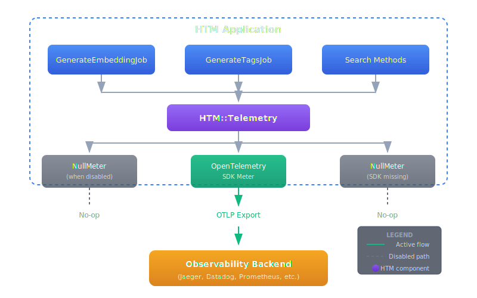

# Telemetry (OpenTelemetry Metrics)

HTM includes optional OpenTelemetry-based metrics for production observability. This document provides detailed configuration and usage information.

## Overview

HTM uses [OpenTelemetry](https://opentelemetry.io/) for metrics collection, the industry-standard observability framework. This provides:

- **Universal compatibility**: Works with 50+ observability backends
- **Zero vendor lock-in**: Emit standard OTLP, route anywhere
- **Zero overhead when disabled**: Null object pattern ensures no performance impact

## Quick Start

### 1. Install Dependencies

Add the OpenTelemetry gems to your Gemfile:

```ruby
gem 'opentelemetry-sdk'
gem 'opentelemetry-metrics-sdk'
gem 'opentelemetry-exporter-otlp'  # For OTLP export
```

### 2. Enable Telemetry

```ruby
HTM.configure do |config|
  config.telemetry_enabled = true
end
```

Or via environment variable:

```bash
export HTM_TELEMETRY_ENABLED="true"
```

### 3. Configure Destination

Set standard OpenTelemetry environment variables:

```bash
export OTEL_METRICS_EXPORTER="otlp"
export OTEL_EXPORTER_OTLP_ENDPOINT="http://localhost:4318"
```

## Configuration Options

### HTM Configuration

| Option | Type | Default | Description |
|--------|------|---------|-------------|
| `telemetry_enabled` | Boolean | `false` | Enable/disable telemetry |

```ruby
HTM.configure do |config|
  config.telemetry_enabled = true
end
```

### Environment Variables

#### HTM-specific

| Variable | Default | Description |
|----------|---------|-------------|
| `HTM_TELEMETRY_ENABLED` | `false` | Enable telemetry (`true`/`false`) |

#### OpenTelemetry Standard

These are standard OpenTelemetry environment variables (not HTM-specific):

| Variable | Example | Description |
|----------|---------|-------------|
| `OTEL_SERVICE_NAME` | `htm` | Service name in telemetry data |
| `OTEL_METRICS_EXPORTER` | `otlp` | Metrics exporter type |
| `OTEL_EXPORTER_OTLP_ENDPOINT` | `http://localhost:4318` | OTLP collector endpoint |
| `OTEL_EXPORTER_OTLP_HEADERS` | `Authorization=Bearer token` | Headers for OTLP requests |

## Available Metrics

### htm.jobs (Counter)

Counts job executions by type and outcome.

**Attributes:**
- `job`: Job type (`embedding`, `tags`)
- `status`: Outcome (`success`, `error`, `circuit_open`)

**Example queries (PromQL):**
```promql
# Jobs per minute by type
rate(htm_jobs_total[1m])

# Error rate for embedding jobs
rate(htm_jobs_total{job="embedding",status="error"}[5m])
  / rate(htm_jobs_total{job="embedding"}[5m])
```

### htm.embedding.latency (Histogram)

Measures embedding generation time in milliseconds.

**Attributes:**
- `provider`: LLM provider (`ollama`, `openai`, etc.)
- `status`: Outcome (`success`, `error`)

**Example queries (PromQL):**
```promql
# p95 embedding latency
histogram_quantile(0.95, rate(htm_embedding_latency_bucket[5m]))

# Average latency by provider
rate(htm_embedding_latency_sum[5m]) / rate(htm_embedding_latency_count[5m])
```

### htm.tag.latency (Histogram)

Measures tag extraction time in milliseconds.

**Attributes:**
- `provider`: LLM provider (`ollama`, `openai`, etc.)
- `status`: Outcome (`success`, `error`)

**Example queries (PromQL):**
```promql
# p99 tag extraction latency
histogram_quantile(0.99, rate(htm_tag_latency_bucket[5m]))
```

### htm.search.latency (Histogram)

Measures search operation time in milliseconds.

**Attributes:**
- `strategy`: Search strategy (`vector`, `fulltext`, `hybrid`)

**Example queries (PromQL):**
```promql
# Search latency by strategy
histogram_quantile(0.95, rate(htm_search_latency_bucket[5m])) by (strategy)

# Hybrid search avg latency
rate(htm_search_latency_sum{strategy="hybrid"}[5m])
  / rate(htm_search_latency_count{strategy="hybrid"}[5m])
```

### htm.cache.operations (Counter)

Counts cache hits and misses.

**Attributes:**
- `operation`: Operation type (`hit`, `miss`)

**Example queries (PromQL):**
```promql
# Cache hit rate
rate(htm_cache_operations_total{operation="hit"}[5m])
  / (rate(htm_cache_operations_total{operation="hit"}[5m])
     + rate(htm_cache_operations_total{operation="miss"}[5m]))
```

## Compatible Backends

HTM metrics work with any OTLP-compatible platform:

### Open Source / Self-Hosted

| Platform | OTLP Support | Notes |
|----------|--------------|-------|
| **Jaeger** | Native (v1.35+) | Distributed tracing with metrics |
| **Prometheus** | Via receiver | Popular metrics platform |
| **Grafana Tempo** | Native | Traces with metrics correlation |
| **Grafana Mimir** | Native | Scalable Prometheus-compatible |
| **SigNoz** | Native | Full-stack observability |
| **Uptrace** | Native | Open source APM |

### Commercial / SaaS

| Platform | OTLP Support | Notes |
|----------|--------------|-------|
| **Datadog** | Native | Full-stack observability |
| **New Relic** | Native | APM and infrastructure |
| **Honeycomb** | Native (preferred) | High-cardinality observability |
| **Splunk APM** | Native | Enterprise observability |
| **Dynatrace** | Native | AI-powered monitoring |
| **AWS X-Ray** | Via ADOT | AWS native tracing |
| **Google Cloud Trace** | Native | GCP native tracing |
| **Azure Monitor** | Native | Azure native monitoring |
| **Grafana Cloud** | Native | Managed Grafana stack |

## Setup Examples

### Jaeger (Local Development)

```bash
# Start Jaeger with OTLP support
docker run -d --name jaeger \
  -p 4318:4318 \
  -p 16686:16686 \
  jaegertracing/all-in-one:latest

# Configure HTM
export HTM_TELEMETRY_ENABLED="true"
export OTEL_METRICS_EXPORTER="otlp"
export OTEL_EXPORTER_OTLP_ENDPOINT="http://localhost:4318"
```

### Prometheus (via OpenTelemetry Collector)

```yaml
# otel-collector-config.yaml
receivers:
  otlp:
    protocols:
      grpc:
      http:

exporters:
  prometheus:
    endpoint: "0.0.0.0:8889"

service:
  pipelines:
    metrics:
      receivers: [otlp]
      exporters: [prometheus]
```

```bash
docker run -d \
  -p 4317:4317 \
  -p 4318:4318 \
  -p 8889:8889 \
  -v $(pwd)/otel-collector-config.yaml:/etc/otel-collector-config.yaml \
  otel/opentelemetry-collector:latest \
  --config=/etc/otel-collector-config.yaml
```

### Datadog

```bash
export HTM_TELEMETRY_ENABLED="true"
export OTEL_METRICS_EXPORTER="otlp"
export OTEL_EXPORTER_OTLP_ENDPOINT="https://otlp.datadoghq.com"
export OTEL_EXPORTER_OTLP_HEADERS="DD-API-KEY=your-api-key"
```

### Honeycomb

```bash
export HTM_TELEMETRY_ENABLED="true"
export OTEL_METRICS_EXPORTER="otlp"
export OTEL_EXPORTER_OTLP_ENDPOINT="https://api.honeycomb.io"
export OTEL_EXPORTER_OTLP_HEADERS="x-honeycomb-team=your-api-key"
```

### New Relic

```bash
export HTM_TELEMETRY_ENABLED="true"
export OTEL_METRICS_EXPORTER="otlp"
export OTEL_EXPORTER_OTLP_ENDPOINT="https://otlp.nr-data.net"
export OTEL_EXPORTER_OTLP_HEADERS="api-key=your-license-key"
```

## Architecture

### Null Object Pattern

HTM uses a null object pattern for telemetry. When disabled:

```ruby
# This code runs identically whether telemetry is enabled or not
HTM::Telemetry.job_counter.add(1, attributes: { 'job' => 'embedding' })
```

When telemetry is disabled or the SDK is not installed:
- `HTM::Telemetry.meter` returns a `NullMeter`
- All instruments return `NullInstrument` instances
- All operations (`add`, `record`) are no-ops returning `nil`
- Zero memory allocation, zero CPU overhead

### Code Flow



### Instrumentation Points

HTM instruments these key operations:

| Component | Metrics Recorded |
|-----------|-----------------|
| `GenerateEmbeddingJob` | `htm.jobs`, `htm.embedding.latency` |
| `GenerateTagsJob` | `htm.jobs`, `htm.tag.latency` |
| `VectorSearch#search` | `htm.search.latency` (strategy: vector) |
| `FulltextSearch#search_fulltext` | `htm.search.latency` (strategy: fulltext) |
| `HybridSearch#search_hybrid` | `htm.search.latency` (strategy: hybrid) |
| `QueryCache#fetch` | `htm.cache.operations` |

## Testing

When writing tests, reset telemetry state between tests:

```ruby
def setup
  HTM::Telemetry.reset!
  HTM.configuration.telemetry_enabled = false
end

def teardown
  HTM::Telemetry.reset!
end
```

### Verifying Metrics in Tests

```ruby
def test_records_embedding_latency
  # Create a mock histogram
  recorded = []
  mock_histogram = Object.new
  mock_histogram.define_singleton_method(:record) do |value, **kwargs|
    recorded << { value: value, attributes: kwargs[:attributes] }
  end

  # Inject mock (requires test helper)
  HTM::Telemetry.instance_variable_set(:@embedding_latency, mock_histogram)

  # Run operation
  HTM::Jobs::GenerateEmbeddingJob.perform(node_id: node.id)

  # Verify
  assert recorded.any? { |r| r[:attributes]['status'] == 'success' }
end
```

## Troubleshooting

### Metrics Not Appearing

1. **Check telemetry is enabled:**
   ```ruby
   puts HTM.configuration.telemetry_enabled  # Should be true
   puts HTM::Telemetry.enabled?              # Should be true
   ```

2. **Check SDK is installed:**
   ```ruby
   puts HTM::Telemetry.sdk_available?  # Should be true
   ```

3. **Check environment variables:**
   ```bash
   echo $OTEL_METRICS_EXPORTER
   echo $OTEL_EXPORTER_OTLP_ENDPOINT
   ```

4. **Check collector is running:**
   ```bash
   curl http://localhost:4318/v1/metrics  # Should not 404
   ```

### High Cardinality Issues

Avoid high-cardinality attributes in metrics. HTM uses low-cardinality attributes by design:

- `job`: 2-3 values (embedding, tags, propositions)
- `status`: 3 values (success, error, circuit_open)
- `provider`: ~10 values (ollama, openai, etc.)
- `strategy`: 3 values (vector, fulltext, hybrid)
- `operation`: 2 values (hit, miss)

### Performance Concerns

With telemetry disabled (default), there is zero overhead:
- No gem loading
- No object allocation
- No method calls beyond the null check

With telemetry enabled, overhead is minimal:
- ~1-5μs per metric recording
- Memory for histogram buckets (~1KB per histogram)

## References

- [OpenTelemetry Ruby SDK](https://github.com/open-telemetry/opentelemetry-ruby)
- [OpenTelemetry Metrics SDK](https://github.com/open-telemetry/opentelemetry-ruby/tree/main/metrics_sdk)
- [OpenTelemetry Specification](https://opentelemetry.io/docs/specs/otel/)
- [OTLP Protocol](https://opentelemetry.io/docs/specs/otlp/)
